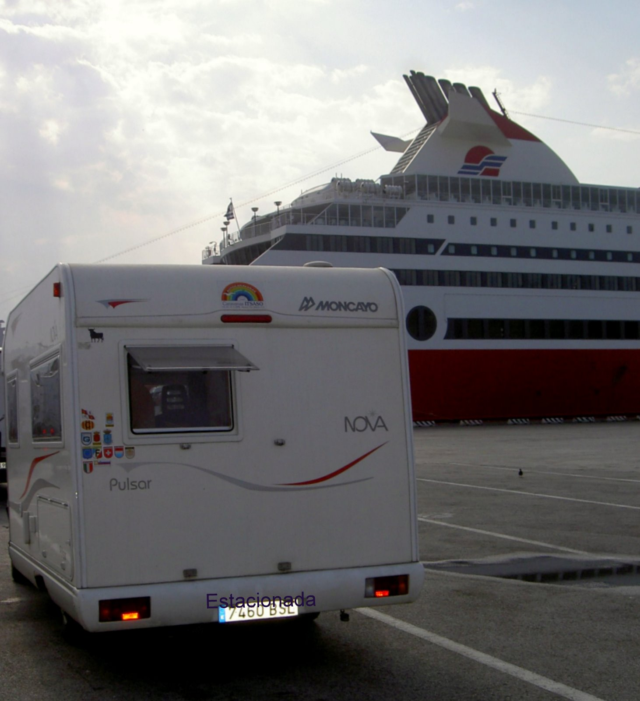
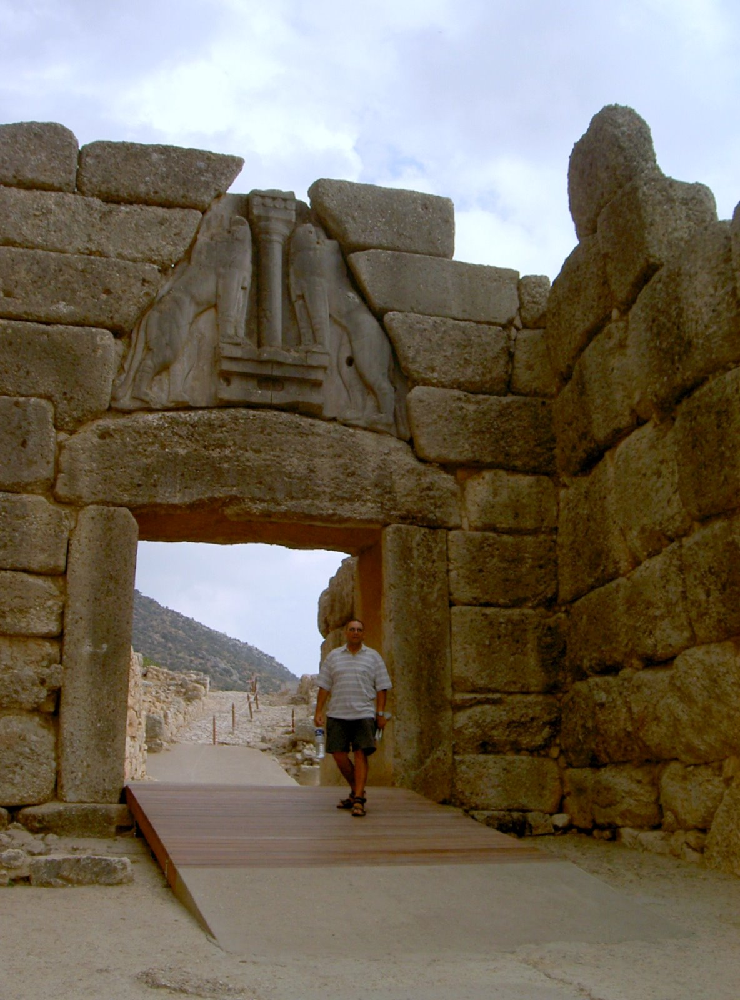
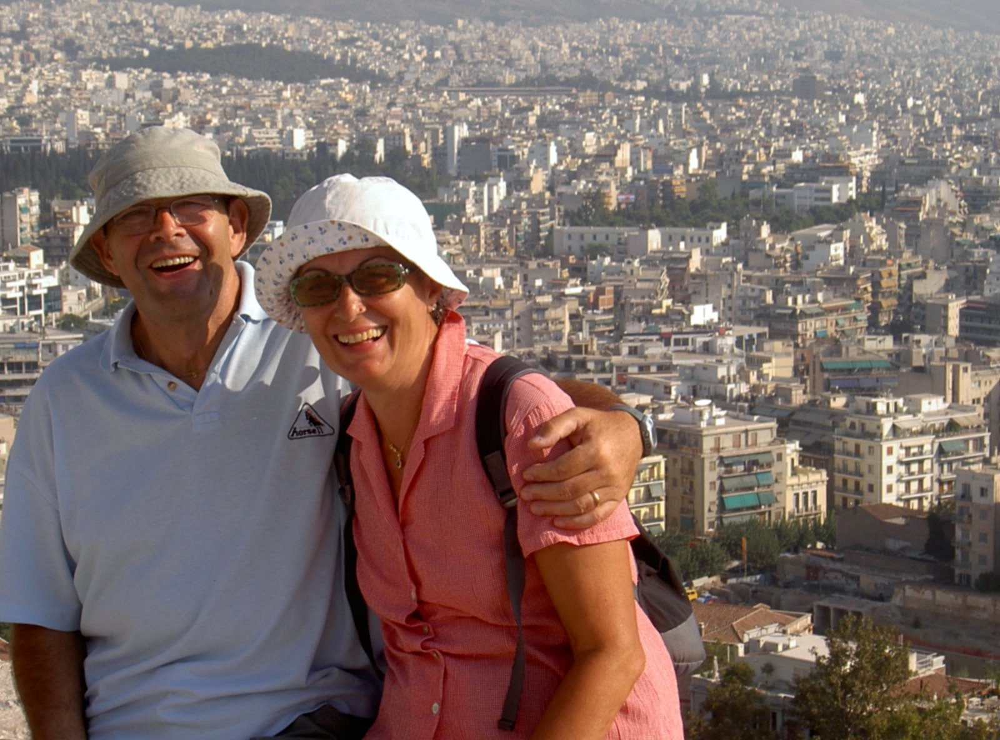
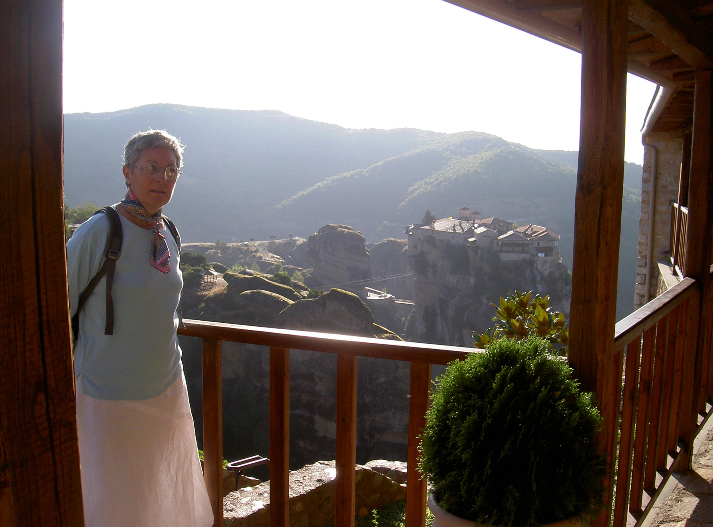
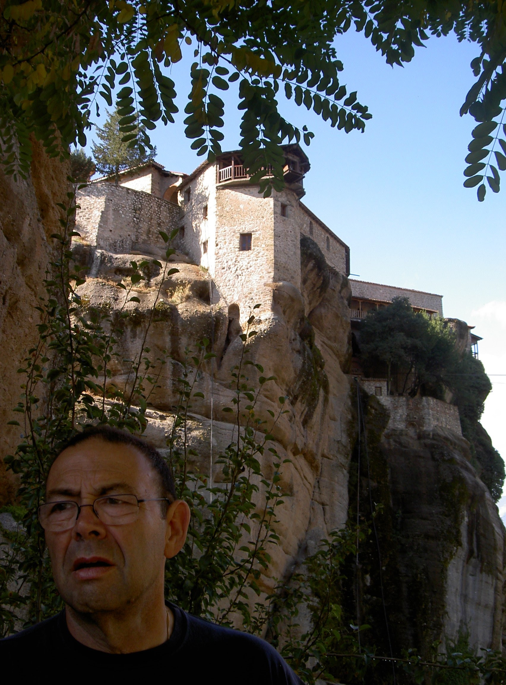
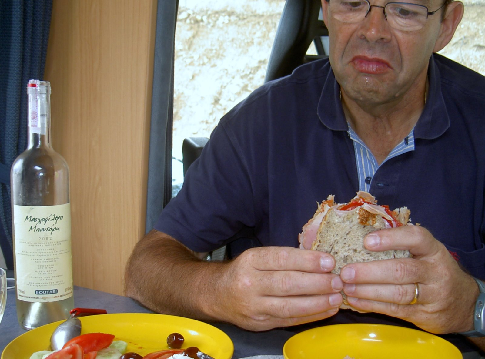

# Grecia
**2004, 3 septiembre - 3 octubre**

**Mistra**

Emprender un viaje de más de seis mil kilómetros de un mes de duración, fuera de la temporada turística, es un privilegio que solo está al alcance de los millonarios o de los pensionistas. Un jubilado y una autocaravana son la combinación perfecta que permite escoger destinos exóticos dentro de los planes de un turista itinerante. Grecia ha sido el país escogido para este Otoño que nos ha proporcionado un tiempo excelente. La aureola de las olimpiadas y el haber finalizado la fuerte presión turística son otras razones que nos han ayudado a escoger Grecia como destino.

Como es bien sabido un viaje comienza a disfrutarse con la propia planificación: Selección del puerto de embarque. Las etapas de aproximación y las facilidades y costo son factores a tener en cuenta.

Descartada la vía terrestre por su distancia y por los países que se deben atravesar con escaso interés turístico y con conflictos demasiado recientes, apelamos a la vía marítima. Los puertos de embarque pueden ser los más próximos como Ancona o Venecia o más los lejanos como Bríndisi o Bari.

Disponíamos de una información contradictoria sobre el viaje haciendo camping a bordo, utilizando la propia autocaravana como alojamiento en un puente abierto y con billete económico.

Tras varias consultas por Internet no pudimos aclarar este extremo pues nos informan que dos de las compañías más importantes han suspendido la opción de camping a bordo. Los precios desde Ancona son altos y en principio pensamos en Bríndisi como alternativa. A pesar de ello, tenemos noticias de que hay ofertas de fuera de temporada y al no obtener una información segura por Internet optamos por hacer una consulta “in situ”.

**Esperando el ferry en Ancona**

**Iniciamos el viaje**

Nos pusimos en marcha el día 11 de Septiembre y el viaje de aproximación lo realizamos en dos etapas, una en Mirepoix (Francia) y la otra en Torriglia (Italia). Sobre la marcha, nos pusimos en contacto con Superfast Ferrys y nos informaron que disponían de una excelente oferta: Ida y regreso en camarote doble y desayuno por 299,00 €. Con esta información hicimos la reserva por teléfono. A mediodía llegábamos al puerto de Ancona y a las cinco de la tarde embarcábamos hacia Patras (Grecia) con la fecha del regreso abierta y a elegir entre Patras o Igoumenitza como puerto de embarque en el regreso.

En temporada solo queda la posibilidad de viajar de forma económica en un sillón con la AC estibada en el puente y, con suerte, conectada a la corriente eléctrica (no se permite alimentar con butano la nevera). Las otras opciones dependen de la posibilidad de disponer de la posibilidad de hacer camping a bordo buscando entre las compañías que operan desde Bríndisi y Bari.

**Camino de Grecia por la autopista salada**

**Comenzamos a rodar en Grecia**

Tras veinte horas de viaje muy placentero llegamos al puerto de Patras en el extremo noroeste del Peloponeso, dispuesto a circundar la península en el sentido contrario a las agujas del reloj.

Lo que buscamos en Grecia son sus paisajes, sus gentes, sus playas y su importante patrimonio histórico, cada uno de estos elementos tiene un tratamiento diferente. Los paisajes son una auténtica maravilla. Costas accidentadas, bordeadas de acantilados y playas inmensas en el noroeste del Peloponeso o calas solitarias en gran parte de la costa. La luz y el paisaje son incomparables. La mayoría de las playas son de piedras y escasea la arena.

No descubriremos nada diciendo que el patrimonio histórico es excepcional.Muchos nombres de los lugares visitados nos recuerdan a las clases de historia del bachiller. El protagonismo de Grecia en la historia abarca un extenso período que va desde el siglo XV antes de nuestra era hasta el período franco, con las invasiones de los cruzados a la conquista de los sagrados lugares. También es interesante la Grecia moderna, sus gentes y sus recursos.

Como ya existen otros relatos sobre Grecia, nos limitaremos a comentar los lugares visitados haciendo un recorrido cronológico.

Llegamos a Patras el 14 de Septiembre. Entre visita y visita procuramos descansar en los lugares costeros y disfrutar del paisaje y de las playas.

Para no cansar al lector, al final haremos un resumen de la sensación que nos ha quedado de los recursos turísticos en general y de las posibilidades que Grecia presta a los usuarios de autocaravanas en particular.

**Ruinas de Olympia**

**Olimpia (14 de Septiembre)**

Olimpia fue uno de los santuarios más importantes de la antigüedad donde se rinde culto a Zeus. En su honor se celebraban los juegos Olímpicos que significaban la unidad de las Polis y gentes de toda Grecia. En un lugar idílico, rodeado de pinos podemos visitar las ruinas del taller de Fidias, la Palestra, el gimnasio, el templo de Zeus, además del estadio olímpico. En el museo local se pueden visitar restos del lugar arqueológico relativos a los templos y juegos.

Una parte de los frontones del templo en el que se representa la lucha entre lapitas y centauros y los preparativos de la competición atlética de Pelópe y Enomao nos da una idea de su grandiosidad.

**Mistras (18 de Septiembre)**

Lo excepcional de Mistras es su emplazamiento en un promontorio de  seiscientos metros de altura. Desde su situación, en una inaccesible ladera, situado a 8 kilómetros al suroeste, domina Esparta y la cuenca del río Eurotas. Las iglesias y monasterios así como sus casas en ruinas, desvelan la importancia que tuvo como capital del despotado de Morea.

El origen de Mistras se remota al siglo XIII y fue partícipe en los acontecimientos históricos de la alta edad media. De su pasado esplendor quedan huellas en los monasterios de Vrondohíou, Pandánassas y Periviéptou, con sus iglesias, así como la Metrópoli (Catedral de San Demetrio), en la ciudad baja. Sante Sofía (S.XIV) y el palacio de los Déspotas (Cerrado por restauración) en la ciudad alta.

Es también muy interesante subir al castillo (Kastro), cuyas murallas y torres fueron construidas en el S.XIII y que se accede por un sendero serpenteante. Un buen calzado con suela dura y un bastón ayudan a llegar desde el parking situado en la ciudad alta. La ciudad baja también dispone de parking apto para AC.

Es de destacar que en los conventos femeninos no está permitida la entrada de varones con pantalón corto por lo que se ofrecen a la entrada unas graciosas faldas anudadas a la cintura. Naturalmente las mujeres deben vestir falda hasta debajo de las rodillas y llevar debidamente cubiertos brazos y hombros.

**El impresionante peñón de Monemvasia**

**Monemvasia (19 de Septiembre)**

En Monemvasia Impresiona la mole que alberga el Kastro o Ciudad Baja, unida a la costa por un dique y una puerta dotada de un pasaje abovedado. Su creación se remonta al despotado de Morea y fue reformada por los venecianos. Palacios e iglesias junto con la cuidadosa reconstrucción de sus calles dan una idea de un lugar destinado al disfrute de los turistas.

Desde un punto de vista histórico lo más importante es la akrópoli, una extensa ciudadela abandonada que dispone unas excelentes vistas. Alberga la iglesia de Santa Sofía, cuyo edificio recientemente restaurado se remonta al S.XI. Las fortificaciones son venecianas construidas en el S.XVI.

**Nafplio (21 de Septiembre)**

Nafplio es una encantadora ciudad turística dominada por la ciudadela y una gran fortaleza veneciana. Dispone de un precioso paseo peatonal marítimo que rodea un promontorio con vistas a la bahía. La ciudad vieja, sus tiendas de artesanía, en especial joyas que son réplicas de los tesoros encontrados en las tumbas antiguas le dotan de un especial encanto.

Entre 1.829 y 1.834 fue capital de Grecia en un período confuso de la historia moderna. El fuerte Palamedes construido a finales del S.XVII domina la ciudad desde una colina.

**Puerta de los leones en Micenas**

**Micenas (22 de Septiembre)**

La poderosa ciudad fortaleza de Micenas en la Argólida estuvo situada en un enclave estratégico. Su historia está narrada en la Iliada. Las fortificaciones están realizadas con piedras unidas sin mortero. Datan en su mayor parte de los siglos XIV y XV antes de nuestra era. Destaca sobre todo la puerta de los Leones (Pili ton Leóndon) que es el acceso principal de la acrópolis. Un monumental dintel soporta un colosal tímpano monolítico de 3,90 metros de base, 3,30 metros de altura y un grosor de 70 centímetros, con la representación tallada de dos fieras opuestas en relieve que coronan una puerta pétrea de 3,10 metros de altura por 2,95 metros de anchura , abierta entre dos muros.

Una vez franqueada la puerta, a la derecha, se distingue la entrada a un enterramiento de forma circular que se pensó que correspondía a Agamenón y a su séquito, pero se ha descubierto que es mucho más antiguo (S.XVI ac.). Los hallazgos de las seis tumbas que contenían los cuerpos de ocho hombres, nueve mujeres y dos niños se hallan expuestos en el Museo de Atenas.

La visita se completa con las ruinas de la acrópolis de las que destacan el palacio y el extremo este donde se encuentra el acceso a un aljibe secreto y la puerta norte. En el exterior de las murallas se hallan una serie de tumbas. Las de Clitemnestra (Tafos Klitemnístras) y el Tesoro de Atreo o tumba de Agamenón (Thissavrós Atrea) son las principales.

A pesar de que los hallazgos más importantes se encuentran en el Museo de Atenas, el lugar dispone de un interesante museo con elementos referentes a la cultura micénica.

**Teatro de Epidauro**

**Epidauro (22 de Septiembre)**

En el período helénico de la Grecia antigua, entre los siglos VI y IV antes de nuestra era, Epidauro es un centro de sanación donde se rinde culto a Esculapio. Una parte de la terapéutica utilizada eran los ejercicios físicos o de relajación, baños y pasatiempos intelectuales, de ahí la importancia del teatro y las instalaciones deportivas.

De entre los restos arqueológicos que se pueden visitar, destacan el Santuario de Esculapio y sobre todo el teatro.

En un lugar mágico, poblado de bosques de pinos y adelfas.

Entre las colinas de la Argólida, se encuentra el teatro mejor conservado de la antigüedad, que fue construido en el S.IV ac. Dispone de un aforo para 14.000 espectadores. La cávea está compuesta por 55 filas de gradas divididas en dos zonas por un pasillo. Tanto la visión como la acústica son perfectas desde cualquier punto, Un cuchicheo o el sonido del papel al arrugarse en el centro de la orchestra se escucha sin distorsión desde la cima a 22,5 metros del suelo.

La orchestra circular tiene un diámetro de 20,28 metros y en el centro se sitúa la base del altar de Dionisos. Sentados en una grada impresiona imaginar que, en el mismo lugar, hace más de dos mil años, una persona vestida con una toga podía estar contemplando la representación de una obra de teatro.

En el sitio arqueológico hay un museo donde, a pesar de que las principales esculturas se encuentran en el Museo de Atenas, se pueden contemplar hallazgos importantes entre los que se hallan curiosas estelas con la relación de curaciones milagrosas.

**Corinto (22 de Septiembre)**

Una de las ciudades más opulentas de la antigüedad. Su agitada historia es consecuencia del lugar estratégico donde está situada. El comercio establecido desde el S.VII ac., su época de colonia romana nos han legado los restos de la Antigua Corinto (Arhéa Kórinthos), situada 7 kilómetros al este de la ciudad moderna, donde destaca el templo de Apolo y la fuente Pirene (Piríni Krini).

En un lugar próximo se encuentran las ruinas del Akrokórinthos. Fue acrópolis griega, ciudadela romana y posteriormente bizantina. El panorama, la muralla, sus puertas y templos nos dan una idea de su historia.

El Peloponeso es un península unida o una isla separada, según se mire, del continente por el istmo de Corinto. Desde su antigüedad se trató, por su posición estratégica, hacer un canal que evitara rodear la península. Nerón, en el año 67 de nuestra era inauguró las obras que fueron abandonadas meses después. Las obras definitivas del canal comenzaron en 1882 por una compañía francesa, las terminaron los griegos once años más tarde.

Desde uno de los puentes se puede divisar los algo más de seis kilómetros del ca que modificó definitivamente con su apertura las rutas marítimas de la zona haciendo de El Pireo el puerto principal de Grecia.

Con el paso del istmo de Corinto arribamos a Atenas después de una jornada maratónica al condensar en un solo día la visita a tres enclaves de los que cada uno de ellos justifica el viaje. Con ello también completamos la circunvalación a la península del Peloponeso, en el sentido contrario de las agujas del reloj, después de haber recorrido cerca de 1.200 kilómetros por las carreteras de la Península.

En esta zona que tardamos nueve día en recorrer, hemos visitado además de los enclaves históricos, parajes agrestes de un belleza excepcional. El litoral que se precipita bruscamente en el mar y compone una costa salpicada de calas y playas aunque pedregosas de una luz y belleza especial habiéndonos bañado en calas solitarias..

Hemos pernoctado en playas pero principalmente en camping. (Cinco días en playa y cuatro en camping). Las carreteras estrechas, poco frecuentadas y a veces difíciles para una AC donde el paso por alguno de los pueblos, sobre todo al sur y particularmente en la península de  Máni, eran problemáticos. Sin embargo, la poca densidad del tráfico permite conducir de una forma relativamente tranquila.

**El Partenón**

**Atenas (23 y 24 de Septiembre)**

Recalamos en Atenas en el camping Atenas, situado en la ciudad, en 198-200 de la Avda. Leoforos Athinon. Un autobús que para cada diez minutos al frente de la entrada del camping nos deja en media hora en el centro.

Solo hay una palabra para definir la sensación que nos ha producido la capital de Grecia: caótica. Una población en la que habitan cuatro de los once millones de habitantes que tiene Grecia. Dotada con tres líneas de metro y multitud de tranvías trolebuses y autobuses y literalmente asaltada por miles de turistas en cualquier época del año.

Es extremadamente complejo desplazarse con una AC por el centro de la ciudad por lo que lo más recomendable es estacionar en uno de los camping del interior y desplazarse en los medios públicos. Un billete combinado de 24 horas es el medio más cómodo y barato. No existen cobradores en los transportes públicos debiendo obliterar el billete al inicio de su uso.

La oferta de restauración es, como en todas las áreas turísticas inmensa, en especial, concentrada en el entorno de la Plaka. El patrimonio histórico de Atenas es extenso. Anterior a Teseo que en el S.XI ac. Hizo de Atenas la capital de un estado, la actual Atica.

Pórtico de las Cariátides en el templo de Erecteión (Atenas)

El mayor esplendor lo alcanzó en los SS. VI-V ac. Cuando se desarrollaron grandes reformas. Fue conquistada por Roma y su dominación persistió entre el S.I ac. Y el S.IV de nuestra era, sin embargo Atenas siguió conservando su predominio cultural. Bizancio y el ascenso de cristianismo entre los SS. V-VIII, provocó el cierre de las escuelas filosóficas y al quedar bajo el gobierno de los emperadores cristianos residentes en Constantinopla en el año 395 favorecieron la construcción de templos bizantinos que incorporaban elementos antiguos.

A la dominación otomana entre los SS. XV y XVII, sigue un período confuso en el que las tropas venecianas destruyeron el partenón. Atenas no fue más que una pequeña ciudad de calles estrechas. En el primer tercio del S. XIX Atenas se rebela y los asedios de la guerra de independencia asolan la ciudad. La Acrópolis permaneció en poder de los turcos hasta 1834 fecha en que sucedió a Nauplia como capital de Grecia. A partir de esa fecha se sucedieron grandes obras de infraestructura, se crearon nuevos barrios hasta llegar a la Atenas actual.

Esta es a grandes rasgos la historia de una ciudad cuyo patrimonio histórico está representado, sobre todo en la maravilla de la Acrópolis y en sus más de cuarenta museos. La Acrópolis, en sí, justifica el viaje. Se erige sobre una roca majestuosa y contiene entre sus muros el Partenón. Un templo dórico construido bajo la supervisión de Fidias dedicado a Atenea. Fue templo cristiano y mezquita. La explosión de un polvorín en 1687 destruyó muchas de las estatuas que contenía.

A principios del S. XIX, casi todo lo que quedaba, frisos, estatuas de los frontones y metopas, fueron trasladados al Museo Británico en Londres -los mármoles de Elgin-. Otra de las maravillas contenidas en la Acrópolis es el templo de Erecteion, pequeño y elegante, combinación de los órdenes jónico y dórico, se caracteriza por la tribuna de las cariátides.  Está compuesta por seis estatuas de más de dos metros de alto que representan unas jóvenes en actitud serena, las Korai.

**Atenas desde la Acrópolis**

Las estatuas del templo son réplicas, una de las originales se encuentra en el Museo Británico, las otras están depositadas en el museo de la Acrópolis. La visita a la Acrópolis se completa con el templo de Atenea Niké, el teatro de Dionisios, el Ágora, el templo de Teseion y el Museo de la Acrópolis donde se pueden admirar muchos de los hallazgos producto de las excavaciones.

La visita a la Acrópolis puede durar una mañana o una tarde, es recomendable madrugar para evitar la enorme afluencia de turistas, sobre todo los grupos.

La ciudad vieja de Atenas, Plaka, al pié de la Acrópolis es un barrio compuesto por una red de callejuelas donde se puede degustar lo que la cocina griega ofrece a los turistas regada por la retsina. En ella se encuentra la Mikrí Metrópoli, una pequeña iglesia bizantina del S. XII, la Torre de los Vientos (Aérides), el templo de Zeus Olimpico y el barrio turco.

Una visita obligada es el Museo Arqueológico Nacional, uno de los grandes museos del mundo, donde se conservan extraordinarios hallazgos de las épocas neolíticas y cicládicas, de las antigüedades micénicas de las que destaca la máscara funerario de oro de un rey aqueo que se creyó de Agamenón. Todas las épocas están representadas en el museo. A nosotros nos impresionaron especialmente las estatuas de los kuroi y korai, el Poseidón y el jinete de Artemisión, las estatuas de bronce rescatadas del mar. La colección de cerámica es una de las más completas del mundo. Muestras del arte clásico, helenístico y de la época romana completan la visita a uno de los museos más importantes del mundo.

La visita al Mercado Central (Kendrikí Agorá) proporciona un extraordinario espectáculo que no ha perdido su carácter oriental, especialmente el pabellón de la carne, el pescado y los orfebres. Dos días de estancia en Atenas dieron de sí para visitar estos lugares inolvidables, pero a sabiendas que dejábamos rincones interesantes sin visitar. La avalancha de gente en los medios de transporte públicos, en los lugares de visita a pesar de estar prácticamente fuera de la temporada turística y el cansancio acumulado, decidimos continuar el viaje por el norte continental.

**Osios Lukás**

**Ósios Loukás (25 de Septiembre)**

Ósios Loukas es un monasterio enclavado en lo más profundo de una accidentada región. Contiene una amplia y característica iglesia edificada en el S. XI. La mayor parte de la decoración del S. XI, consiste en unos maravillosos mosaicos que enriquecen bóvedas, tímpanos y pilastras. Las paredes y los pilares están revestidos de mármol.

**Delfos (Delfí) (25 de Septiembre)**

Delfos es un lugar mágico, sin duda, un roquedal cuya aridez está mitigada por olivos, cipreses, pinos y lentisco. Un centro religioso al que en la antigüedad acudían los peregrinos en busca de luz. Sin duda uno de los lugares que más nos ha impresionado de Grecia.

El yacimiento arqueológico está situado a ambos lados de la carretera al este de la ciudad moderna. Apolo, dios del Olimpo, hijo de Zeus y Leto, hermano gemelo de Artemisa tuvo en Delfos su principal oráculo. Los peregrinos que acudían a pié o por mar, penetraban en la zona de templos. Una vez purificados, depositaban sus ofrendas en edificios llamados tesoros y se dirigían al templo.

**Delfi**

El santuario de Apolo (Ieró Apolónia), en el que se encuentra el Teatro y el Templo de Apolo (Naós Apolónia), ambos construidos en el S.IV ac., el estadio del S.III, rodeado de bosques de coníferas son los lugares más interesantes del yacimiento situado en la parte alta de la carretera. Junto a ellos se encuentra el museo, uno de los más importantes que hemos visitado. Destaca la sala del auriga, cuya estatua de bronce de una belleza insólita y magníficamente conservada de la época arcaica (S.IV aC). Formaba parte de un exvoto de bronce que representa una cuadriga.

Otras salas importantes del museo son las del tesoro de Sifnos, la de los Kuroi, la Sala del Toro, la sala de las Bailarinas, la sala del Tholos, la sala de Antinóos y las salas del templo de Apolo. En la parte inferior de la carretera se encuentran las ruinas de Marmaria (Santuario de Atenea Pronaia) y el Tholos (S.IV ac.), una elegante rotonda de mármol probablemente en honor de la tierra madre, Gea.

Continuamos el viaje y pasamos de largo por Métsovo por el letrero que ostenta en el cruce de carreteras que indica que está prohibido a las AC.

**Increible ciudad de piedra**

**Meteora (26 de Septiembre)**

Meteora es uno de los lugares griegos que más referencias teníamos antes de comenzar el viaje. Como en otros lugares la realidad empequeñece lo que habíamos imaginado. Meteora es un auténtico bosque de rocas. Las aguas no han conseguido desgastar los bancos de arenisca situados sobre la piedra caliza que se elevan hasta 300 metros.

Las innumerables cuevas fueron al principio albergue de monjes y anacoretas que a partir del siglo XI se refugiaban en busca de soledad.

A partir del S.XV muchas de estas ermitas se transformaron en monasterios a pesar de que la orografía obligaba a transportar los materiales a hombros o izados con tornos de mano.

La visita se puede realizar a partir de Kalambáka, una carretera asfaltada y lugares adecuados para estacionar nos permiten visitar cada uno de los monasterios entre los que destacan: Gran Meteora (Mégalo Meteoro) o Monasterio de la Transfiguración (Metamorfosis). Monasterio de Valaám, Ágios Nikólaos y Agios Stéfanos. Gran Meteora y Varlaám cierran los Martes y Agios Stéfanos cierra los Lunes.

**Monasterios inaccesibles**

Iniciando la visita por la mañana temprano, (A las 9 es la apertura), antes de que lleguen las grandes hordas en autobuses, da tiempo suficiente para visitar estos Monasterios.

**Ioanina (Janina) (28 de Septiembre)**

Ioanina es la capital de Épiro y está ligada a la historia moderna a través de Alí Baja. Alcanzó su máximo esplendor a mediados del S.XVIII. Estuvo bajo el dominio turco hasta 1913. Situada a las orillas de un lago formado por una depresión cubierta de aluviones sus aguas albergan un complejo sistema natural. Una isla, Nissí Ionínon tiene su acceso a través de lanchas que parten desde un paseo lacustre.

Esta isla lacustre y arbolada, con un litoral pantanoso alberga un poblado de pescadores y los mejores restaurantes del entorno donde se puede degustar la anguila, las ancas de rana y las percas. También dispone de cinco monasterios y la mezquita de Aslán Bajá construida en 1619.

Desde Ioanina se pueden realizar excursiones a las cuevas de Perama, próximas a la ciudad, de 1 kilómetro de longitud en cuyas salas, muy altas y bien iluminadas abundan las formaciones calizas  de estalactitas y estalagmitas de variados colores. Otra excursión interesante es Dodóni, 21 kilómetros al sur, con las ruinas de un santuario dedicado a Zeus cuyo oráculo se manifestaba en el rumor del viento sobre las hojas de un roble sagrado. Diversas ruinas de templos, un estadio y el teatro nos dan una idea de la importancia que tuvo.

**Contra el vértigo un buen bastón**

Las gargantas de Vikos, con más de mil metros de desnivel. Desde la pequeña ciudad de Monodendri, donde degustamos una interesante variedad gastronómica local: la tiropita, especia de hojaldre con feta, se accede a través de una carretera de 7,5 kilómetros, sin asfaltar, practicable para una AC,  a un paraje donde se pueden divisar una gran parte de las gargantas. Desde el pueblo, parte también un sendero que nos acerca al monasterio de Agía Paraskeví.

El 29 de Septiembre llegamos a Igoumenitza y embarcamos de regreso para Ancona. El viaje de regreso dura solamente quince horas y es tan placentero como el de ida. Hemos recorrido casi ochocientos kilómetros, en cinco días, en el norte continental de Grecia, con un total de 1.975 kilómetros.

**Conclusiones después del viaje**

Es hora de hacer un repaso a las condiciones que hemos encontrado en nuestro viaje. Está fuera de toda discusión la conveniencia de los 4.700 kilómetros recorridos. La grandeza de cualquiera de las partes del patrimonio histórico visitado justifica con creces el viaje. Otros aspectos lúdicos y culturales, como son el paisaje, el clima y el conocimiento de la cultura y forma de vivir de un pueblo que pertenece al mismo entorno pero tan alejado, son otro alicientes para emprender el viaje.

**Comida para turistas: ensalada con feta.**

Sin embargo, es necesario tener en cuenta algunos aspectos como las infraestructuras. Desde un punto de vista turístico en general y con respecto a las autocaravanas en particular.

Las carreteras y la actitud en general hacia el turismo puede equipararse a la España de hace veinte años o mas. Pocos kilómetros de autopistas y carreteras en mal estado de conservación son la generalidad, tramos de carretera que se supone de ámbito estatal se estrechan hasta convertirse en caminos angostos en muchas pequeñas poblaciones del sur. Los trazados de montaña son abruptos y tortuosos, como compensación el tránsito es escaso.

Nos llamó particularmente la atención la suciedad acumulada en las cunetas de las carreteras que soportaban algo de tráfico, botellas, papeles y plásticos son una constante en todo el país, en especial en el sur.

Grecia está en pleno “boom” turístico con una asistencia que se ha ido incrementando, siendo los alemanes, austriacos y suizos, sus clientes principales en las zonas turísticas y multinacional en los yacimientos arqueológicos y museos. La única AC española que encontramos fue en el camping de Atenas, cuyo piloto Federico, catalán, se recorrió con su pareja de forma intrépida todo Atenas en la moto que lleva. Sin embargo este “boom” parece ralentizar. Esto puede ser debido a que los precios para el consumo turístico se han ido incrementando de una forma ostensible, es más frecuente que el precio de un café se parezcan a más Suiza que a España. (6,6 € dos cafés expresos en Monemvassia, por ejemplo).

**Prohibido el camping**

La oferta de hostelería es abrumadora, en cualquier lugar donde puede encontrarse un grupo de turistas proliferan los las tabernas. La oferta gastronómica orientada al turista no es muy variada. La omnipresente ensalada griega a base de trozos de tomate, pepino, pimiento verde, olivas y alcaparras aderezadas con aceite de oliva y orégano y coronada con feta, que es un queso agrio y salado.

Probamos las especialidades de mousská y pulpo en diferentes presentaciones. No probamos el pescado por los precios desorbitados del menú (Una ración de lubina probablemente de las piscifactorías que vimos en la costa este costaba 20 euros).

El café griego no hay más remedio que tomarlo pues muchos cafés carecen de cafetera exprés y el omnipresente café frapé es de la marca Nescafé.

En resumen, una comida con raciones escasas de un entrante para dos y un plato más para cada uno, con cafés y vino, hemos pagado entre 20 y 30 euros. En vino, hay algunos blancos que pueden calificarse de interesantes. La retsina es uno de ellos muy particular que puede o no gustar pero cuyo sabor a la resina de pino que se utiliza para conservarlo, hace que un vino peleón se pueda beber, si está fresco, con agrado.

En otros aspectos también están muy lejos de competir con otros lugares con mayor experiencia turística. Por ejemplo, más del cincuenta por ciento de los establecimientos de hostelería, camping y estaciones de servicio no aceptan pagos con tarjeta de crédito.

En general, el trato se puede considerar de amable, pero queda la impresión de que el turismo se explota de la forma más intensa sin tener en cuenta que a largo plazo deberán competir con otros países emergentes y con los que ya tienen una clientela.

Es indiscutible la superioridad del patrimonio histórico y por tanto, en la oferta de lugares visitables y museos, pero el turismo de paisaje y sol debe estar sustentado por unos precios adecuados y una infraestructura. En este campo, Croacia, por ejemplo, puede ser un competidor muy fuerte en el futuro y a los precios que se ponen tanto la restauración como el combustible (entre 0,79€ y 0,83€) y los servicios, España puede recuperar una parte del turismo que en la actualidad opta por Grecia, con una relación calidad costo superior.

La información que disponíamos sobre la facilidad para la pernocta libre en autocaravana no se ha confirmado. La realidad es que en Grecia está prohibido el camping libre y hay zonas en las que prolifera un cartel: “Free camping is prohibited by law 2741/1999 fined with 147€ per person per day”. Incluso pudimos ver uno en Monemvassia que al final decía que el camping libre estaba penado con prisión. La impresión es de que los autocaravanistas no somos bien recibidos más que en los camping.

Podemos asumir que el cumplimiento de la ley es poco estricto y que una cosa es pernoctar y otra acampar, pero en un país que no conoces su idioma hay que ser muy inconsciente o estar muy seguro para no hacer caso de estos avisos. Nosotros decidimos hacer lo que viéramos, pero a pesar de que nos cruzamos numerosas AC (más de un 60% alemanas), no vimos grupos excepto en un par de playas del Peloponeso en especial en Leonidio. Por lo tanto decimos utilizar mayoritariamente los camping donde sí encontramos numerosas AC alojadas.

Los camping que hemos visitado se pueden calificar de justos, aunque siempre con un trato muy correcto. Las instalaciones, la limpieza y el mantenimiento, sin ser un motivo de queja, se pueden calificar de escasos. Ninguno contaba con instalaciones específicas para el vaciado y llenado de depósitos y la limpieza del depósito del váter era siempre improvisada. El costo medio de unos 18,00 €, fuera de temporada, es alto en relación con la calidad y el servicio, en cualquier caso nos hemos quedado con la sensación de que las AC no son bienvenidas por las autoridades turísticas. Es posible que  gracias a la presión, con un número importante de unidades en plena temporada, es posible que se disponga de más facilidades para pernoctar libremente.

Una vez que desembarcados en Ancona, nos desviamos a Roma para recoger a nuestra hija mayor y pasamos con ellas un par de días de relax en la isla de Elba donde el “dolce far niente” en un cala idílica del norte nos relajó de la vorágine que había supuesto andar esa porrada de kilómetros.

Al final nuestra Karraka tiene casi cinco mil kilómetros más y ha aguantado perfectamente y sin incidentes el viaje demostrando su buena condición rutera.

**En la preparación del viaje hemos utilizado:**

**La Guia Verde de Michelín, excelente apoyo.**

**El mapa 1:700.000 National 737 de Grecia de Michelín.**

El mapa 1:250.000 de Road Editions, adquirido en Grecia, del Peloponeso.

**La web de la Oficina de Turismo griega http://www.greektourism.com/**

**La agencia oficial de ferrys http://www.ferries.gr/**

Para las etapas, Le Guide Officiel des Étapes Camping-Car (Fr), y el Portolano (it)