# Marruecos
**2006, 20 enero - 10 febrero**

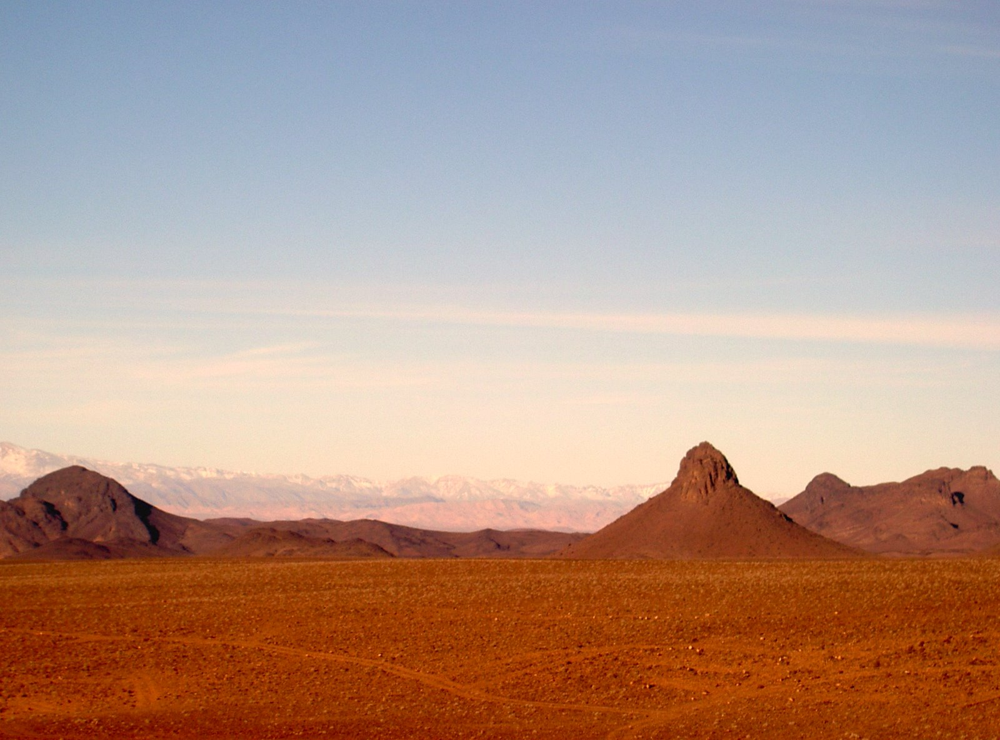

**Febrero 2006**

**Un paisaje lunar**

Los protagonistas: dos jóvenes jubilados, Charo y Arsenio que pasan algo de los sesenta, y una autocaravana Moncayo Nova Pulsar del 2002 (Fiat Ducatto 2,8 JTD) que cuando partió de Tánger el 20 de Enero tenía 70.131 Kmtrs. Y cuando regresamos al mismo punto, el 11 de Febrero, el cuentakilómetros marcaba 73.019. Hemos recorrido 2.888 kilómetros sin contar los otros 2 mil largos desde nuestro domicilio a Tarifa y regreso.

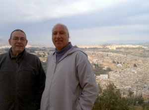

Hemos comprobado que Marruecos es un país de contrastes. Paisajes que van desde el verde de los campos de trigo recién nacido y de los palmerales de las cuencas de los ríos Draá, Ziz y Todrá hasta los grandes pasos de montaña del Alto y Medio Atlas y de los Montes Sarhro, las dunas del Erg Chebbi hasta el inmenso desierto de piedra.

Recorrimos varias ciudades imperiales, sus medinas, sus zocos, sus casbahs. Cada una de estas visitas justifica por sí misma el viaje. Hemos entrado en contacto con la sociedad y hemos experimentado buenas y no tan buenas sensaciones.

Leemos los relatos publicados en VEA, entramos en contacto con la Embajada de Marruecos en España. Contactamos para recabar información puntual de Toni, Iñaki, M.Carmen, Oscar y Piki, gracias a todos ellas, ellos, por su ayuda y paciencia.

Como guía básica compramos la Lonely Planet, el mapa Michelín 959 y cargamos la PDA con el OziExplorer y los mapas 1:250.000 de Marruecos digitalizados y calibrados cuya utilidad fue indiscutible.

Confeccionamos un recorrido: Asilah, Mequinez, Fez, Merzouga, Ouarzazate, Marrakech, Essaouira, Casa y Rabat, que al final cumplimos con el añadido del valle del Draá hasta Zagora y que comprende una variedad de aspectos paisajísticos, históricos y sociales.

Con Ahmed, el guía, al fondo la medina de Fez

**Las medinas**

Uno de objetivos del viaje era conocer las medinas. A pesar de haber leído bastante sobre el tema la realidad desborda cualquier idea preconcebida. La medina es un mundo en sí mismo. Un microcosmos autosuficiente que conserva una forma de vida milenaria. Cada medina es diferente pero mantiene una serie de elementos que la caracterizan en cada barrio: el horno de pan, la fuente, la mezquita, la escuela religiosa, la posada donde se establecen los negocios o los trueques, los baños y los diferentes zocos, uno por cada artículo.

**Los guías**

Nos habíamos creado la idea de que los falsos guías eran unas personas que se ofrecían, sin la correspondiente licencia, a acompañarte por una medina a cambio de una retribución negociada. Pues no. En torno a un turista gira una serie de personas cuya forma de vida se basa en el engaño y en la venta de una falsa hospitalidad. Una hospitalidad impuesta y remunerada que no tiene nada que ver con la hospitalidad real del pueblo. Por un lado la necesidad y por otro una economía emergente que se apoya en parte en el turismo al que hay que exprimir como si se tratara de una naranja hasta sacarle la última moneda.

Tampoco los guías oficiales cumplen con su trabajo. La única vez que contratamos a un guía oficial para visitar la medina de Fez, después de abonar la tarifa de 250 DH más la inevitable propina, Ahmed no nos perdonó ninguno de los artesanos de los que seguramente esperaba una comisión por nuestras compras. Nos tragamos a ceramistas, curtidores, tejedores o ebanistas… y perdimos la oportunidad de visitar otros lugares de más interés.

La medina de Fez es la única en la que está justificado prever un guía por su tamaño y la disposición de sus estrechas callejuelas. A pesar de ello, si se tiene tiempo por delante, lo realmente divertido es ir descubriendo por uno mismo los rincones con las indicaciones de alguna guía impresa. Si pierdes el camino, siempre queda el recurso de dar unas monedas a algún chaval para que te saque del laberinto. El único riesgo de deambular solos por una medina es soportar a los pelmazos que te agobian con sus demandas.

Ante esta actitud la mejor recomendación es la firmeza cortés: ¡Gracias no necesito nada! (¡Oualú!). El acoso de los falsos guías, cuya táctica es el interrogatorio para descubrir cuánto tiempo llevas en el país y tu potencial económico de compra, es una lacra que debe superar Marruecos para que el turista se encuentre cómodo.

**Algunos datos de interés**

No es necesario llevar agua en exceso hay abundante oferta, de garantía, por todo el país. La comida típica mas frecuente es la tajina, se trata de una cazuela de barro con una tapa cónica donde se cocina a fuego lento una serie de hortalizas entre las que predominan las patatas, las zanahorias, los guisantes y los calabacines. Cada tajina es diferente y deliciosamente especiada, puede incluir carne de carnero, novillo o cabra, incluso en la costa pescado. No hemos tenido problemas de digestión en todo el viaje a pesar de haber comido abundantemente.

Además de la tajina, el cuscús, las brochetas y la pastilla han sido también la base de nuestra comida en el país. Un buen método para alimentarse en viaje es parar en un pequeño pueblo frente a un establecimiento donde se ofertan tajinas sobre un fuego y consumirla en la auto acompañada de vino de nuestra propia bodega del que es recomendable ir bien provistos Hay pocos restaurantes que sirvan alcohol. En un lugar así, una tajina para dos personas puede costar 50 o 60 DH.

Las bombonas de gas españolas no pueden intercambiarse en Marruecos. Únicamente queda la posibilidad, en caso de necesidad, de adquirir una botella local y devolverla a la salida

El gasoil normal costaba sobre los 7.20 DH y el especial 230  a 8,4 DH. No es necesario tomar precauciones adicionales para el suministro. En las carreteras que circulamos no hay tramos de más de 100 kilómetros sin estación de servicio.

Al sur de Marrakech es inútil buscar una gasolinera o un restaurante que acepte tarjetas de crédito. Solo la aceptan algunos vendedores desesperados. Es necesario prever dinero en efectivo suficiente para hacer frente a los pagos.

La disposición de cajeros automáticos es abundante aun en poblaciones pequeñas. El cambio que hicimos en los bancos fue de 1 euro = 10,4 DH, el cambio de las disposiciones del cajero y las compras con VISA ha sido de 1 euro = 10,8 DH, la diferencia puede compensar la comisión bancaria por la disposición.

Mucha gente habla francés… pero el conocimiento del francés se limita intercambios simples y temas habituales. Paciencia, el lenguaje universal de los gestos y la buena disposición de la gente nos han ayudado, aunque es justo reconocer que se encuentran algunas personas que hablan aceptablemente el español.

A lo largo de las carreteras nos tropezaremos con multitud de vendedores de diferentes objetos: geodas pintadas con mercurio entre Ouarzazate y Marrakech, fósiles en el bosque de Cedros de Azrou, dátiles en la ruta de Zagora. Los vendedores se precipitan en la carretera saltando al paso del vehículo para ofrecer su mercancía con el consiguiente susto si te cogen desprevenido.

En las medinas la solicitud de un regalo es algo constante, y no basta con el pago pactado, siempre hay una petición explícita de una propina. También los niños y los no tan niños, además de los mendigos, solicitan espontáneamente un regalo. Lo mejor es evitar atender estas demandas, pues nunca disminuyen accediendo a ellas sino todo lo contrario.

Es cierto que hay una gran necesidad social. Si nos sentimos inclinados a ayudar, hay cauces más adecuados, como las ONGs que operan en el país o los centros de enseñanza y de atención médica, que seguramente estarán encantados de recibir donativos.

**Preparando el paso del Estrecho en Algeciras (20.01.2006)**

Nos presentamos en las oficinas de J.C. Gutiérrez y Susana, su hija, nos prepara los pasajes en el ferry rápido entre Tarifa y Tánger, 225 euros. El cuentakilómetros marca 70.131.

Embarcamos a las cuatro de la tarde y nos plantamos en Tánger en cincuenta minutos. A bordo entregamos a la policía los impresos cumplimentados de entrada que nos había facilitado Susana, y tras presentar el pasaporte y el impreso de importación temporal de vehículos que habíamos cumplimentado previamente por Internet, salimos en dirección a Asilah, nuestra primera etapa.

En Asilah nos situamos al borde de las murallas junto a una veintena de AC (10 DH). Se trata de una pequeña ciudad, tranquila y limpia, que conserva las murallas edificadas por los portugueses. Nos da tiempo a un paseo por el interior.

Asilah, salimos en dirección sur. Comemos tajina en un restaurante de carretera próximo a Sidi Kacem, Llegamos a Mequinez y nos alojamos en el camping Agdal. Visitamos la medina y los zocos.

**Mequinez (21.01.2006)**

A pesar de ir prevenidos, caemos en el viejo truco de la oferta de: “enseñarnos como se trabaja el damasquinado, solo mirar, sin compromiso” y acabamos comprando un kilim berebere que partiendo del exagerado precio inicial de 4.700 DH negociamos en 900 DH y por el que abonamos 1.045 DH al cargar la comisión de la VISA y 100 DH mas que el vendedor nos pide para comprar un kilo de carne para sus hijos y que alucinados acabamos entregando sin rechistar. Hemos recibido la primera lección.

Mequinez, camping Agdal. Visitamos el mausoleo de Muley Ismail, los graneros del palacio imperial y la medina.  Tenemos también el primer incidente con un falso guía al que sin solicitarlo se nos pega para exigirnos 40 DH por enseñarnos algo que está ya descrito suficientemente en la  guía. La medina de Mequinez y el recinto del palacio son interesantes y fáciles de recorrer sin perderte, es nuestra primera visita a una medina y nos parece fascinante.

Mequinez, camping Agdal. Pagamos 153 DH por dos días, los bloques sanitarios inutilizables que es lo mas frecuente en los camping. Podemos vaciar y llenar depósitos.

**Yacimiento arqueológico de Volúbilis**

Visitamos las ruinas de Volúbilis ayudados por un sol espléndido. El foro y los mosaicos que conservan algunas de las viviendas hacen interesante a las ruinas de uno de los establecimientos romanos en África. Las vistas del valle son espectaculares.

Continuamos viaje con la visita a Mulay Idriss y por una estrecha carretera llegamos a Fez donde nos alojamos en el camping “Le Diamant Vert”.

Compramos algunas verduras a un vendedor ambulante en la carretera para comprobar poco después que lo mismo cuesta tres veces menos en el supermercado de Fez.

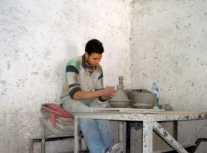

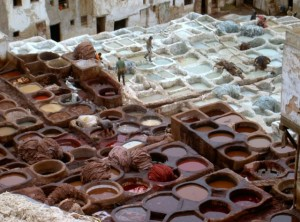

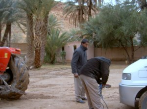

**Artesanía local.**

**Fez (24.01.2006)**

Camping “Le Diamant Vert”, a las nueve y media llega Ahmed, el guía que hemos solicitado el día anterior. Dice que no hay guías disponibles en español y pretende acompañar a otro matrimonio francés cobrando la tarifa completa a cada uno. El matrimonio francés se niega y Ahmed sale con nosotros solos en la autocaravana que estacionamos cerca de la medina.

La medina de Fez es intrincada con endiabladas callejuelas llenas de gente y con asnos enormemente cargados, como es habitual en todos los medios de transporte en el país, y que circulan a toda velocidad. Si no te apartas a tiempo te pueden arrollar como una locomotora.

Es notable la visita al barrio judío y su cementerio, a las curtidurías, cuya imagen difundida universalmente nos sorprende por su colorido. El cuero marroquí ha ostentado la fama de ser el mejor del mundo en especial las pieles de cabra dedicadas a la encuadernación. Los trabajadores se aferran a una forma tradicional de curtir las pieles.

Ahmed nos explica que la medina tiene cuatro barrios además de la Mellah cuyos habitantes emigraron a Israel en los años cuarenta. Nos acompaña a un telar, un alfarero, un taller de mosaicos, visitamos las curtidurías desde una terraza y la inevitable tienda de objetos de cuero adosada. De paso visitamos alguna madraza y mezquita.

Por encima de la proyección turística de los negocios de la medina, sus gentes mantienen una forma de vivir tradicional como si el tiempo se hubiera detenido hace mil años.

Cuando hablamos de un zoco nos referimos a un mercado pero en las medinas de las grandes ciudades, no podemos

**Los curtidores del zoco en Fez**

hablar de un mercado en general sino del mercado de las babuchas, o el de los tejidos o el de las especias, la fruta o el cuero.

Comemos los tres en el restaurante El Blida, cuscús, brochetas, pastilla y ensalada marroquí, excelente. (600 DH)

Ha amanecido con el cielo nublado ha llovido algo y hace frío. Hemos recorrido 427 km. Pagamos el camping, 160 DH y continuamos el viaje hacia el sur. Rebasamos Azrou y llegamos al bosque de cedros.

Renunciamos a visitar el Cedre Gouraud pues la carretera se estrecha por la nieve y aparecen placas de hielo. Está nevando mientras trepamos con la auto hasta cerca de los dos mil metros a través de un precioso bosque del que han desaparecido todos sus habitantes, desde las famosas monas de Berbería hasta los no menos famosos vendedores de fósiles.

En dirección al sur la carretera atraviesa algunos de los mejores paisajes del Atlas Medio y transcurre por altitudes superiores a los mil quinientos metros.

Atravesando Midelt y Rich, llegamos a las gargantas del Ziz después de pasar por el túnel del Legionario. Atravesamos Er Rachidia y la  “Source Bleue” de Meski y nos internamos en los palmerales del Oued Ziz. Nos alojamos en el camping Tissirt en pleno palmeral.

**Una grúa para todo.**

**Oued Ziz (26-01-2006)**

Camping Tissirt, Km. 30 de la carretera de Efroud. El termómetro marca tres grados, ha llovido toda la noche por primera vez en tres años. El camping está situado en una zona arenosa tras una pista de tierra de unos ciento cincuenta metros con una fuerte pendiente. Es una auténtica trampa para la AC que no puede salir por sus propios medios debido al barro que se ha formado con la lluvia.

Después de consultar con Europ assistance y Jorge García de Boker Segur, llamamos a un tractor conducido por un berebere como un armario de grande que nos remolca y nos saca a la carretera. El precio es de 350 DH innegociable.

Continuamos el camino hacia el sur pasando por Erfoud donde, según sus propios habitantes, se producen los mejores dátiles de Marruecos y llegamos a las dunas del Erg Chebbi en Merzouga a través de Rissani.

**Caminando por las dunas del Erg Chevi.**

**Merzouga (27.01.2006)**

Descartamos el albergue El Aiour por miedo a la pista de tierra y a la lluvia y nos alojamos en el albergue camping “La Tradition” al final de la carretera.

La presencia en la zona de numerosas autocaravanas ha hecho proliferar un tipo de negocio conocido como albergue camping. Se trata de restaurantes y albergues, algunos con el aspecto de Casbah, que en el propio parking aceptan la presencia de AC. Los servicios incluyen descarga de aguas grises manual, a cubos, y a veces suministro de electricidad. También a veces disponen de duchas con agua caliente.

Las dunas, con su colorido, y los dromedarios nos sorprenden componiendo una imagen que por sí misma justifica el viaje a pesar del cielo encapotado.

Contratamos una noche de vivac en pleno desierto, para ello nos montamos en sendos dromedarios bajo la guía de Ahmed y después de cincuenta minutos llegamos a la base norte de una gran duna. Al fondo se divisa una cordillera que es la frontera con Argelia y las tierras negras del desierto del que toma el nombre, Erg Chebbi (Dunas negras).

Mientras Ahmed nos prepara una sabrosa tajina de carnero, nos subimos a la cresta de la duna para ver anochecer. Tenemos mala suerte y el cielo está nublado, pero admiramos los cambios de color que van experimentando las arenas mientras, entre nubes, el sol se pone.

Regresamos a la base y cenamos en la haima con cabida para ocho personas que nos han asignado para nosotros dos solos mientras Ahmed y otros guía cantan al ritmo de crótalos y tambores.

Hace frío, a pesar de meternos en el saco de dormir vestidos, las mantas añadidas no impiden que el aire helado del desierto penetre hasta los huesos. Sobre el suelo, un delgado colchón de borra apenas mitiga algo la dureza del suelo arenoso.

A media noche ha habido un momento en el que se han despejado las nubes y millones de estrellas han aparecido en el firmamento, el espectáculo era fascinador. Echo de menos las linternas de frente que hemos dejado en la auto.

En algún lugar del Erg Chebbi, cinco de la madrugada, hace mucho frío. Escalamos otra vez la cresta de la gran duna para contemplar la salida del sol. El cielo se ha vuelto a cubrir pero podemos admirar una vez más cómo la luz va tiñendo de diferentes colores el mar de dunas hasta donde nuestra vista alcanza.

Ha sido una noche difícil de olvidar. Hemos soportado el frío y la incomodidad pero nos ha regalado un espectáculo que, por lo insólito, queda grabado en nuestra memoria. La experiencia también nos ha servido para intuir cuál es el tipo de vida que llevan los numerosos nómadas del desierto.

Regresamos a “La Tradition”. La excursión nos ha costado unos 450 DH incluido guía, dromedarios, la cena y el desayuno. Comemos y aún hacemos otra excursión, esta vez a pie hasta una gran duna que hay a una hora de marcha. Contemplamos una vez más el anochecer y nos acostamos con la sensación de haber experimentado algo de lo que nos acordaremos durante mucho tiempo.

Nos hemos quedado sin gas, tenemos que recurrir a la botella de 6 kilos de butano que llevamos de reserva.

Abonamos 200 DH, por dos noches todo incluido: una comida, las duchas y la electricidad, son las 8 de la mañana, estamos a seis grados, nublado, ha llovido algo por la noche, hemos recorrido hasta el momento 900  Km.

Continuamos el viaje hacia Goulmima donde visitamos el Ksar Goulmima, una aldea bereber amurallada. Un guía nos cobra 50 DH y nos conduce por un laberinto de estrechas callejuelas la mayoría cubiertas. Pasamos por el domicilio de una mujer separada que vive con su madre y una hija. Esta visita nos muestra la dura forma de vivir que tienen muchos aldeanos. Sabemos que la visita está preparada para los turistas, de todas formas se comportan de forma tan espontánea que por momentos nos sentimos receptores de una hospitalidad tradicional.

El guía nos muestra el palmeral y nos explica algunos aspectos interesantes sobre las explotaciones agrarias tradicionales como el cultivo de los dátiles y las tres cosechas consecutivas del regadío: trigo, maíz y arroz. En noviembre se recolectan los dátiles. Nos explica que muchas palmeras llegan a producir hasta 200 kilos y que algunas llegan a los 500. Continuamos la marcha hasta Aït Quaritane, donde nos alojamos en el camping “Atlas”.

El camping “Atlas”, cuesta100 DH con el desayuno. Nos dirigimos a las gargantas del Todrá. Es una enorme falla en la meseta que separa el Alto Atlas del Jebel Sarhro. Con una altura de 300 metros en su parte mas estrecha y una anchura de 10 metros impresiona por la mañana cuando el sol penetra hasta el fondo iluminando la roca con tonos que van del el rosado al ocre profundo.

Un largo paseo por la carretera nos lleva hasta el nuevo albergue camping “Le Festival” a dos kilómetros de la “Petite  Gorge” que sirve de base para treeking y escalada.

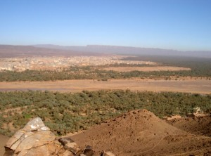

**Ourzazate (30.01.2006)**

Continuamos el viaje y llegamos a Ourzazate. Visitamos la Casbah de Taourirt cuyo exterior es muy interesante, y también visitamos la cooperativa de tapices a precio fijo.

Un grupo de mujeres trabaja en los telares. Nos explican que hay dos tipos de lana de oveja, una, la que se obtiene al esquilar las ovejas vivas y otra procedente de las pieles de los animales sacrificados. Esta última tiene un fuerte olor que se mantiene en el tiempo. También nos indican que hay tapices confeccionados con seda, con pelo de cabra y de camello.

Las alfombras de nudos cuestan a 750 DH el metro cuadrado, esto ya es una referencia. Los Kilim pueden tener diferentes precios dependiendo de la calidad, tipo de lana y del trabajo de bordado. Compramos una chilaba de invierno por 550 DH, es de buena calidad y de mi tamaño, pero tenemos la sensación de que nos hemos dejado engañar.

Camping Municipal de Ouarzazate. Llevamos recorridos 1.72  km. Intentamos recargar la bombona en el almacén territorial. Nos dicen que es imposible y tenemos que recurrir a un invento para acoplar una bombona de butano marroquí.

Continuamos el viaje hacia Zagora a través del Tizi-n-Tiniffift rebasando la cota de 1660  metros; descendemos hacia Agdz (se pronuncia Agadez). Ante nuestros ojos aparece el inmenso palmeral del Oued Draá. En el descenso soportamos un fuerte viento que nos hace redoblar las precauciones, en el horizonte se vislumbra una nube que nos indica una tormenta de arena.

Nos alojamos en el camping “L’Oasis Enchanteé” en El Arroumiat a dos kilómetros de Zagora. Un paseo de una hora por palmeral al atardecer nos relaja y nos pone en buena disposición para dormir. Estamos solos en el camping.

**Zagora desde el Jbel Zagora, Qued Draa**

**Zagora (31-01-2006)**

Amanece con una temperatura de dos grados. Nos dirigimos a Zagora donde aparcamos. Subimos en hora y media a la cima del Jbel Zagora a 974 metros de altitud. El paisaje es extraordinario, la superficie de roca negra calcinada por un sol implacable, debajo la arcilla roja.. El inmenso palmeral del valle del Draá se extiende sobre el cauce del Oued Draá y a ambos lados el gran desierto de piedra, la hamada.

El inevitable guía que nos ha conducido al parking nos cobra sus servicios llevándonos a una tienda de objetos de cambio “La Cueva del Truc”, intento cambiar la emisora de CB por un kilim y solo consigo quedarme con el kilim y la emisora y sin 700 DH, pero esta vez creo que hemos hecho una buena compra. En la tienda podemos admirar objetos antiguos como arcones de boda y puertas beréberes de cedro decoradas con latón, plata labrada y huesos de camello, auténticas joyas, cuyos precios de salida superan los 6.000 euros.

Regresamos hacia Ouarzazate atravesando otra vez el Tizi-n-Tiniffift con la intención de llegar hasta Aït Benhaddou, donde nos alojamos en el patio del café Auberge Fouddoud mientras las montañas del Alto Atlas se iluminan al anochecer en la lejanía.

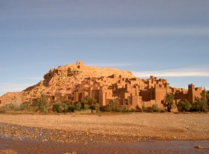

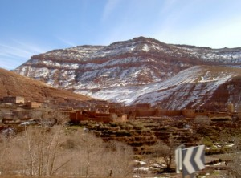

**Ksar de Aït-Ben-Haddou**

**Aït-Ben-Haddou (01-02-2006)**

Son las siete de la mañana y el termómetro marca menos de cuatro grados, amanece soleado. Nos dirigimos a la Casbah, pero el río ha crecido y es necesario utilizar un asno para vadearlo. Mientras estudiamos la forma de aproximarnos se nos acerca un anciano con gafas de diseño y capa berebere sometiéndonos al ritual que vamos conociendo poco a poco: “Bon Jour”, “Sa va?”, “Francais?”, “Oh! Espagnol, du Madrid?”, “Oh! Pais Basque!, Soyez bienvenues!”, así es como se te pega un falso guía que pretende llevarse una propina por una explicación que generalmente no es necesaria y por un trabajo que no hemos solicitado ni siquiera ha sido ofrecido sino impuesto. Este guía se conforma con los 40 DH que le ofrezco.

Desistimos atravesar el río y visitar la Casbah a pesar de que los guardianes de los asnos, como quien no quiere la cosa, han traído uno digno de mi tamaño y nos conformamos con contemplar los edificios perfectamente armonizados con el entorno que exponen una forma de vivir de una sociedad antigua pero actual.

Este conjunto de Casbashs es uno de los mejores conservados de toda la región del Atlas ya que ha recibido

**Por el impresionante Tzi-n-Tichka**

financiación por haber sido escenario de una veintena de películas y que cuenta con la proximidad de los estudios de cine de Oauarzazate donde se han rodado varias películas de gran presupuesto como Gladiador. Estos estudios se pueden visitar cuando no se rueda una película.

Continuamos el camino hacia la Casbah de Tamdaght, distante a siete kilómetros, pero cuando la tenemos a la vista nos encontramos con un puente derruido y los vehículos tienen que vadear el río. Nos damos la vuelta y emprendemos el camino hacia Marrakech.

Pasamos el impresionante Tizi-n-Tichka, que había estado cerrado un par de días. La carretera está despejada aunque hay tramos con nieve y hielo. Llegamos a Marrakech sobre las tres de la tarde y nos alojamos en un parking vigilado cerca del minarete de la Koutoubia.

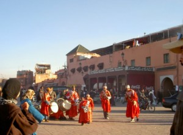

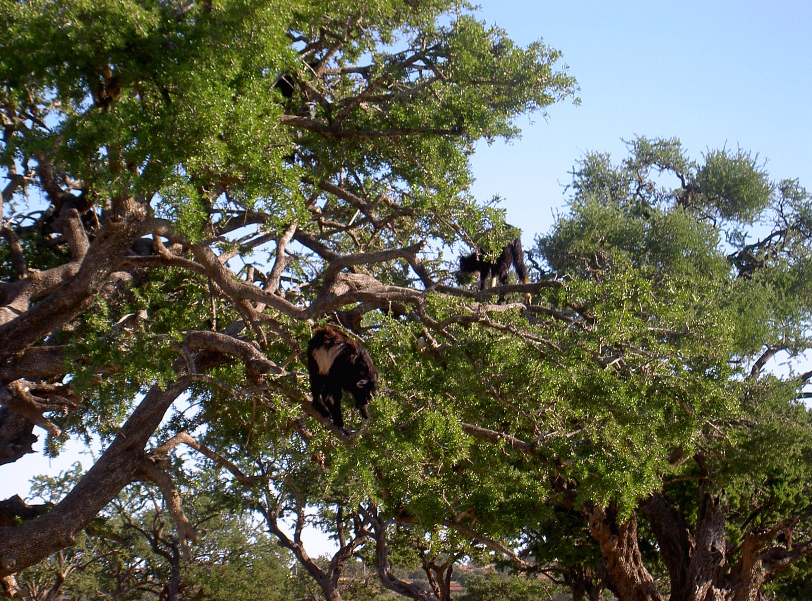

**<Danzantes en la plaza Djemaa El-Fnag**

**Marrakech 31º37’26,76’’N / -7º59’46,32’’W (02-02-2006)**

El famoso monumento de la Koutoubia, al suroeste de la  plaza Djemaa el-Fnag, con su minarete de 70 metros domina la ciudad. Construida por Yusuf Al Mansur (1184-1199), es el mas antiguo y mejor conservado de los tres minaretes mas famosos que se completan con la Tour de Hassan en Rabat y la Giralda de Sevilla.

Hacemos una visita a la plaza Djemaa El-Fnag y quedamos impresionados por el ambiente al atardecer. Desde la terraza de un café podemos contemplar a los acróbatas, encantadores de serpientes, danzantes, comparsas y sobre todo el espectáculo de los restaurantes al aire libre que se montan al atardecer para desmontarlos después de cenar.

Son las nueve de la mañana y el termómetro llega casi a los 11 grados, hemos recorrido ya 1.651 km. Un autobús descubierto por 260 DH nos lleva por los alrededores de la medina y la ciudad moderna, no merece la pena.  Al regreso damos una vuelta por el interior de la medina y sus zocos, es fácil orientarse. Reservamos hora para una visita a un hammam por la tarde.

En la visita tenemos el segundo incidente con un falso guía: se nos acerca un individuo que dice que trabaja en el hammam y nos indica el camino a las curtidurías que deseábamos visitar. Nos dice que vive por allá, el caso es que cuando llegamos nos está esperando otro individuo al que nos presenta y nos enseña las tinas donde se curte y tiñe el cuero. Lo cierto es que ya habíamos visitado las de Fez y las de Marrakech son menos curiosas. El objetivo de ambos individuos es la visita a la tienda de cueros.

Después de una tremenda discusión con el dueño porque al final nos fuimos sin comprar nada a pesar de la enorme presión que hizo para vendernos unas babuchas, el que nos enseñó las curtidurías viene a exigir dinero por sus servicios. Resignado le ofrezco 40 DH y se siente ofendido por el dinero que le ofrezco. Al final le dije que nada y si quería lo podíamos discutir en la policía.

Fue una escena muy desagradable, la del tendero y la del guía. Comemos en el restaurante “El berebere”, el cuscús y la pastilla nos cuesta 180 DH. Visitamos las tumbas Saaddíes, una extraordinaria muestra del arte andalusí, los estucos, la marquetería y los mosaicos son unas autenticas obras de arte. La sala de las doce columnas en el centro está considerada como uno de los más bellos exponentes de este arte procedente de la España árabe.

A media tarde acudimos al hammam El Bacha, baño de vapor, enjabonado, “peeling” con un guante de crin y un masaje relajante nos deja como nuevos y la piel como la de sendos infantes. Este servicio cuesta 700 DH, incluida la inevitable propina.

Son las ocho de la mañana y el termómetro marca nueve grados, luce el sol. Tomamos el camino de Essaouira. Cuando

**Las cabras subidas al los arganieres.**

nos faltan unos treinta kilómetros para llegar observamos como unas cabras están subidas a las ramas de unos árboles que no conocemos. Esto nos hace recordar algo que habíamos leído en Lonely Planet acerca de un árbol de cuyas simientes de extrae un aceite que tiene unas propiedades nutricionales y cosméticas muy interesantes. Se trata del argán.

Al pasar por el pequeño pueblo de El Hanchane vemos que hay un discreto cartel que anuncia la cooperativa de mujeres El Kheir. En el local, unas sesenta mujeres se dedican a extraer aceite de las pequeñas nueces del argán. El proceso, en cadena de producción, es de lo más primitivo. Un grupo de mujeres van retirando una a una, a mano, la envoltura seca y carnosa del fruto que sirve de alimento a las cabras y extraen la nuez del tamaño de una almendra y con la forma de una bellota. Otro grupo de mujeres van rompiendo con un canto rodado la cáscara y separando una a una la semilla.

A partir de esta semilla se puede extraer el aceite no apto para el consumo por el sabor amargo pero con unas propiedades antioxidantes muy notables para tratamiento de las arrugas y la prevención del envejecimiento de la piel. El aceite para el consumo se extrae de las semillas tostadas. Una mujer controla el único detalle moderno consistente en dos infiernillos de gas, donde se tuestan las almendras en sendas ollas de barro y finalmente otra mujer tritura las almendras hasta extraer el aceite en un curioso molino de piedra que mueve a mano.

El aceite cosmético cuesta sobre 90 DH los 100 ml. El aceite de alimentación lo compramos en una casa particular donde las mujeres complementan su economía extrayendo aceite. El costo de un litro así obtenido es de unos 80 DH comprado en una casa particular de Ida Ourgoud. Extraer un litro de aceite a una mujer sola le cuesta unas ocho horas de trabajo. Para elaborar un litro de aceite cosmético se requiere la cosecha de un árbol, unos 100 kilos de semillas.

El argán (Argania spinosa L) es un árbol endémico de la zona de Essaouira y Agadir, y no se cultiva, según manifestaciones de los lugareños en otra parte en el mundo. La producción anual de aceite de argán en Marruecos se calcula en unas 4.000 toneladas y se exporta a Europa y sobre todo a EEUU donde sus propiedades son muy apreciadas. La recolección de las semillas se realiza en el mes de Junio. Las hojas son un bocado exquisito para las cabras por lo que es frecuente verlas subidas a las ramas.

A media tarde llegamos a Ida Ourgoud a 18 kilómetros de Essaouira y nos alojamos en el camping “Le Calme”, excelentemente preparado en un arganier y el entorno y las instalaciones hacen honor a su nombre.

**La playa de Essaouira**

**Essauira (04-02-2006)**

Camping “La Calme”, cielo parcialmente cubierto, al sol hace calor. Nos desplazamos a Essaouira porque nos hemos quedado otra vez sin gas. En Marruecos hay varias compañías que comercializan GLP, se les distingue por el color de las botellas, la nuestra es naranja y de ésas no hay en Essaouira. Nos mandan a cambiarla a Marrakech pero consigo que un distribuidor acceda a cambiárnosla abonando la diferencia.

Nos dedicamos a disfrutar del sol y de la calma tomándonos un día de merecido descanso.

Son casi las nueve el termómetro marca algo mas de veinte grados, luce el sol. Nos dirigimos a Essaouira aparcando frente a una preciosa playa en la bahía (20 DH ) en compañía de otras veinte autos.

Un paseo de un par de horas nos abre el apetito para comer en uno de los puestos al aire libre del puerto. Un sargo, una centolla a la brasa con ensalada y una docena de erizos de mar nos cuesta 230 DH. Otro paseo y desde la propia auto contemplamos un anochecer de ensueño.

Essaouira es una bonita ciudad costera con una medina muy bien dotada y conservada y fácil de recorrer. Dispone de varios zocos donde los de las frutas, carne, pescado y verduras están muy bien surtidos. Se puede encontrar también buenos puestos de carne. En definitiva es una localidad excelente para pasar unos cuantos días si el tiempo acompaña.

Son las siete y media y el termómetro marca casi diecinueve grados. Partimos hacia Casablanca por la carretera de la costa atravesando Safi y El Jadida, el paisaje es fantástico. Los arenales de las playas se alternan con franjas cultivadas donde se ven grandes cosechas. Los bosques de argán dan paso a los pinos y éstos al monte bajo y la jara. Todo está verde y se ven descargar grandes cantidades de tomates, nabos, cebollas y zanahorias. La carretera es aceptable y la circulación escasa. Llegamos a Casa sobre las cuatro y media de la tarde y nos alojamos en el camping “El Oasis”.

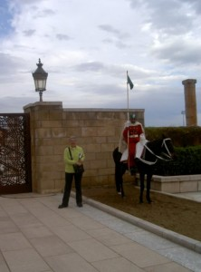

**Grandioso**

**Casablanca (08-02-2006)**

Camping “El Oasis”, (70 DH). Nos desplazamos con la auto hasta la gran mezquita de Hassan II en cuyas inmediaciones estacionamos sin dificultad. Fue construida en 1993 para conmemorar el 60 aniversario del anterior rey.

Dejando a un lado sus dimensiones que son ya de por sí extraordinarias para una mezquita. La longitud de la nave de oraciones, con cabida para 25.000 participantes o su minarete de 210 metros, el mas alto del mundo. Pero lo mas sorprendente y digno de admiración es el trabajo de los artesanos procedentes de los lugares tradicionales en Marruecos. El estuco, la marquetería en madera de cedro y los mosaicos son la expresión de un arte que no se ha perdido con el tiempo.

En la visita nos detenemos para admirar la decoración de las fuentes, las inmensas puertas de bronce, las salas de abluciones, las celosías exquisitamente labradas del espacio de oración para las mujeres. Los baños y las salas de abluciones son impresionantes.

El costo, sufragado por suscripción pública fue de 500 millones de dólares y el impacto social enorme donde junto con algunas críticas sobre el destino del dinero constituye un emblema para los marroquíes en especial los habitantes de Casa. Desde un punto de vista social se puede considerar una muestra entre las obras de arte construidas para perpetuarse en la memoria de un personaje con poder.

Terminada la visita salimos de Casablanca con destino a Rabat alojándonos en Salé situada al otro lado del estuario del Oued Bou Regreg que separa Salé de Rabat.

Visitamos la medina de Salé y padecemos un incidente más con falsos guías. Mientras deambulamos se nos acerca un muchacho que nos indica la dirección de la Gran Mezquita, le agradecemos el detalle y le indicamos que nos gustaría seguir solos la visita. Nos contesta que él vive allá y que no le cuesta trabajo darnos indicaciones. El caso es que nos resignamos a que nos acompañe y nos lleva por la medina, admiramos el minarete de la Gran Medina construida en el S XII y la madrassa que está cerrada. Nos negamos a entrar en un taller de alfarería y al cabo de una hora de visita decidimos que estamos cansados y nos queremos retirar.

Le ofrezco 40 DH en agradecimiento por sus indicaciones y nos dice que sus honorarios son 100 DH. La bronca que le armé fue equivalente al enfado que tenía, sobre todo conmigo mismo pues era la tercera vez que caía en la trampa como un principiante. Al final tuvo que aceptar de muy malas formas los 40 DH que le había ofrecido.

Nos alojamos en el camping de “La Plage” y comentando con un compañero autocaravanista francés nos indicó que la palabra mágica es “Oualú”, es decir: “No necesito nada”, lo mismo que la palabra “Ouajá”, quiere decir “De acuerdo”.

Tomamos un “Grand Taxi” a Rabat (30 DH) y visitamos la  torre Hassan que es el minarete de una mezquita construida

**Rabat, Mausoleo de Hassan**

en 1195. El proyecto inicial de llegar hasta los 60 metros fue abandonado quedando en unos bellísimos 40  metros. Junto con el mausoleo de Mohamed V, ambos constituyen los monumentos más representativos de Rabat.

Hacemos una visita al departamento de cartografía donde adquirimos algunos mapas de Marruecos a escala 1:250.000. El personal de oficina despliega una considerable desconfianza a los potenciales compradores de cartografía extranjeros.

Nos desplazamos a la medina para visitar la Casbah des Oudaias y la puerta almohade Bab Oudaia que es la parte mas antigua de la ciudad y tenía funciones defensivas.

Nos paseamos también por diferentes zocos, en especial el de frutas y verduras donde hicimos acopio. “Oualú” funciona, nos hemos quitado de encima un par de guías.

Visitamos el museo arqueológico. Un pequeño museo poco dotado de medios que exhibe algunos hallazgos de los campamentos romanos en Marruecos así como algunas piezas arqueológicas diversas. Destaca la sala de bronces que presiden sendas cabezas de Juba II y Catón procedentes de Volúbilis.

Continuamos el viaje y llegamos a Asilah. El parking de la muralla está vacío, nos situamos en una campa frente al puerto junto a una docena de autos. Nos comentan que hacía una semana que cerca de doscientas autos han organizado tal atasco que las autoridades locales han prohibido pernoctar en la muralla.

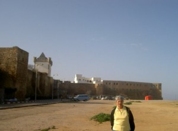

**Parking de Asilah, han echado a las autocaravanas**

**Asilah (10-02-2006)**

Son las ocho y media, el cielo está parcialmente despejado, ha llovido por la noche. Un largo paseo por la orilla del mar y el puerto nos abre el apetito para comer en Casa García. Un calderete especiado con all i oli aromatizado con azafrán nos despide con honores de la cocina marroquí oficiada por un español.

Continuamos el camino hacia Tánger donde llegamos sobre las cuatro de la tarde. Los trámites de la aduana se complican pues no encontramos los impresos de la importación temporal del vehículo.

Nos dicen que tenemos que hacer un parte de pérdida y que lo tendremos que enviar a Rabat. Al final un funcionario accede a revisar los impresos de entrada del día 20 de Enero entre los que aparecen las tres copias correspondientes a nuestra autocaravana. ¡El funcionario había olvidado entregarnos nuestros ejemplares a la entrada!.

Embarcamos a las siete de la tarde en el ferry de las seis después de ser actores en la representación del caos que se organiza cada vez que se llena un barco. Probablemente los responsables se entrenan para hacerlo cada día peor.

Llegamos a las ocho de la noche a Tarifa donde pernoctamos en una de las calles que acceden al puerto y damos por concluido nuestro primer viaje a Marruecos. Hemos recorrido 2.888 kilómetros.

Estamos fascinados por el viaje, solo tenemos claro una cosa: queremos volver para pasar mas tiempo en unas fechas cuyo clima sea mas propicio.

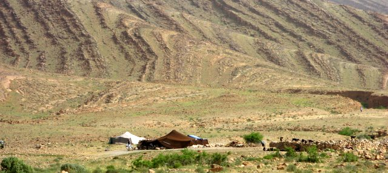

**Vida en las montañas plegadas del Atlas**

Marruecos es uno de los destinos míticos para los autocaravanistas europeos. Un destino que juega con diferentes sensaciones en las que el reto, el misterio y la curiosidad se entremezclan. Además, el clima y el poder adquisitivo son los motores que impulsan a unos miles de jubilados europeos a prolongar estancias de unos meses en la temporada que comienza en octubre y finaliza en mayo del año siguiente.

**Marruecos2010**