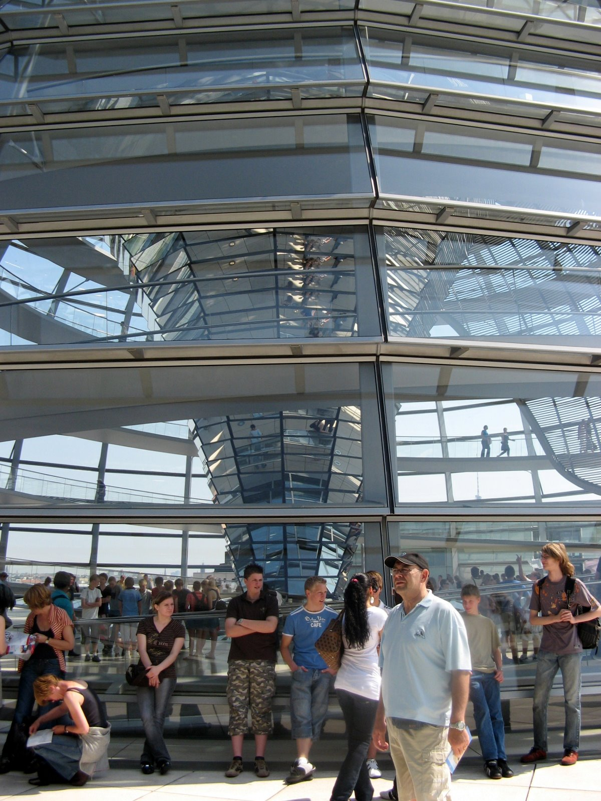
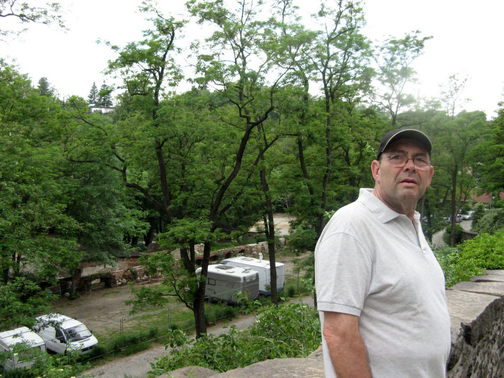

# Alemania y Polonia
## 2007, 17 mayo - 7 junio

Alemania es un país fascinante para un latino, su cultura y patrimonio histórico están ligados a la historia de Europa. Por otra parte, Polonia es un país que acaba de incorporarse a la Unión Europea y algo desconocido en nuestras latitudes. Conocer algo de estos países ha sido el objetivo del viaje.

Este viaje lo hemos preparado basándonos en los relatos de Pepe Hermo “Pepiño”en el verano de 2004 y de Iñaki Calvo “Bikote” en las mismas fechas de 2006 (Viajar en Autocaravana). Éste último tiene como objetivos principal visitar lugares de Alemania que han sido declarados Patrimonio de la UNESCO. También hemos incluido en el proyecto una breve visita a Polonia, un país, para nosotros exótico y misterioso que despierta nuestra curiosidad.

 

**Inmensos palacios y jardines**

El itinerario previsto atraviesa Francia por el eje de París, desde Hendaya, y Bélgica para comenzar la visita en Aachen (Aquisgrán). Contamos con la ayuda inestimable de una PDA hx2490, con el TomTom 6 y los mapas de Europa, incluidos los países del Este.

Las etapas y los puntos de pernocta han sido planificados en parte por la experiencia de Pepiño y Bikote, en parte por la guía ADAC Stellplatz Fürrer y complementado con la información sobre camping de la Embajada de Polonia en España. Todos los puntos han sido cotejados con la ayuda del Google Hearth, convertidos en POIs y transferidos al TomTom con el programa gratuito Tyre.

La guía de Alemania, de Lonely Planet, ha servido de apoyo para la planificación y para la realización del viaje así como los planos de carreteras de Michelín, 718 de Alemania y 731 de las repúblicas Checa y Eslovaca que contiene información sobre Polonia. Las áreas de Francia han sido seleccionadas de la web Camping Car Infos.

Es imposible describir los lugares visitados con la maestría de Pepiño, Bikote y otros compañeros que hay publicado el relato de sus viajes con anterioridad en las diferentes web, por lo tanto nos limitaremos a describir el recorrido, los lugares de etapa y los recursos utilizados con la esperanza de que a otros compañeros les sea de utilidad en el futuro.

 

**Acercándonos al destino, 14.05.2007.**

En la primera etapa del viaje, pernoctamos en el área para AC de Villaines-les-Rochers (47º13’16.896”N/0º29’43.548”E). Es un lugar bonito, seguro y tranquilo. Nos hemos propuesto hacer etapas de un máximo de 600 km evitando las autopistas de pago. Sin embargo, el tráfico y la configuración de la N10 entre Hendaya y la salida 10 obligan a tomar la autopista pues de otro modo el recorrido se hace eterno por las innumerables travesías de población.

En la segunda etapa llegamos al área para AC de Babay gracias a los POI del TomTom (50º18’0.144”N/03º47’43.836”E), cerca de la frontera con Bélgica.

15.05.2007. La tercera etapa no sitúa en el área de Aachen (Aquisgrán). Está situada a quince minutos a pié del centro histórico de la ciudad. Es un lugar perfectamente acondicionado para etapas breves, sombra, suelo llano y con hierba entre celosías de cemento. Un par de baños y un par de duchas, así como lugares para el vaciado y llenado de depósitos cómodo y accesible. Estamos alojados un par de docenas de autocaravanas y unas cuatro o cinco caravanas.

Visitamos la catedral con la capilla original del palacio de Carlomagno, patrimonio de la UNESCO desde 1978. Completamos la visita con la Altstadt que incluye el Rathaus (Ayuntamiento).

Aquisgrán ha tenido un papel preponderante en la historia de Europa. Situada cerca de las fronteras de Bélgica y Holanda fue convertida en una importante ciudad por Carlomagno instalando la capital del Imperio Franco a finales del S.VIII.

 

17.05.2007, En Köln amanece lloviendo, en el parking de la calle  Adam-Stegarwald-Strasse (50º57’03.29”N/6º59’27.63”E), donde nos alojamos sin problemas guiados por el relato de Pepiño.

Es indudable que Colonia posee uno de los edificios religiosos más impresionantes de Europa, la  Kölner Dom. A la majestuosidad de las agujas de las torres y su estilo gótico francés, hay que añadir los innumerables tesoros que contiene: las vidrieras, el crucifijo de Gero, la sillería del coro y el sepulcro de los tres Reyes Magos.

Los más de quinientos escalones que llevan a la torre nos dejan las piernas para el arrastre pero nos permiten contemplar un panorama insólito desde el campanario en el que está anclada la campana Pedro cuyo peso es de 24 Tm. La visita se completa con las iglesias románicas de Gross St.Martín, St.Maria im Kapitol y la espectacular St.Gereon con sus fascinantes frescos. Hemos comido en una Brietgarten.

18.05.2007. Salimos temprano hacia Brühl, estacionamos en el parking del palacio de los Ausburgo (Schloss Augustusburg), patrimonio mundial de la UNESCO del que visitamos los impresionantes jardines de estilo francés.

Partimos hacia Hannover después de comer. Llegamos a media tarde con sol. Estacionamos en MittelStrasse (52º22’09.33′N/9º43’36.43”E), en un lugar bonito y tranquilo. Con las bicis hacemos un largo recorrido por el borde de un lago.

19.05.2007. En Hannover otra vez el tiempo amenaza lluvia y nos disponemos a recorrer el Alstadt a pié. Como es jueves se ha montado un curioso mercadillo en el que se ofrecen todo tipo de objetos. Nos parecen interesantes la Marktkirche y el Neues Rathaus en cuyo ascensor curvado montamos para acceder a un mirador desde donde se divisa una bonita panorámica de la ciudad.

A continuación tomamos el suburbano y nos desplazamos hasta los Herrenhäuser Gärten. Paseamos durante un par de horas por el Grossen Garten y visitamos también la gruta de Niki de Saint Phalle.

Nuestra impresión es que Hannover es una ciudad que proporciona una alta calidad de vida a sus habitantes. Parques, servicios y jardines que hacen de ella una ciudad viva y participativa. Volvemos a disfrutar de una nueva noche tranquila en plena MittelStrasse.

 

20.05.2007. En Hildesheim aparcamos cerca de centro (52º8’19.42’’N/9º57’15’’E) y visitamos a bordo de nuestras bicicletas el núcleo comercial. La Markplatz felizmente reconstruida en 1980 cuyo único elemento original es una fuente situada frente al Rathauss. La St.Michaeliskirche, Patrimonio mundial de la UNESCO estaba cerrada al público por obras. De la visita a la Dom, destacan los impactantes bajorrelieves originales de la puerta, de 5 metros de altura que se salvaron milagrosamente del bombardeo aliado del 22 de marzo de 1945.

Después de comer salimos hacia Wolfenbütel donde estacionamos en el parking del castillo. La visita al pueblo es una delicia cada casa compite con la de al lado en belleza y originalidad. La idea primitiva era quedarnos a pernoctar en el parking del castillo, pero como estábamos solos nos pareció un poco llamativo y como quedaban un par de horas de luz, decidimos continuar hasta Wenzlow donde pernoctamos sin problemas en una de sus calles (52º17.934’N/12º26.774’E).

21.05.2007. Llegamos al parking de autocaravanas de los jardines de Sanssouci, en Potsdam, sobre las 10 de la mañana (10 euros, cuatro horas, 2 euros cada hora suplementaria y 10 euros la noche de 20:00 a 08:00 horas).

Tomamos un pequeño autobús que nos desplaza por el impresionante entorno de jardines y palacios. Posteriormente, y aunque está estrictamente prohibido, imitando a otros visitantes, nos damos una vuelta en bicicleta disfrutando de la sombra de los árboles, pues hace bastante calor.

El parque es un extenso espacio situado al oeste de la ciudad donde se han construido varios palacios, el Schloss Sanssouci, rococó, con el jardín siciliano. El Orangeriesscholoss, el Neues Palais, barroco y el Schloss Charlottenhof.

En el Altstadt se encuentran las puertas del S.XVIII y el pintoresco barrio holandés que lo forman algo mas de un centenar de viviendas de ladrillo rojo construidas por trabajadores de esta nacionalidad en el S.XVIII.

 

**En el interior de la cúpula del Bundestag**

21.05.2007. Salimos después de comer y llegamos al área de pernocta de ChausseeStrasse en Berlín (52º32’15.75’’N/13º22’21.42’’E) a media tarde. Se trata de un área privada de pago, como la de Aachen aunque no tan bien acondicionada, en la que se albergan una treintena de autocaravanas y un par de caravanas. Dispone de váteres y duchas  y unas plazas muy justas, pero situada en el centro de Berlín.

Tomamos las bicicletas y nos vamos directamente a visitar el Bundestag, desde cuya cúpula se divisa una magnífica perspectiva. A pesar de salir temprano tuvimos que aguantar una hora de cola pero mereció la pena. El resto de la mañana la dedicamos a tomar contacto con una gran ciudad en la que la bicicleta es un medio de transporte muy importante. Al circular por sus calles nos permite tomar el pulso a una ciudad cuya trayectoria en los últimos 70 años ha sufrido una serie de cambios importantes al ser escenario de unos acontecimientos claves en la historia de Europa.

Un paseo por EbertStrasse nos conduce desde la puerta de Brandenburgo hasta el museo Pérgamo que visitamos. Se trata de un museo muy interesante sobre restos arqueológicos romanos y asirios. Comemos en una biergarten y regresamos a media tarde cansados y felices.

Al día siguiente volvemos a tomar las bicicletas temprano y pedaleamos a través de la FriedrichStrasse hasta llegar al Checkpoint Charly y visitamos los restos del muro de Berlín y los alrededores. A la vuelta visitamos la Dom y nos perdemos en el Tiergarten.

No es suficiente con relatar las impresiones de los lugares visitados, la propia ciudad es el objetivo y la clave es su muro. Un muro que ha sido el protagonista de un profundo drama dentro de la llamada guerra fría y que sólo visitando el lugar nos podemos dar cuenta de su dimensión y significado al margen o a pesar del folklore turístico montado que se escenifica en el propio CP Charly o en la puerta de Brandenburgo.

Una vez concluida la visita a Berlín nos desplazamos hasta Cottbus donde hay un extenso lugar de estacionamiento señalado en los POIs de CCinfos (51º45.345’N/14º19.012’E).

 

**La plaza central de Wroklaw**

24.05.2007. Llegamos al camping nr 117 en Paderewskiego, 35 en Wroklaw, (51º07’05.77’’N/17º05’24.79’’E). Se trata de un camping con pocas instalaciones pero con espacios inmensos, hierba bien cuidada y abundante sombra arbolada.

Un tranvía nos lleva al centro de la ciudad que visitamos. Es difícil expresar la impresión que nos ha causado. En el centro, descuidado, coexisten edificios medievales junto a bloques de cemento típicos de la época en que Polonia pertenecía a la esfera soviética. Hay cantidad de iglesias, de fábrica de ladrillo, suntuosas y recargadas pero oscuras y sin la grandiosidad de las catedrales occidentales.

Es el día del Corpus Christi y es festivo. En todas las iglesias se celebran misas continuamente y la imagen del fallecido papa Wojtyla está omnipresente. Los oficios se celebran con la liturgia anterior a la reforma de Juan XXIII. Algunas en latín, otras de espaldas al pueblo y con simbología y ritos que hace tiempo han sido abandonados en la liturgia católica de otros países como España.

25.05.2007. Casi todo el camino entre Brelavia y Cracovia transcurre por una autopista, gratuita excepto un tramo al final (4 euros). Pero entre el mal estado del piso y las infinitas obras que se realizan y los consiguientes atascos empleamos casi todo el día para llegar.

El camping es el Krakowianka, en Borek Talecki, (50º0’54.70’’N/19º55’31.22’’E) y está situado en las afueras, en una zona verde y arbolada. Está medio vacío y aunque la recepción es algo mas moderna que el anterior y hasta hablan algo de inglés, tiene menos servicios, eso sí, las instalaciones están limpias y cuidadas. Sin embargo carece de servicios para autocaravanas. El vaciado de depósitos es casi inaccesible, así como el vaciado del váter que carece de grifo para la limpieza del casette y es imposible encontrar un grifo de agua para llenar el depósito.

26.05.2007. A pesar del catarro y del consumo desaforado de pañuelos y pastillas Juanola, nos decidimos a visitar en centro de la ciudad cuyo casco antiguo ha sido declarado patrimonio mundial de la UNESCO. El tranvía 8 nos deja en pleno centro. Se percibe que esta ciudad tiene un número mayor de visitantes y que tanto el comercio como los servicios están orientados al turismo.

Se trata de un casco antiguo mejor conservado pero con edificios grises de cemento en algunas zonas. Prácticamente en cada manzana hay una iglesia del mismo estilo. Gótico o neogótico de fábrica de ladrillo. Un ladrillo rojo oscuro y triste. Con interiores recargados en el peor concepto del barroco. Cada iglesia celebra una misa detrás de otra y como no está permitido visitarlas durante los oficios solo se nos permite asomarnos al interior.

Visitamos Wawel que es una colina bañada por el Vístula en el centro de la ciudad y que contiene una fortaleza y la catedral de St.Stanislaus con las tumbas reales en su cripta cuyos elementos más antiguos están datados en el S XI.

Un poco mas al oeste está situado el barrio de judío Kazimierz, lugar donde se filmó “La lista de Schlinder”. Repoblado de nuevo a partir de que la tragedia de la segunda guerra mundial exterminara prácticamente la población judía. En él se pueden visitar los cementerios, las sinagogas y los museos que mantienen viva a la memoria histórica.

Tanto en Breslavia (Wroklaw) como en Cracovia (Krakow) las iglesias disponen de unos excelentes órganos y podemos comprobar que también de unos buenos intérpretes. Nos retiramos después de una comida en un restaurante del centro (22 euros con el café).

 

**Torres sobre el Vístula**

27.05.2005. Tardamos bastante en llegar al santuario mariano de Czestochowa porque la salida de Cracovia es complicada y por la circulación dominguera. También nos cuesta encontrar la basílica porque no hay muchas indicaciones en la calle, por fin un letrero nos indica “Jasna Gora” y conseguimos estacionar en la parte trasera.

La imagen de Juan Pablo II es omnipresente y podemos encontrar en el santuario similitudes con otras localidades de peregrinación que ya conocemos como Fátima o Lourdes. Czestoschowa recibe unos cinco millones de peregrinos al año y tiene para nosotros un interés tanto como fenómeno social como lugar de visita.

Es domingo y estamos en la proximidad de la fiesta del Corpus Christi. El complejo mariano está inundado de familias endomingadas que asisten desde todos los rincones de la región con niños que han hecho primera comunión en estas fechas. Comemos en un restaurante local, (24 euros con los cafés) y salimos para Wroklaw a cuyo camping llegamos sobre las siete de la tarde.

28.05.2007. Salir de Polonia nos cuesta trabajo pues a pesar de circular por una autopista gratuita, las innumerables obras y las deformidades de la calzada, hacen que tengamos que sufrir media docena de atascos.

El área de Bautzen donde estacionamos para pernoctar es un angosto lugar para unas seis autos en el solar de una vieja fábrica abandonada y convertida en un lugar cultural. Hay un punto  para vaciado y suministro de agua. Compartimos el lugar con otra autocaravana y una caravana.

Se trata de una población que está situada en un profundo valle del río Spree que conserva parte de su recinto amurallado y las torres medievales que lo dominan desde un acantilado

Dispone de una Dom que ejerce de catedral católica e iglesia protestante divididas ambas zonas de culto por una verja, única iglesia de estas características en Alemania.

Su Altstadt conserva muchos edificios históricos, incluidas 17 torres y murallas de las fortificaciones. En ellos coincidimos con la celebración de los festivales sorabos que es una minoría étnica alemana de ascendencia eslava. En cada plaza se han instalado carpas para exhibiciones musicales, mercadillo medieval, atracciones música bebida y fiesta, al estilo alemán, hasta las nueve de la noche.

Es particularmente interesante el cementerio situado, dentro de las murallas, encima del área para autocaravanas que integra las ruinas de una pequeña iglesia gótica y desde cuya posición se divisa un bonito panorama. Participamos de la fiesta, y nos retiramos cansados y alegres.

 

**Area para AC en Bamberg**

29.05.2007. Llegamos al área de Bamberg poco después de comer. Esta área que no dispone de servicios, situada al borde del río Regnitz tiene un costo simbólico de 50 céntimos.

No ha parado de llover desde media mañana. Enfundados en los chubasqueros y armados de paraguas nos acercamos hasta el centro que dista un kilómetro del área. Visitamos detenidamente la catedral, una de las más hermosas e interesantes del viaje. Un excelente órgano austriaco está colgado en la nave central y tenemos la oportunidad de escuchar como el organista ensaya un concierto.

30.05.2007. Amanece un día soleado propio para utilizar las bicicletas. Aprovechamos la ocasión para visitar Bamberg más a fondo. Podemos visitar el Rathaus, fotografiar los puentes, la impresionante catedral románica patear los alrededores de la Domplatz y el monasterio de Michaelsberg. No nos sorprende conocer que Bamberg pasa por ser una de las ciudades más bonitas de Alemania y Patrimonio Mundial de la UNESCO.

Salimos a media tarde hacia Nuremberg, donde llegamos al área de Marienbelk (49º28’29’’N/11º05’39’’E) situada a unos 3,5 kilómetros del centro en un inmenso parque público. El área es gratuita y dispone de servicios. El suministro de agua a base de regadera y el vaciado a cubos así como el casette del Thettford en el váter público, pero suficiente.

Conocíamos ya la ciudad por haberla visitado anteriormente para conocer los excelentes órganos que hay en las diferentes iglesias. Hace buen tiempo y paseamos por el parque en bicicleta y nos acercamos al centro, pero estamos cansamos y decidimos regresar temprano.

31.05.2007. Hemos dormido plácidamente. Ha sido una noche tranquila en compañía de una docena de autocaravanas. Tomamos el autobús 46 que nos deja en el centro. Los dos billetes libres para todo el día nos cuestan 6,60 euros.

Visitamos el Kaiserburg, Lorenzkirche, Sebalduskirche, Hauptmakt y en conjunto un recorrido a pié muy extenso por el Altstadt. Hemos quedado impresionados en esta ocasión con las imágenes de destrucción que redujeron casi a escombros a la ciudad con los bombardeos de la segunda guerra mundial. Nos quedamos con la imagen de que las guerras siempre pasan una factura que la pagamos todos. Las ruinas se pueden restaurar aunque nunca vuelve a ser igual que antes, además, los muertos no se pueden reconstruir como los edificios.

Comemos en plena plaza de la Hauptmark, salchichas, chucrut y patatas, ¡que escasos son los alemanes con el pan en las comidas! (24 euros). Regresamos a media tarde con tiempo suficiente para otro amplio paseo en bicicleta por el parque donde nos tumbamos a la bartola en la hierba.

 

**El ayuntamiento de Wüzburg**

01.06.2007. La RomantischeStrasse es una carretera que recorre de norte de sur una treintena de localidades a lo largo de unos trescientos cincuenta kilómetros entre las localidades de Wüzburg y Füssen, en los Alpes y que ofrecen un patrimonio histórico único. Plazas fuertes, castillos medievales y edificios históricos que atraen una cantidad ingente de turistas.

La Ruta Romántica es uno de los atractivos turísticos más importantes y conocidos de Alemania y, por sí misma, puede ser el objetivo único de un viaje. En esta ocasión hemos incluido unas pocas localidades de la  Ruta Romántica que recorremos de sur a norte. Comenzamos con Nordlingen que es un encantador pueblo amurallado que se puede rodear siguiendo el recorrido de las torres de los centinelas.

La Altstadt está muy bien conservada y en ella se encuentra la iglesia evangelista de St. Georgskirche de estilo gótico tardío con la torre Daniel cuyos 350 escalones nos llevan a una altura de 90 metros desde donde se contempla toda la población y el paisaje del cráter Ries de 25 kilómetros de diámetro producido por la caída de un meteorito.

Damos la vuelta a la muralla y después de patear varias calles y la iglesia evangélica regresamos a la autocaravana estacionada en un parking gratuito habilitado para autocaravanas.

Continuamos con la visita a Dinkelsbühl. Se trata de otra pintoresca población medieval protegida por murallas y torres de vigilancia y cuyo Altstatd integra el Monasterio de St. Georg, una de las catedrales góticas tardías del sur de Alemania. En el exterior el Weinmarkt, la plaza principal del pueblo que constituye un conjunto de magníficas mansiones de madera.

Regresamos a la auto donde comemos, descansamos y continuamos viaje a Rothenburg ob der Tauber donde estacionamos en un área para autocaravanas de pago. Estamos aproximadamente una docena. Estamos cansados y decidimos visitar la ciudad a la mañana siguiente.

02.06.2007. Rothenburg ob der Tauber es una gran ciudad medieval perfectamente conservada, rodeada de murallas y torres de vigilancia. La Altstadt es un conglomerado de calles adoquinadas en las que destacan casas singulares. Se puede decir que es el principal destino de la Ruta Romántica y está atestada de turistas como en este fin de semana de Junio.

Rodeamos el perímetro fortificado y las torres de vigilancia en especial la Röderturm con unas vistas impresionantes de la ciudad y del panorama del valle del Tauer. Dispone también de un par de iglesias interesantes, la espléndida Jakobkirche, gótica y la de St.Peter-und-Pauls-Kirche, románica.

Comemos en la auto y partimos para Wüzburg. Esta vez hacemos descansar al TomTom y recorremos la RomantischeStrasse en sentido inverso siguiendo el curso del río Tauber pasando por Creglingen, Röttingen, Bad Mergentheim, entre inmensos campos de cereales en los que destaca la cebada, materia prima para la fabricación de la cerveza cuyas espigas empiezan a tomar el color amarillo de la madurez. Tomamos la autopista en Tauberbischofsheim.

No nos convence para pernoctar el parking del Residentplatz en Wüzburg y gracias a los PDIs almacenados en el TomTom encontramos un área para autocaravanas a las orillas del Main. Esta área dispone de electricidad y agua fresca pero no de facilidades para vaciar las aguas grises ni las negras.

 

**Unos inmensos jardines**

03.05.2007. El área ha resultado ser excesivamente ruidosa, al pié de las vías del tren, en un estacionamiento en el que aparcan los coches de los asistentes a una discoteca que está abierta hasta las seis de la mañana, las voces y el ruido de la música (o lo que sea) de la discoteca es muy poco alemán, a pesar de ello descansamos lo suficiente. Recomendamos utilizar el parking “Talavera” en la otra orilla del río, parece mas tranquilo.

A bordo de las bicicletas recorremos la Altstadt, el puente medieval, la fortaleza Festung  Marienberg y las iglesias Neumünster y la Dom St. Kilian. Esta iglesia totalmente reconstruida a partir de las ruinas ocasionadas por las bombas de la segunda guerra, expone varios estilos desde el románico con una nave central desnuda y en penumbra hasta un coro lleno de luz y ornado con elementos modernos. El órgano es fabuloso y podemos comprobar que el organista es un maestro.

La Resident nos ha impresionado y recorremos en las bicicletas los inmensos jardines del palacio barroco diseñado por Neuman. Wüzburg es una ciudad que nos ha entusiasmado con un ambiente extraordinario, la MarkPlatz se llena de pequeños establecimientos de comida. Despachamos medio metro de salchicha con una jarra de un excelente vino local blanco afrutado.

Retomamos la carretera sin el TomTom para evitar las vías rápidas y llegar a Heidelberg a media tarde. Las plazas de estacionamiento de los jardines de la rivera del río Neckar están abarrotadas y debemos estacionar en un parking gratuito cercano en 49º24.858’N/8º40.537’E. Un largo paseo por la orilla donde grupos de personas hacen barbacoas, juegan al fútbol, toman el sol o pasean a pié o en bicicleta nos pone en disposición de descanso.

04.06.2007. Salimos temprano con las bicicletas para visitar Heilderberg, un agradable paseo por la orilla del Neckar y tras vadearlo por el puente medieval nos dirigimos a la Markplatz no sin antes pasar la mano por un espejo que sostiene la estatua de un mono situado a la entrada del puente, con la esperanza que nos traiga riqueza según las tradiciones locales. Nos abstenemos de pasar la mano por unos ratones, también de bronce, que acompañan al mono pues no deseamos tener muchos mas hijos.

A medida que nos acercamos a la ciudad se concreta la imponente mole del castillo. Por ocho euros tomamos dos tickets para subir hasta el castillo en un moderno funicular que parte desde el norte de la Altstadt. El castillo en ruinas, los jardines, su entorno y la panorámica de la ciudad que se divisa desde el castillo son impresionantes. La visita se complementa con la Markplatz, la universidad y la Dom, después de una breve compra y resguardarnos de un chaparrón regresamos a la autocaravana.

Nada más comer emprendemos el camino hasta Maulbronn. Estacionamos en un parking a la entrada de la carretera que conduce al monasterio (48º59.940’N/8º48.326’E).

 

**Los edificios de la abadía de Maulbronn**

05.06.2007. Comenzamos la visita a las 10 (11 euros), después de vaciar el depósito del váter en el váter público del estacionamiento donde hemos pernoctado. Tomamos una audioguía (2 euros). El conjunto abacial está impresionantemente conservado y restaurado de forma exquisita. En el recinto se destacan los graneros del SXV de ocho pisos y las casas auxiliares que ahora son el Rathaus y dependencias para el turismo.

El Monasterio de finales del románico, protogótico, impresiona por la originalidad arquitectónica puesto que en las formas románicas se insertan soluciones constructivas del gótico como los arcos en las bóvedas o los adornos lobulados en las ventanas, esta característica hace un conjunto arquitectónico único en su estilo.

El interior de la iglesia es magnífico, austero y a la vez elegante. En su conjunto una obra de arte perfectamente conservada. Lo mismo se puede decir de las dependencias monacales como el claustro la sala capitular y las dependencias auxiliares como el refectorio y las salas de calefacción.

La visita ha durado un par de horas. Partimos a continuación hacia Friburgo donde pernoctamos en el área de Südcaravan Freiburg, un distribuidor de AC.

06.06.2007. A la mañana siguiente nos trasladamos al área de pago para autocaravanas situada en  (47º59’57.9’’N/7º49’31.5’’E) por 8.5 euros dispone de todos los servicios incluidos corriente eléctrica y Wi-Fi.

Tomamos las bicicletas y visitamos el centro histórico en el que se aprecia el ambiente juvenil universitario. Hay varios edificios muy notables y la Dom es una iglesia gótica muy interesante. En conjunto Freiburg nos pareció una ciudad agradable e interesante en su conjunto. Comimos en la auto y completamos las jornada paseando en bicicleta por el parque próximo al área y descansando del ajetreo de los últimos días.

 

07.06.2007. Para el camino de regreso a casa teníamos proyectos y decidimos, ya que nos pillaba de camino, visitar Cluny, cuna de una de las culturas que mas influyeron en la alta edad media.

Cluny es una población interesante que conserva algunos edificios históricos de la alta edad media. Esta ciudad es en primer lugar donde inició su andadura la Orden Benedictina de Cluny, una de las organizaciones más decisivas en la historia de occidente.

La Orden consiguió un poder tan importante que en el S.XI lo ejercía a través de los mas de diez mil monjes distribuidos por Europa Occidental. Esta Orden fue también la mas importante impulsora del Camino de Santiago.

En los siglos X y XI se acomete la construcción de una iglesia que se considera la cuna del románico, la iglesia mas importante de su época.

Llegamos al área de Saint André D’Apchon, un lugar bonito y calmado sobre las 21:30 y pasamos una buena noche, algo mas fresca.

08.06.2007. Continuamos el viaje de regreso después de renovar los depósitos. Ha sido un día duro de calor y de volante. Paramos a comer en el área de Baume-Les-Dames, que ya conocíamos de otros viajes. El TomTom nos llevó por pequeñas carreteras a partir de Clemont Ferrand, el paisaje de la campiña es muy hermoso pero avanzamos despacio. Decidimos retomar la N89 hasta Perigeux y luego la D933 hasta el pequeño pueblo de Castelljaloux donde existe un área para una media docena de autos con todos los servicios gratuitos.

Lo cierto es que es difícil desplazarse por Francia y hacer grandes distancias sin recurrir a las autopistas. Si se utilizan las carreteras nacionales, éstas tienen un tráfico endemoniado y están llenas de rotondas en los pasos de cualquier población de mediana importancia. Si se viaja por carreteras comarcales, aunque bien cuidadas, son estrechas y muy reviradas. Llegamos a echar de menos las autopistas alemanas con todo el tráfico que soportan.

09.06.2007. Pasamos el día en Vieux Boucau paseando en bicicleta y tumbados al sol, disfrutando de la hospitalidad landesa en un área abarrotada por el módico precio de 10 euros incluidos todos los servicios.

**CONCLUSIONES DEL VIAJE**

Hemos realizado un viaje monográfico, destinado a la revisión del patrimonio histórico de una zona. Llegamos a la conclusión de que nos hemos saturado de datos, lugares, monumentos e iglesias. A pesar de ello entendemos que es una forma de abarcar un espacio que ha supuesto recorrer seis mil kilómetros en cuatro semanas.

Algunos de los lugares visitados justifican por sí mismos el viaje, en especial Berlín o la RomantischeStrasse. Otras ciudades como Nuremberg o Hannover pueden ser objeto de un viaje monográfico y lugares concretos como los jardines de Sanssouci en Potsdam, la catedral románica de Speyer, la de Köln, la abadía de Maulbronn, el conjunto de la ciudad de Bamberg son lugares que cada uno de ellos gratifica los kilómetros.

Polonia es un país interesante que quizá requiere un viaje más dedicado y otras ciudades además de Wroklaw o Czestoschowa. Krakow es una ciudad interesante patrimonio mundial de la UNESCO que, por sí sola, justifica el desvío, pero después de los conjuntos monumentales de los Altstadt alemanes quizá desmerece un poco. Sin embargo hay otros lugares que pueden justificar un viaje tan largo completado unas rutas que han quedado pendientes.

Hemos constatado que Polonia es un país seguro en el que se puede pernoctar en lugares donde está permitido estacionar. Carece de servicios específicos para autocaravanas y las pocas que vimos en los campings eran alemanas principalmente. Es fácil entenderse a pesar del idioma y en general, en nuestra experiencia, el trato con la gente ha sido frío y distante pero educado.

**RECURSOS PARA AUTOCARAVANAS EN ALEMANIA.**

En nuestra experiencia en todas las localidades hemos encontrado facilidades para estacionar y pernoctar en la autocaravana. En algunas localidades de la Ruta Romántica, hay lugares reservados a autocaravanas en zonas próximas a las áreas turísticas y prohibiciones en otros lugares a cambio.

La impresión que hemos sacado es que se puede estacionar y pernoctar en cualquier lugar donde está permitido estacionar. De hecho hemos pernoctado en varias ocasiones en parking públicos sin que aparentemente nadie se haya sorprendido.

La información que contiene el libro de ADAC Stellplatz Fürrer (en nuestro caso una edición de 2005), es poco útil, quizá por las dificultades del idioma es difícil establecer cuales son las condiciones de uso, su costo y los servicios que incluyen y en tres de las cinco ocasiones consultadas no nos ha sido posible encontrar los lugares descritos. Nos ha sido más útil la información recuperada de Internet del sitio CCinfos con los POIs de estacionamientos en Alemania, además de los relatos de Viajar En Autocaravana.

En cualquier caso podemos recomendar utilizar el sentido de la experiencia propia a la hora de seleccionar un lugar para pernoctar, cualquier pequeña localidad puede resolver una etapa en ruta. Incluso las áreas de descanso en las autopistas parecen lugares adecuados para una etapa aunque nosotros no los hemos necesitado.

Es de destacar que de las áreas que hemos visitado, las únicas que estaban dotadas de servicios para autocaravanas eran privadas y de pago, como las de Aachen, Berlín, Wüzburg y Freiburg. El suministro de agua y vaciado de depósitos, como en España se sigue confiando a las estaciones de servicio y los váteres de las áreas de descanso.

Podemos concluir que nuestra impresión es que en Alemania existen unas posibilidades inmensas de lugares de pernocta pero escasas áreas en el sentido como las concebimos en Francia o en las construidas en España. A cambio existen algunos servicios para autocaravanas en negocios privados como algunos concesionarios de automóviles o distribuidores de autocaravanas limitados, naturalmente, a los horarios de trabajo. No hemos podido constatar la existencia de servicios para autocaravanas en las áreas de descanso de las autopistas.

Las áreas privadas que hemos visitado están a medio camino entre los campings y las áreas francesas. Tienen unos pocos servicios comunes como váteres o duchas, un buen servicio de vaciado y llenado de depósitos, parcelas adecuadas al tamaño y son mixtas, coexisten las caravanas y las autocaravanas. El costo oscila entre los 8 y los 15 euros. Estas áreas se pueden definir como camping de bajo costo.

Otras áreas descritas en los POIs o en la guía ADAC son lugares de estacionamiento reservado a autocaravanas, muchas veces de pago cuyo costo oscila entre los 8 y los 10 euros. En estos parking los alemanes respetan con cuidado las normas de estacionamiento y es muy raro ver que nadie haya sacado unas sillas o desplegado el toldo, sin embargo el uso de los calzos hace sin limitaciones cuando es necesario.