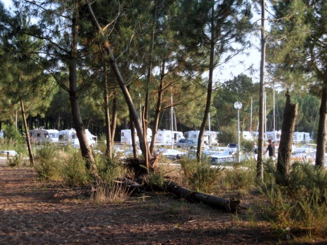
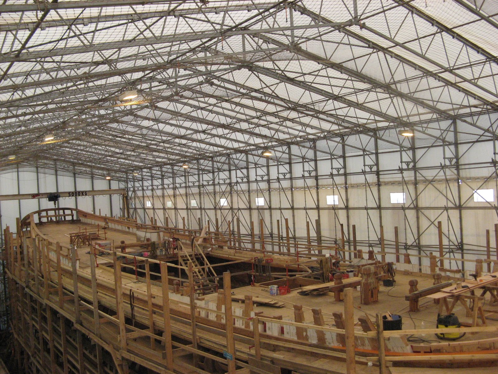
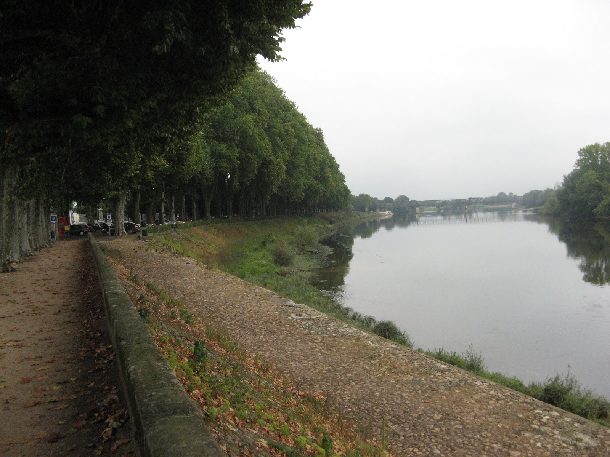
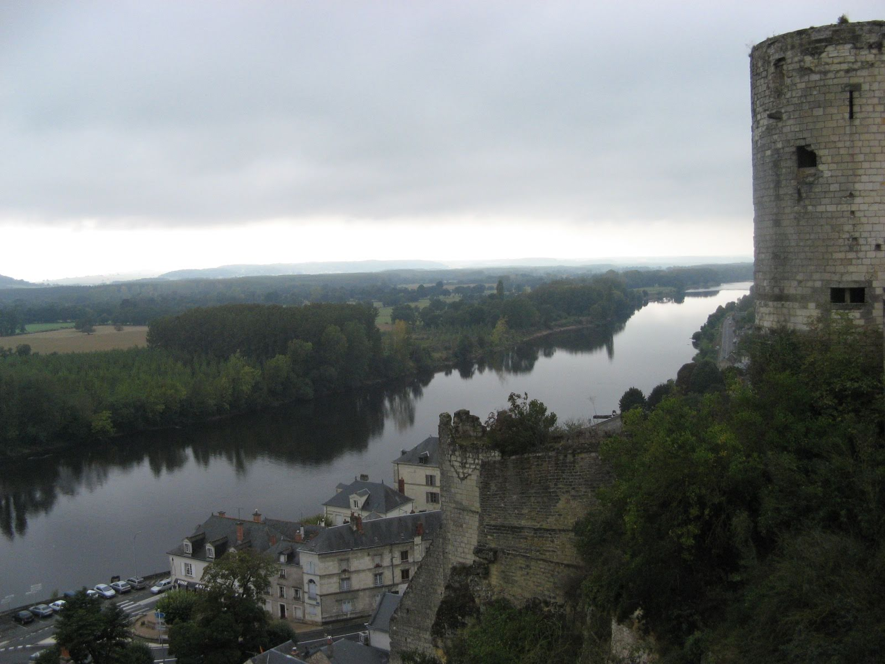
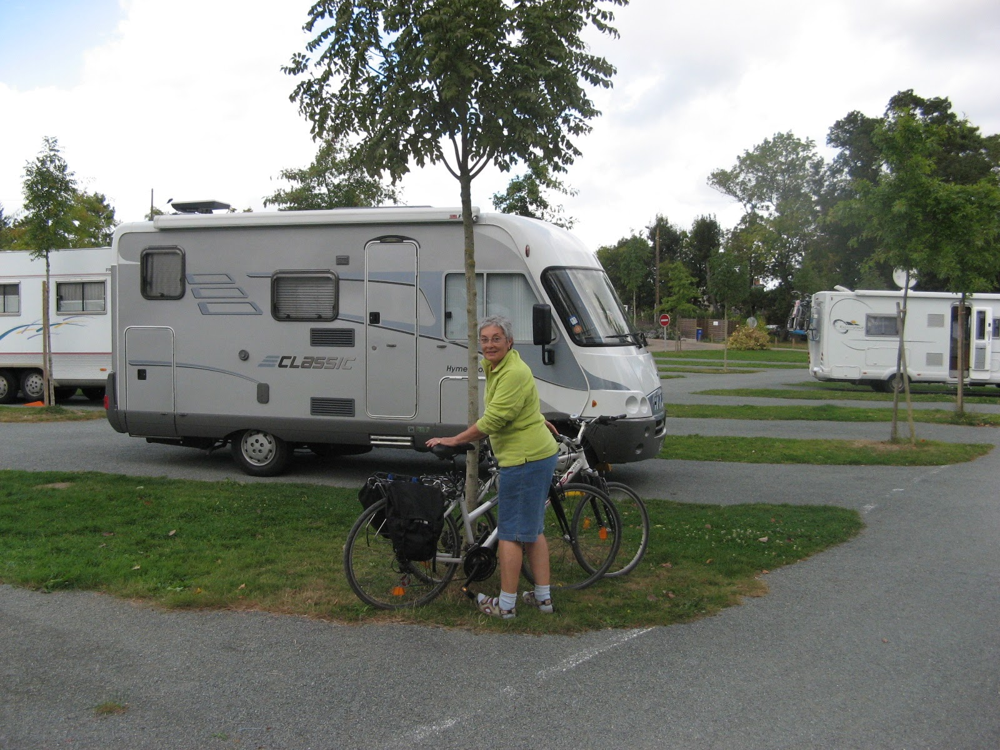
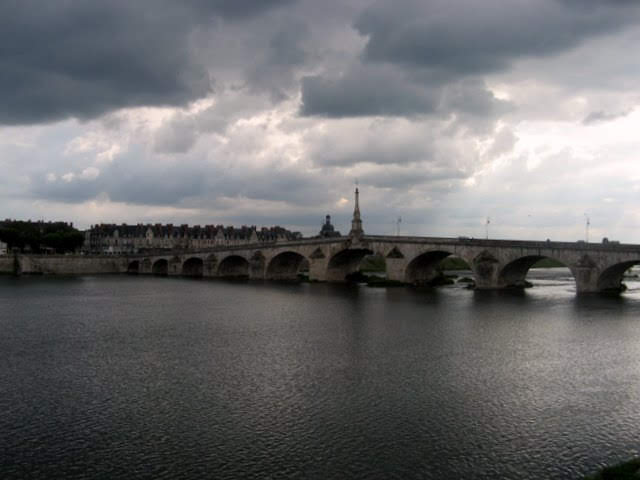
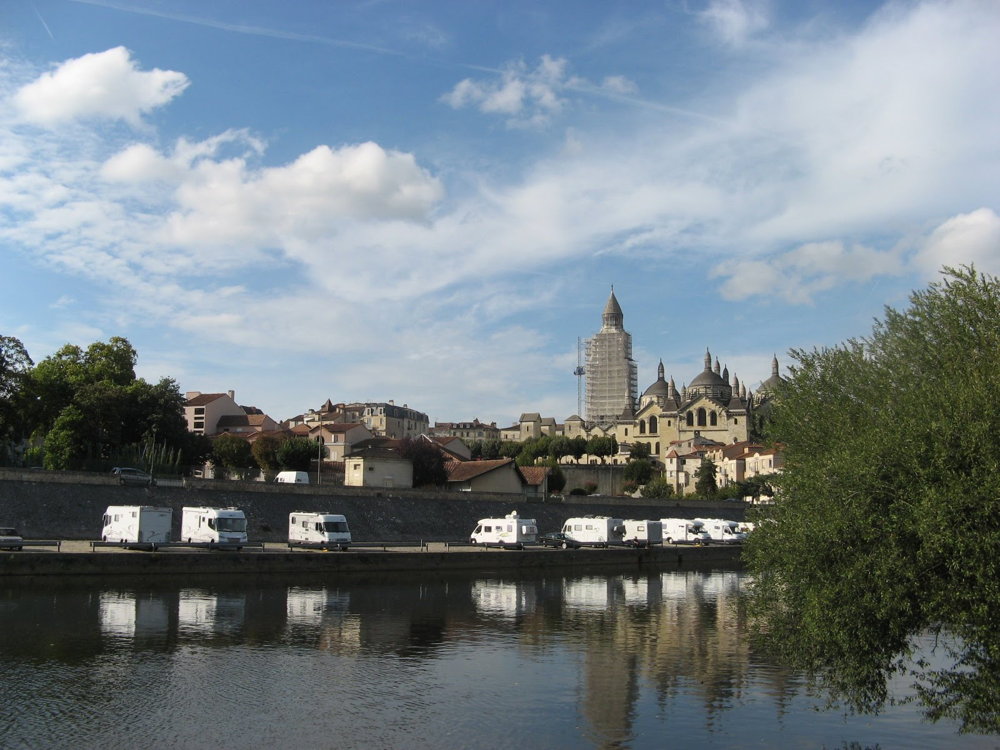
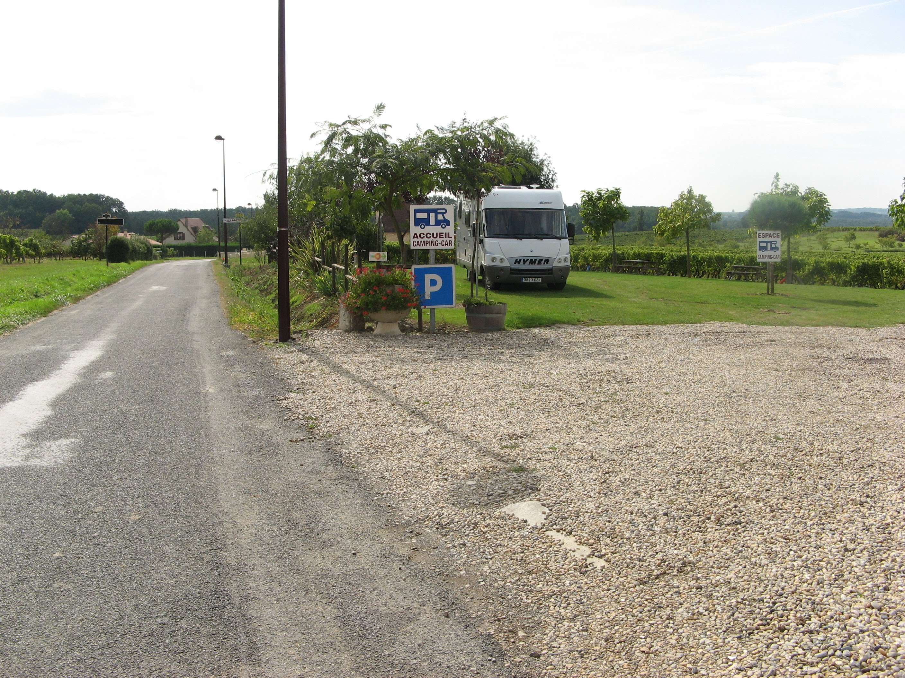
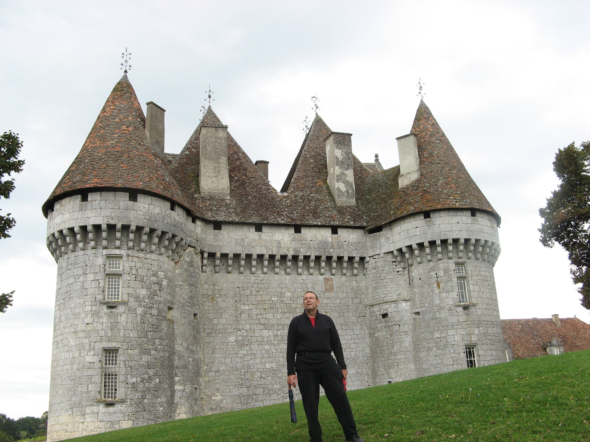

# Los Castillos del Loira
## 2007, 15 septiembre - 1 octubre

 

**Área de Bicarrosse (Navarrosse)**

Esta es una de nuestras salidas favoritas a Francia. En esta ocasión nuestro objetivo es disfrutar del paisaje y del contacto con la naturaleza, de los paseos a pie o en bicicleta aprovechando la orografía favorable de la zona así como los recursos para viajar en autocaravana que ofrece cualquier región francesa.

Los castillos del Loira es un objetivo turístico de culto, pero el patrimonio histórico no es el único atractivo. También lo es la gastronomía y el vino.

Cuando se utiliza una autocaravana para viajar y el tiempo no es un bien escaso, es posible añadir el propio viaje al objetivo. Uno de los atractivos de la autocaravana es convertir la ida y el regreso  en un componente lúdico inseparable.

**Arsenio y Charo. septiembre 2007**

 

 

**Atardecer en el parking del puerto de Arcachon**

**Aquitania**

Salimos el viernes, 15 de septiembre a bordo de nuestra Hymer B504, una pequeña integral de seis metros de largo con dos tripulantes para las tres plazas de alojamiento que dispone. La primera etapa la realizamos en el área de Navarrosse.

Esta área en la que caben unas 100 autocaravanas es gratuita a partir de Septiembre, está muy bien sombreada. El suelo compactado y arenoso obliga a tomar precauciones para evitar derrapar a la salida.

Está situada al borde del lago de Cazaux y de Sanguinet en un entorno de bosques de pinos centenarios en pleno contacto con la naturaleza. La gran mayoría de los usuarios despliegan toldos, mesas, sillas y hasta la colada.

**El mejor bioche del viaje.**

El tiempo invita a bañarse en el lago y dar largos paseos por la pista adaptada a bicicletas que pone en comunicación una extensa zona dedicada al turismo y que llega, hasta la duna de Pyla en Arcachon.

El 17 llegamos a Arcachón, que dispone de un estacionamiento gratuito reservado para unas dos docenas de autocaravanas. Está situado en el puerto deportivo, al extremo de una magnífica playa.

Arcachón pertenece al departamento de La Gironde, en el corazón de las Landas Gasconas en la región de Aquitania. Su economía se basa en el cultivo ostreícola, el turismo y la industria papelera que se nutre de las plantaciones de pinos de la comarca.

Visitamos la ciudad a pié y en bicicleta paseando por una extensa playa con la arena fina característica del Atlántico.

 

 

 

 

**La huerta de los "frutos de la Mar"**

**La isla de Oleron y Rochefort-sur-la-mer**

El 19 de septiembre, miércoles, llegamos a la isla de Oleron, situada al norte de la desembocadura de la Gironde. Un puente de casi tres kilómetros une la isla con el continente.

La economía de la isla es el turismo, pero también la pesca tradicional, el marisco y la agricultura, en especial los viñedos. La sal fue una de los motores económicos de la zona y hoy se ofrece como un producto especial para los turistas.

Mide algo mas de treinta kilómetros de largo y quince kilómetros en la parte mas ancha. Visitamos le Chateau d’Oleron, un poblado marinero que conserva vestigios de las fortificaciones que protegían la costa y desde donde se divisa una extensa zona que en la bajamar entretiene a cientos de mariscadores recogen los “frutos del mar”.

**Fort Boyard**

La gran afluencia de autocaravanas ha propiciado que, junto a áreas de servicio, coexisten zonas en las que el estacionamiento está prohibido entre las 20:00 horas de la tarde y las 08:00 del día siguiente con la presencia de barras de limitación de altura a la entrada de numerosos parking.

En cualquier caso, una decena de áreas de acogida en la isla permiten escoger el lugar de pernocta. En nuestro caso en la de Le Grand Village. Se trata de un parking asfaltado, reservado a AC dentro de una población, tranquilo y seguro.

En este parking conocemos a una pareja de autocaravanistas, Jean Claude y Christianne, residentes en la zona, que nos adoptan y se convierten en nuestros guías para la visita a Olerón.

**La corderie.**

A la mañana siguiente temprano, Jean Claude se dedica a mariscar cerca del puente y regresa a las dos horas con cuatro docenas de ostras y cerca de tres kilos de almejas de tamaño reglamentario.

Guiados por la pareja visitamos Saint Denis, La-Brée-les-Bains y Boyardville. Desde Boyardville se puede divisar la fortaleza prisión de la isla de Fort Boyard, que es actualmente un estudio de televisión.

Por el camino hemos hecho un alto en un área de “pique nique” donde hemos dado cuenta de hasta el último molusco. Las ostras crudas con limón y las almejas al vapor, acompañado de jabugo, unos pimientos del piquillo que hacen las delicias de nuestros anfitriones y un par de botellas de albariño “Terras Gaudas”, que teníamos perdidas por la bodega. Por la tarde hemos comprado unas botellas de un excelente Merlot local. Pernoctamos en el área de le Château d’Oleron.

Réplica de la fragata Hermione que intervino en la guerra de independencia de la EEUU

A la mañana siguiente nos dirigimos hacia Rochefort donde llegamos a un parking al pié de las murallas que dispone de agua y WC.

El día 20 de septiembre, jueves, Jean Claude y Christiane se despiden temprano. Nos disponemos a visitar la ciudad. Rochefort-sur-Mer. En la actualidad esta ciudad cuenta con unos 30 mil habitantes. Entre las calles del casco antiguo se pueden contemplar edificios de los siglos XVII y XVIII.

Fue una importante base naval a partir de finales del Siglo XVII cuyas instalaciones albergan el museo de La Corderie Royal, que visitamos, donde se fabricaban los aparejos de los buques construidos en los astilleros. En el majestuoso dique de carena, perfectamente conservado, se construye una réplica exacta de la fragata Hermione que intervino en la guerra que enfrentó a las trece colonias de América del Norte con el Reino de Gran Bretaña entre 1775 y 1783.

Nos desplazamos también, entre nubes de mosquitos y a través de una pista acondicionada para bicicletas, hasta la base del puente transbordador, situado a la entrada de la población y que comunica las dos orillas de La Charente.

El 21 de septiembre, viernes por la tarde, nos desplazamos hasta el área de Sainte Maure de Touraine donde hacemos un descanso táctico. Se trata de un área privada (5,00€ con servicios), en un lugar bonito, simpático, tranquilo y seguro.

 

 

 

**La zona de Angers**

**Magníficos paseos para bicicleta.**

Al día siguiente, el 22 de septiembre, sábado, nos adentramos por la zona de los castillos, se trata de un recorrido de unos 280 kilómetros bañados por el Loira, situados entre Sully-sur-Loire y Chalonnes-sur-Loire, cuyo conjunto de paisaje y patrimonio histórico esta catalogado como Patrimonio de la Humanidad por la UNESCO.

Los castillos del Loira engloba un conjunto de 42 edificios construidos la mayor parte o reconstruidos en el Renacimiento francés entre los siglos XV y XVI, aunque la mayoría tienen sus orígenes en la edad media.

**Vista del Loira desde el castillo de Chinon.**

Comenzamos la visita en Chinón, donde paseamos por la ciudad que posee un casco medieval muy bien conservado, circunvalando las ruinas del castillo. Visitamos también una bodega excavada en la roca donde compramos unas botellas de un excelente Sauvignon de la denominación local perteneciente al valle de Turaine.

A media tarde llegamos al estacionamiento de Fontevraud-l’Abbaye. El domingo, visitamos la abadía que data del Siglo XII y que entre 1804 y 1963 fue prisión central. La iglesia abacial, el claustro y las dependencias son interesantes pero lo que llama la atención son las cocinas románicas, un edificio único datado en la segunda mitad del SXII.

Chimeneas de las cocinas románicas de la abadía de Fontevraud.

A media tarde nos acercamos hasta Angers, primera ciudad importante del recorrido, estacionamos en lugar próximo a un área de servicios. Hacemos una breve visita y en la oficina de información turística nos indican que el mejor lugar para pernoctar es un área situada a diez kilómetro, en la población de Bouchemaine.

Se trata de un antiguo camping municipal reconvertido en área de autocaravanas, arbolado, a las orillas del Maine y con bloque sanitario y todos los servicios. Todos los usuarios despliegan elementos y en septiembre es gratuita aunque en temporada alta cuesta 6,00€ al día.

Al día siguiente nos desplazaos hasta Angers para visitar la ciudad y su imponente castillo regresando a mediodía al área. Por la tarde dos horas de paseo en bicicleta y a disfrutar del área  cuyas parcelas tienen hierba.

La zona dispone de extensos caminos acondicionados para bicicletas en las orillas del Maine y nos llevan, por lado hasta Angers, por otro hasta Sainte Gemmes-sur-Loire y finalmente hasta Savenières y Bèuhard. Visitamos en estos pueblos unas pequeñas iglesias románicas muy interesantes. Permanecimos tres días.

 

 

 

 

**La zona de castillos**

**Área de Bouchemaine cerca de Angers.**

El 26 de septiembre, miércoles, partimos en dirección de Rilly-sur-Loire, para llegar a la bodega “Domaine du Vieux Pressoir”, adscrito a France Pasion que dirige Joël Lecoffre. Se trata de una pequeña propiedad de cultivo artesanal en la que compramos unas botellas de Sauvignon joven con denominación Touraine.

En el camino hemos intentado visitar Tours pero nos ha sido imposible estacionar en un punto cercano al centro. Lo hemos intentado varias veces pero no hemos tenido la suerte de encontrar un lugar libre. Completamos el día con un largo paseo en bicicleta por las orillas del Loira.

**Puente sobre el Loira en Blois.**

Al día siguiente tomamos la N152 y nos acercamos a Blois, hacemos un recorrido completo por la ciudad. El castillo de Blois es un edificio renacentista construido por Luis XII. La ciudad conserva un casco histórico interesante. Blois mantiene un pasado histórico muy denso en el que el episodio mas conocido es cuando en 1429 Juana de Arco hizo de Blois su base de operaciones para la batalla de Orleáns.

Toda la zona al sur de Blois dispone de pequeñas carreteras adaptadas a las bicicletas. A través de ellas se pueden visitar una serie de castillos algunos tan importantes como Cheverny o Chambord.

Continuamos el viaje hasta Cheverny, en cuyo parking, pernoctamos. Visitamos el castillo y hacemos un largo paseo en bicicleta por los alrededores.

**Castillo de Chambord**

Al día siguiente salimos hacia la localidad de Chambord a cuyo parking, reservado a autocaravanas llegamos a mediodía. Por la tarde visitamos el castillo que alguna guía francesa compara con El escorial.

Según las guías es el castillo mas característico del mundo debido a su arquitectura renacentista francesa que mezcla formas medievales y estructuras clásicas italianas siendo la simetría de sus seis imponentes torres , las 440 habitaciones y las 365 chimeneas lo mas destacable. Pernoctamos en el mismo parking (limitado su uso a 24 horas).

A la mañana siguiente hacemos una salida en bicicleta por la zona que nos lleva a la comida con el apetito renovado. Después de comer salimos en dirección al sur, pasando por Orleans. Hacemos en esta ciudad una breve parada al borde mismo del Loira para visitar la catedral y pasear entre sus calles.

Al caer la tarde iniciamos el regreso rumbo al sur, parando a pernoctar en el área de Vierzón. Se trata de un área con tres plazas de la que una está ya ocupada por una pareja que se dirigen al salón de Le Bourget en una enorme Laika.

El área, perteneciente al parking de la Maison du Pays, aunque incómoda y ruidosa por la proximidad de la carretera dormimos de un tirón.

 

 

 

**Área de Perigueux**

**De regreso a casa**

El 30 de septiembre continuamos el regreso vía Perigueux a cuya área llegamos a media tarde. Esta área gratuita dispone de todos los servicios para autocaravanas a la orilla del Isle es un poco ruidosa por el paso de vehículos sobre el pavés.

La visita a la capital del Perigord con su catedral, saint Front, de estilo bizantino, camino de Santiago, nos permite descubrir el núcleo de población medieval bien conservado.

Después de comer hacemos un recorrido en bicicleta de un par de horas por una pista situada en la orilla izquierda del Isle, es un paraje precioso acondicionado como solo saben hacerlo los franceses y muy concurrido por ciclistas y peatones de todas las edades.

**Acogida (France Passion) en Montbazillac.**

Nada mas despertarnos, el día 1 de octubre, lunes, salimos hacia casa no sin antes hacer una parada en Monbazillac, en el domaine de la Lande, un lugar adscrito a France Passion en el que Cécile y Fabrice Camus, autocaravanistas, cultivan artesanalmente seis hectáreas de viñedo de la variedad local.

Este matrimonio vende una gran parte de su producción a los autocaravanistas a los que cuida con mimo cediendo un lugar acondicionado y sombreado sobre hierba con área de servicios. Un par de botellas de la excelente cosecha de 1999 nos acompañarán al tradicional foie du canard de las próximas Navidades.

**El castillo de Montbazillac**

El vino Monbazillac es dulce, muy afrutado de elaboración es artesanal. La vendimia se realiza muy tardía permitiendo una primera fermentación en la vid. Esto es posible gracia a la climatología local, con brumas matinales y el sol del mediodía favorece el crecimiento de un hongo.

Se vendimia racimo por racimo y, habitualmente, en tres jornadas separadas por una semana. El resultado es un vino licorizado, de alta graduación, pleno de matices que llena el paladar y es el mejor compañero de un foie mi cuit. Requiere una buena crianza en botella y hay enormes diferencias entre añadas puesto que la climatología, que varía de año en año, es fundamental.

Realizamos, como es habitual la limpieza de fin de viaje en el área de Biriatou en la A10. Hemos recorrido en total casi 2.000 kilómetros en números redondos. Hemos visitado unos parajes naturales de gran belleza, las marismas atlánticas y el litoral entre las islas de Re y Oleron. Un río que fue navegable con un contenido histórico incomparable y que transcurre por un valle plagado de contrastes históricos, paisajísticos y gastronómicos.

En definitiva, nos hemos quedado con un buen sabor de boca en todas sus acepciones y con la impresión de que es necesario regresar un día.