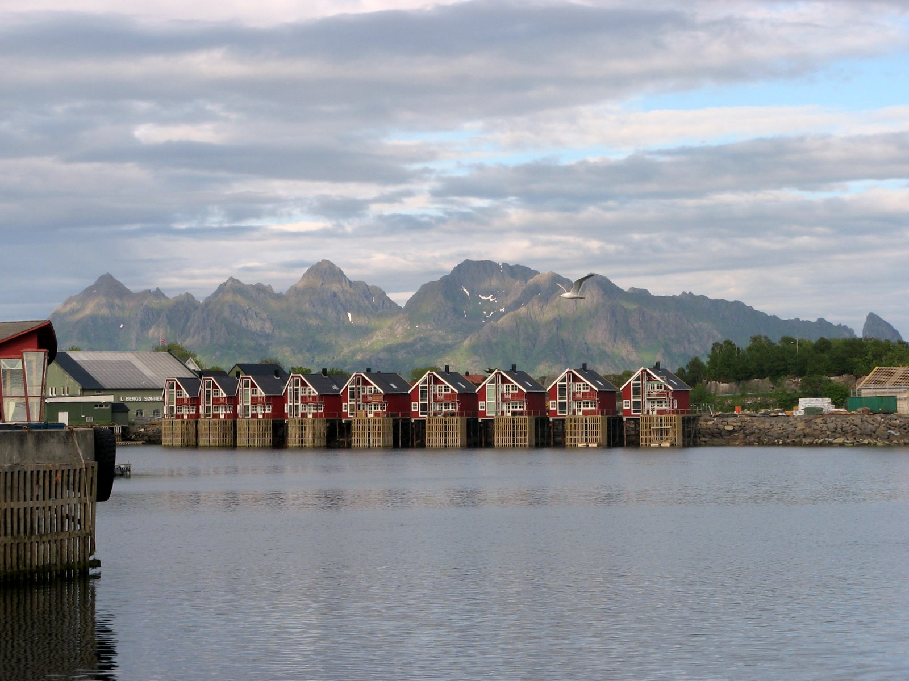
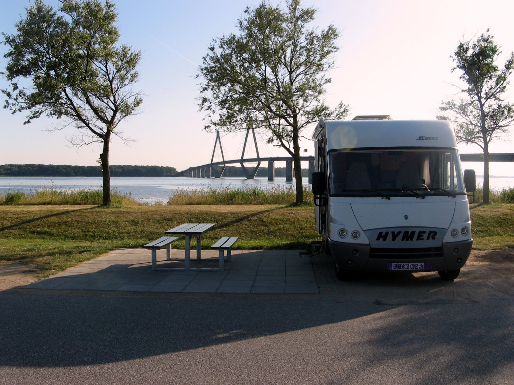
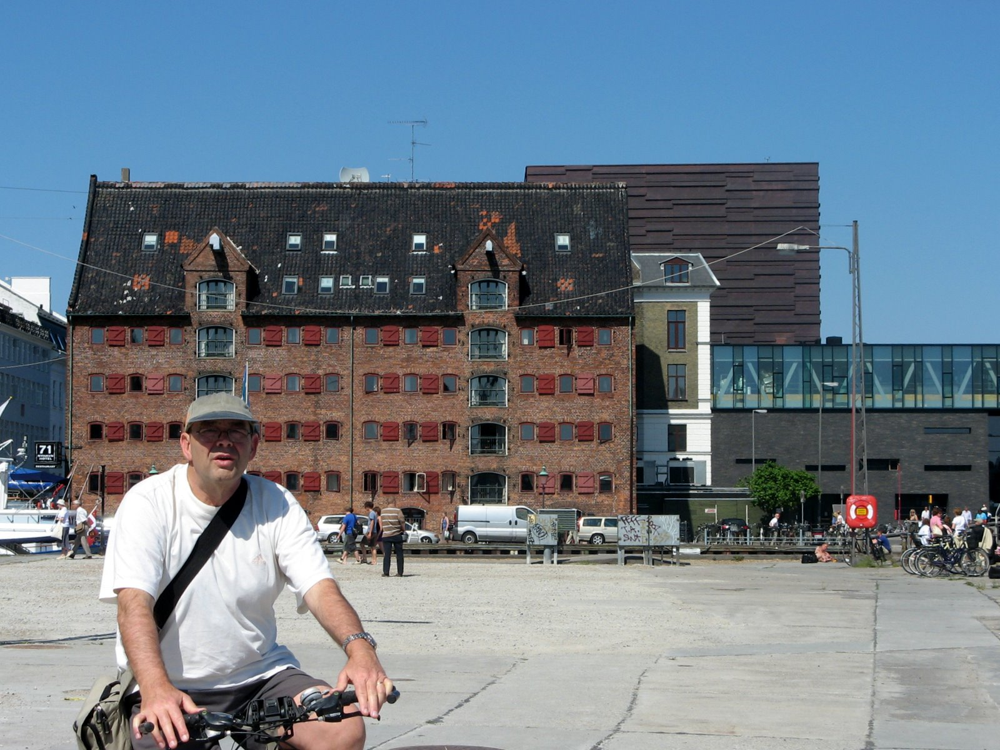
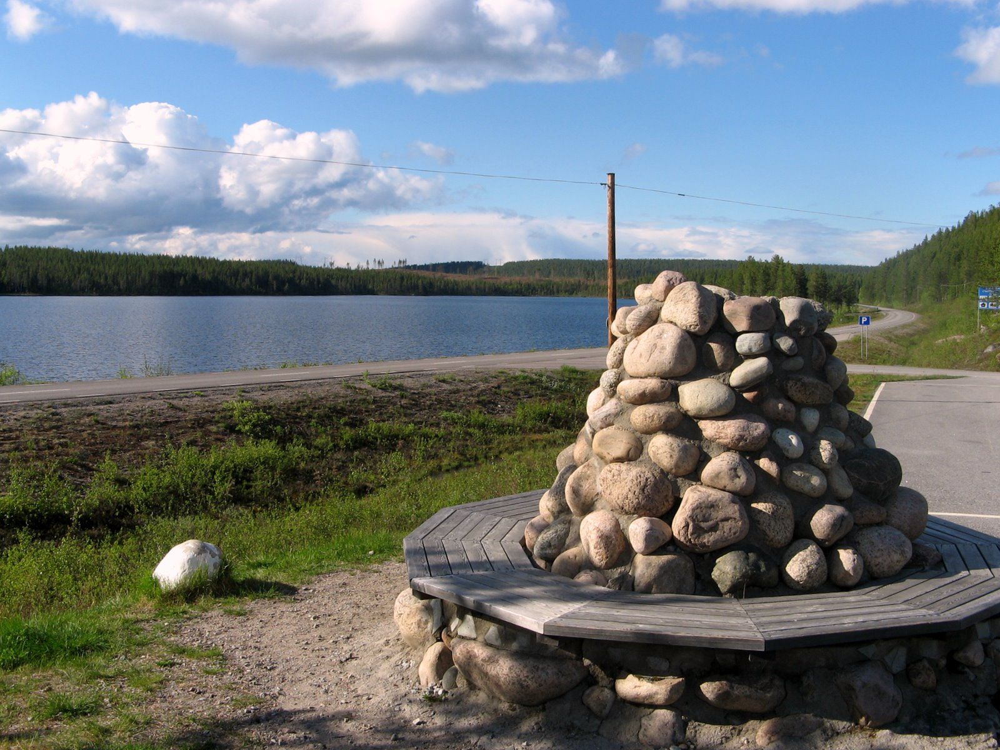
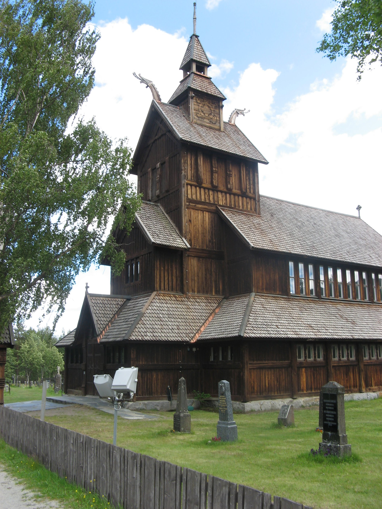
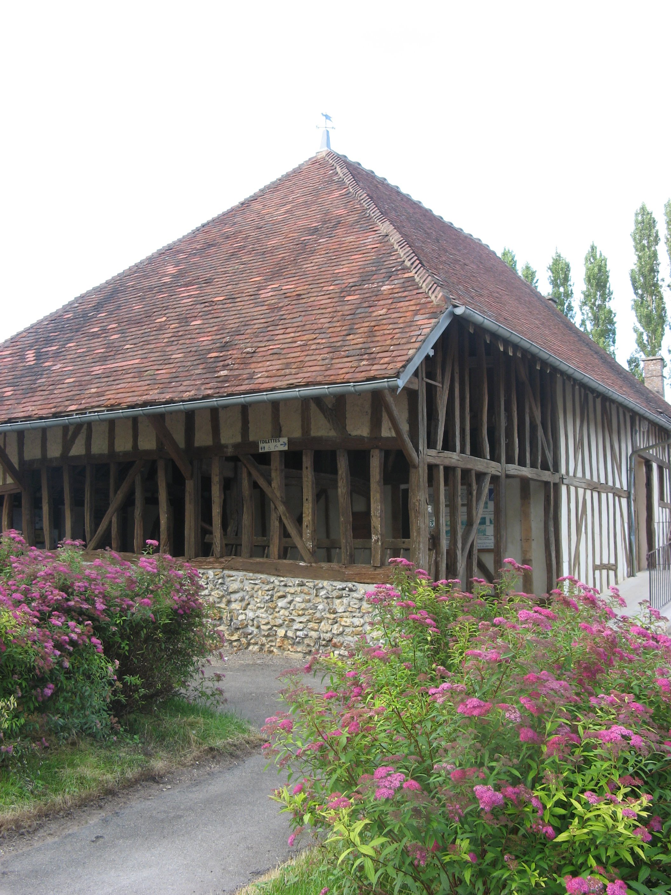
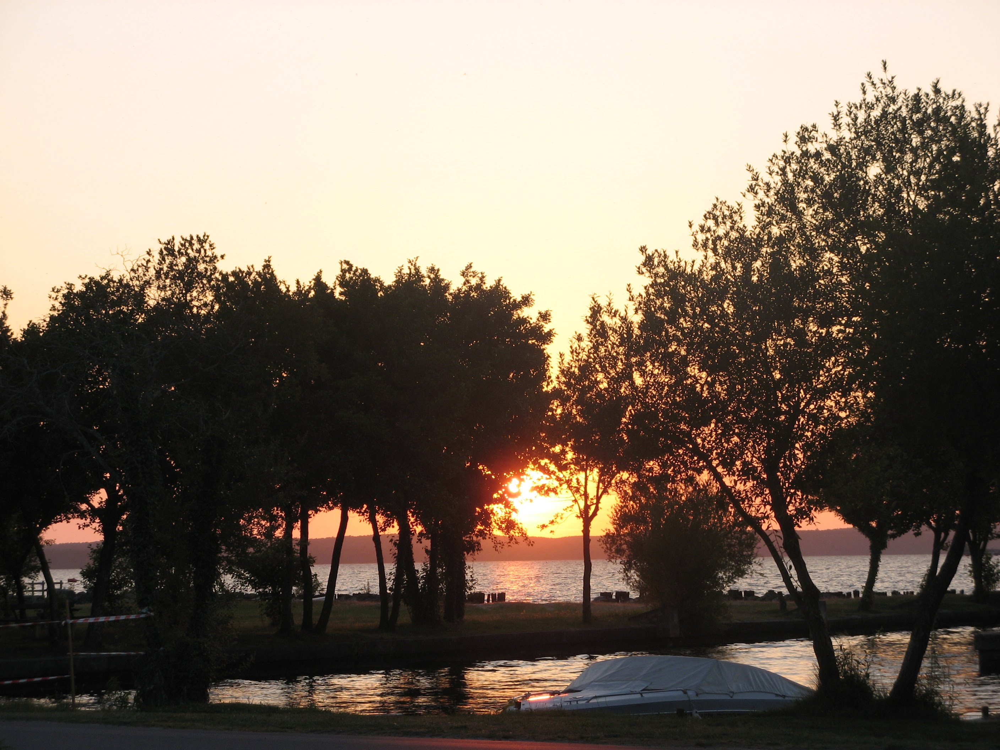

# Escandinavia
## 2008, 3 junio - 24 junio

 

**Casas de pescadores en Svolvaer (Lofoten)**

**Preparando el viaje, junio de 2008**

Cientos de autocaravanas de todos los tipos, tamaños y nacionalidades, que circulan por el norte de Suecia, consagran el interés por esta forma de viajar y por las posibilidades turísticas de la región más septentrional de Europa.

Sin una planificación minuciosa y con la voluntad de perdernos entre las maravillas naturales que encierran los países nórdicos, emprendimos el viaje el día 2 de junio de 2008.

Hemos utilizado sobre la marcha la guía Lonely Planet de los Países Escandinavos, el imprescindible Tom Tom V6 con los POI de áreas para autocaravanas, la base de datos de áreas de Europa del CCInfos en el PC portátil y los mapas Michelín de Francia, Alemania y Escandinavia.

La idea central del viaje es acceder al Círculo Polar Ártico por Jokkmokk en Suecia para visitar las islas Lofoten. Es un viaje diferente al de Nordkapp cuyo acceso se realiza habitualmente a través de Finlandia ingresando en el Circo Polar Ártico por la ciudad de Rovaniemi.

A priori, al planificar el viaje, consideramos que el Cabo Norte tiene un plus de leyenda antes que de atractivo paisajístico y valoramos los mil kilómetros extra que representaba el llegar hasta el punto más septentrional de Europa. El regreso decidimos hacerlo por Noruega.

Este relato no pretende descubrir las maravillas de la naturaleza que hemos tenido la oportunidad de contemplar y que nos ha mantenido con la boca abierta durante todo el viaje. Detrás de cada paisaje impresionante descubríamos el siguiente aún más espectacular, cada kilómetro recorrido ha sido objeto de admiración  sin saber cual destacar.

En este relato queremos también indicar los recursos para los autocaravanistas, los lugares visitados y los kilómetros recorridos con la idea de que sirvan de orientación para cualquier otro compañero que tome la acertada de decisión de viajar hasta estos lugares que atesoran una belleza incomparable.

 

**Comenzamos el viaje de aproximación (2 de junio)**

Emprendemos el viaje a través de la N10 francesa, vía Burdeos hasta Saint Paul Blaye (F), nos alojamos en una pequeña área para autocaravanas gratuita, (45.14797ºN/0,60479ºW). .

Continuamos hacia el norte evitando las autopistas y evitando también el paso por París, aprovechando la ocasión para volver a visitar Le Mont Saint Michel, pernoctamos en una área de autocaravanas gratuita en la pequeña población de Saint Brice en Coglés (F) (48º24’40.32”N/1º21’45.216”W).

**Le Mont Saint Michael**

**Le Mont Saint Michel (4 de junio)**

La marea está baja y damos un largo paseo por la bahía. Admiramos desde todos los ángulos el perfil de esta semi-isla que nos tiene fascinados y volvemos a visitar la iglesia y el poblado medieval.

El parking cuesta 12 euros y hay que abandonarlo antes de que lo cubra la marea alta, a las siete de la tarde. Hay decenas de autocaravanas estacionadas.

Reemprendemos el viaje por pequeñas carreteras secundarias hasta la población de Beubron en Auge (F), en el departamento de Calvados al oeste de Caen, en cuya área gratuita pernoctamos (49º11’8.16”N/0º2’58,2”W).

Continuamos el viaje hasta la pequeña población de Hondschoote (F), en la frontera con Holanda, en cuya área gratuita pernoctamos, no tenemos prisa. (50° 58′ 34.608′′N/2° 34′ 49.188′′E).

Continuamos viaje hasta el área de autocaravanas de la pequeña ciudad de Xanten (D) en Alemania (52º54’1.404′N/8º25’38.496”E).

 

**Isla de Faro, área de acampada**

**Dinamarca primera etapa (7 de junio)**

El viaje hasta Putgarden en Alemania nos permite coger el ferry que nos deja en Rodvihavn en Dinamarca y llegamos hasta el área gratuita para autocaravanas, caravanas y camiones de la isla Faro. Pisamos por primera vez tierras escandinavas y comenzamos realmente nuestro viaje.

El área de descanso de la isla Faro, (54º56.929′N/11º59.202′E), es un lugar privilegiado para hacer una etapa. Dotada de todos los servicios, gratuitos, para autocaravanas, incluido váter público. Dispone de una extensa área de acampada, verde y con extraordinarias vistas sobre el estrecho que separa un conjunto de islas al sur de la isla Sjaelland donde se sitúa Copenhague. La isla, además del área, soporta el pilar que sustenta el centro de los puentes de la autopista E47/E55 que atraviesan el estrecho.

Nos hemos dado cuenta de que entre nuestro propósito de viajar sin prisas, de evitar las autopistas francesas, de evitar el corredor de París y hacer más ameno el viaje de aproximación visitando Le Mont Saint Michael, hemos dado un rodeo de casi 500 km y al programar el navegador para que evite autopistas también hemos perdido la oportunidad de utilizar las autopistas holandesas y alemanas gratuitas.

La conducción de una autocaravana por las autopistas alemanas es fácil pero muy estresante. Los conductores son rápidos pero muy concienciados para facilitar las maniobras de inserción, intersección y adelantamiento a los demás conductores, pero requiere una concentración extrema, sobre todo para adelantar camiones, a menos que adaptemos nuestro vehículo a su velocidad (80/90 km/h).

 

 

**Paseo en bicicleta por Copenhague**

**Copenhague(8 de junio)**

Llegamos al parking del Kalvebod Brygge en Copenhague (Kobenhavn). Nos llevamos la sorpresa de que en ese parking estaba prohibido estacionar a las autocaravanas a pesar de lo indicado en otros relatos. Es domingo y hay plazas de sobra en la ciudad. Estacionamos en una calle próxima (55º40.518′N/12º35.071′E) y montados en las bicicletas nos disponemos a recorrerla.

Un largo paseo en bicicleta nos lleva por el centro histórico, el barrio de Cristianhavn, el paseo marítimo hasta la famosa Den Lille Havfrue (La Sirenita). No tenemos intención de explorar museos sino de ver paisajes.

La estancia ha sido corta pero intensa. No estamos seguros si vamos a poder pernoctar con tranquilidad en el aparcamiento y decidimos continuar el viaje a la caída de larde aprovechando la luz natural.

En Helsingor (DK) tomamos el ferry hasta Helsinborg en Suecia continuando por la  autovía E4 hasta Granna.

**El palacio de Hamlet en Helsingor**

Teníamos referencia de un parking accesible en esta pequeña ciudad al borde del lago Vattern, pero nos encontramos con prohibiciones expresas para estacionar autocaravanas. En el camping vecino nos indican que son 24 euros lo qe cuesta pernoctar, por lo que optamos seguir por la autopista hasta un área de descanso.

La primera área de descanso está situada a un kilómetro escaso de la salida de Granna, dotada de un bloque sanitario con calefacción incluido un lugar para el vaciado del depósito del váter y un grifo de suministro de agua potable. Las aguas grises las vaciamos con cubos, operación que repetiremos en el viaje.

Con unas magníficas vistas sobre el lago Vattern pernoctamos junto a otras dos autocaravanas y tres caravanas con una absoluta sensación de seguridad. (59º19’12.36”N/18º1’48.54”E).

 

 

**En el Ayuntamiento de Estocolmo en bicicleta**

**Estocolmo y Upsala (9 y 10 de junio)**

Continuamos viaje hasta Estocolmo. Estacionamos en un área de autocaravanas situado en Langholmsbacken (120 coronas), (59º19.199′N/18º19.199′E). Esta área está próxima al centro en un lugar cómodo y tranquilo.

Salimos con las bicicletas a recorrer Estocolmo yendo directamente al centro histórico, Gamia Stan, el Palacio Real, la catedral, la  isla Ridalholmen. Es una delicia pasear en bicicleta por las calles. El mayor aliciente es perderse por las calles y ver el ambiente de la ciudad vieja así como el paisaje de los canales que la surcan. Hace buen tiempo y una cerveza en la terraza de una cafetería al borde del canal es un lujo que merece la pena darse.

A la mañana siguiente realizamos una breve escapada en la que visitamos de nuevo los canales y las calles de la ciudad vieja dedicando especial atención al ayuntamiento literalmente ocupado por turistas japoneses. Regresamos a comer en la autocaravana y partimos después de vaciar y llenar los depósitos.

Llegamos a Upsala a media tarde y estacionamos en un parking público (59º51.787′N/17º38.082′E).

**La catedrañ de Upsala desde el castillo**

Hacemos una visita a la ciudad, lo más interesante queda cerca. La catedral (Domkyrka), el edificio del museo Carolina Rediviva y el castillo (Uppsala Slot) con la campana (Gunilla Clockan), que suele tañerse durante el solsticio de verano, situada en los restos de una de las torres.

Reanudamos el viaje por la carretera 72/70 por el centro de Suecia para acceder al círculo polar ártico por Jokkmokk en lugar de utilizar la carretera del Báltico hasta Umea. Se trata de vías estrechas pero llanas con pocas curvas y de escasa circulación. Cada vez nos cruzamos con más autocaravanas y caravanas.

Cada 20 kilómetros aproximadamente hay una pequeña área de descanso dotada de un bloque sanitario, con calefacción, que incluye en muchos de ellos una “letrina” de acero sueco inoxidable para vaciar el depósito del váter químico con su correspondiente grifo. Algunos de estos bloques disponen de un grifo exterior de suministro de agua potable.

El paisaje es impresionante, cada estampa supera en belleza a la  anterior. Extensos bosques de abedules, pinos y abetos a la orilla de unos lagos increíbles. Los tonos cromáticos del agua cambian en relación a la posición del sol que no vemos ponerse y cuya luz utilizamos para leer hasta acostarnos. Hace frío por la noche lo que nos obliga a poner la calefacción.

Llegamos a la pequeña población de Ratvik a la orilla del lago Slijan, donde después de un paseo pernoctamos en el parking que nos indicaron en la oficina de turismo (60º52.924′N/15º07.136′E).

La carretera E45 nos conduce por el centro hacia el norte de Suecia. Nuestro objetivo es contemplar las maravillas de una naturaleza desconocida para nosotros y nuestras expectativas se ven cumplidas con creces.

Siguen los bosques de abedules, pinos y abetos interrumpidos por lagos con muy pocos terrenos destinados al cultivo o praderas en un suelo llano. Nos tropezarnos con los primeros grupos de renos que no nos causan problemas.

Llegamos a la población de Stromsund a un parking a la orilla del lago Rufssjarden. Un rincón increíble al lado de un poblado para los pequeños con un troll de piedra en el acceso con megafonía que no paraba de contar cuentos. Pernoctamos después, de un largo paseo, en compañía de otras cuatro autocaravanas, lo más alejados posibles de pelmazo del troll. (63º50.976′N/15º33.180′E).

 

 

**Túmulo del Círculo Polar Ártico en Jokkmokk**

**En el Círculo Polar Ártico (13 de junio)**

Seguimos sin abandonar la carretera E45 hasta la puerta del Círculo Polar Ártico en la localidad de Jokkmokk. Entre la sucesión de bosques aparecen praderas y caseríos de madera dedicados a la  ganadería. Espacios pulcros y bien cuidados, que ponen una nota pintoresca en el paisaje sirviendo de contrapunto a la aparente monotonía del bosque.

En la carretera, a la altura del paralelo 66º33,015′N, hay un área de descanso extensa, junto a uno de los millares de lagos de la región, con una cafetería y un área de pago para autocaravanas (100 coronas) dotado con electricidad (40 coronas más). Unos hitos de piedra pintados de blanco marcan el paso del paralelo que establece la frontera del Círculo Polar Ártico. Colocamos una piedra con nuestros nombres bajo el primer hito junto al lago y después de la obligada sesión fotográfica nos disponemos a descansar. (66º33.015′N/19º45.826′E).

El Círculo Polar Ártico delimita el extremo sur del día solar en el solsticio de verano donde el sol no se pone durante las 24 horas. Aunque el límite es variable en el tiempo, está establecido en el paralelo 66º33.015′N. En Europa este límite está próximo a las poblaciones de Rovaniemi en Finlandia, Mo I Rana en Noruega y Jokkmokk en Suecia.

Uno de los objetivos que nos habíamos propuesto al emprender el viaje era contemplar el sol de media noche sin llegar al Cabo Norte, por esto, en vez de seguir al norte viramos al oeste y nos pusimos en camino hacia las islas Lofoten siguiendo la carretera E45/E10, en dirección a Kiruna y Narvik.

Poco a poco nos adentramos en la Laponia Sueca en territorio Sami, mientras el paisaje va cambiando y se hace más montañoso. Pasamos por Kiruna, una ciudad en cuya área de influencia se sitúan unas enormes minas de hierro explotadas a cielo abierto. También está situado el Kebnekaise la montaña más alta de Suecia con algo más de dos mil metros.

Nos alojamos en un área de descanso en la E10 en las proximidades de Bjorkliden, en las orillas del lago Tornetrask parcialmente helado, cerca de la frontera Noruega. (68º25.923′N/ 18º40.236′E).

**Llegamos a las islas Lofoten (15 de junio)**

**Puente de entrada en las islas Lofoten**

Continuamos viaje por la carretera E10, pasamos la frontera entre Suecia y Noruega y entramos en las islas Lofoten por Bjekrvik hasta la población de Svolvaer. Nos situamos en el área de descanso de una estación de servicio a la entrada del pueblo. (68º14.366′N/ 14º34.014′E).

Lo primero que llama la atención al contemplar el paisaje es la impresionante belleza natural de las formaciones rocosas que se elevan como muros. Picos, isletas, montañas, fiordos, playas y grandes áreas vírgenes sorprenden a cada paso que damos. Todas las islas están comunicadas entre si por carretera a través de puentes o túneles bajo el agua.

He cogido un catarro impresionante, a pesar de ello damos un paseo por una de las poblaciones más importantes de las islas. Toda la población es un exponente de las dos fuentes de riqueza principales: el turismo y la pesca del bacalao y el arenque así como la piscicultura del salmón.

La pesca del bacalao se realiza en invierno y por todas partes hay empalizadas donde se secan al sol las capturas del invierno.

 

 

**Lago glaciar en Eggum**

El sol de medianoche en el área de Eggum (16 de junio)

Volvemos a pasear por los alrededores disfrutando del paisaje. A mediodía Charo se embarca para un pequeño crucero a lo largo del Trollfjord. El viaje se complementa con el avistamiento de los tímidos frailecillos o el espectáculo de una enorme águila marina capturando al vuelo el pescado que le lanzan desde el barco. Las paredes verticales del estrecho fiordo, las rocas y las colonias de frailecillos hacen las delicias de los pasajeros favorecido por el buen tiempo.

Por la tarde reanudamos el viaje hasta el área de autocaravanas de Eggum, situada en un paraje increíble al noroeste de la isla Vestvagoy. A los pies de un lago glaciar que desagua en el mar, con una cascada al fondo y un pequeño fortín. Se trata de un área dotada de un bloque sanitario con calefacción y con suministro de agua potable en la que aparcamos un par de docenas de autocaravanas dispuestas a pasar la noche con una visibilidad total del horizonte al noroeste. (68º18.476′N/ 13º39.258′E).

El tiempo es magnífico y nos permite ver cómo el astro rey describe un elipse en el horizonte, durante la noche, sin

**Área para autocaravanas en Eggum**

desaparecer bajo las aguas. Es un espectáculo impactante y uno de los objetivos del viaje cubiertos.

Todavía impresionados por el espectáculo del sol de media noche reemprendemos el viaje hasta el extremo occidental de la carretera E10, en A i Lofoten, una pequeña población de pescadores en la que proliferan numerosas empalizadas destinadas al secado del pescado. La isla finaliza con una vista espectacular sobre extremo oeste de las mayores islas del archipiélago. Regresamos a Moskenes para tomar el ferry que nos llevaría hasta Bodo ya en el continente.

La elección del ferry de Moskenes a Bodo ha sido aleatoria, y el coste ha sido el mas alto de los pagados en el viaje (716 NOK, 89,13 euros). Otra opción que no valoramos era el ferry de Svolvaer a Skutvok, probablemente más económico y sin necesidad de soportar las dos horas de cola que hicimos en Moskenes. La posibilidad de regresar por carretera vía Narvik la descartamos, pues suponía más de trescientos kilómetros y la necesidad de  tomar un nuevo ferry en Skarberger.

Tradicionalmente la actividad principal de los habitantes de las islas Lofoten ha sido la pesca favorecido por las condiciones climáticas y la corriente del Golfo. La pesca del bacalao se realiza en invierno y en primavera y verano las capturas de secan en extensas empalizadas. Actualmente esta actividad se complementa con la piscicultura, concretamente el engorde del salmón y el turismo que ha llegado a ser la primera fuente de riqueza para los isleños.

Decidimos pernoctar en un área de descanso de la carretera E6, entre Bodo y Fauske, en compañía de una auto francesa pilotada por Pierre. (67º17.895′N/ 14º52.533′E).

 

**Es el terreno de los ferry**

**Los incidentes también cuentan (18 de junio)**

Continuamos el viaje hacia el sur por la carretera E6, donde hacemos la siguiente etapa en un área de descanso situada en las proximidades de Laskfors. (65º44.595′N/13º5.13′E).

Atravesamos la puerta del Círculo Polar Ártico en dirección sur cuyo hito está situado en la intersección del paralelo 66º33.015′. En este lugar, unos pocos kilómetros al norte de Mo I Rana, existe un área de descanso con cafetería y tiendas de recuerdos.

No me encuentro muy bien, la carretera tiene muchas limitaciones de velocidad a 70 y a 50 km/h y, además, el tiempo ha empeorado, llueve de forma continua. A pesar de ello podemos disfrutar de un paisaje impresionante. Hay menos bosques y los abedules que jalonan el paisaje tienen unas formas atormentadas por el viento, la nieve y el frío, hay lagos que mantienen en pleno mes de junio zonas heladas.

Decidimos regresar a Mosjoen para realizar una consulta en el hospital local donde soy atendido con toda amabilidad. Me diagnostican una infección vírica y para prevenir una sobre infección me prescriben un antibiótico.

La atención está cubierta por la seguridad social, la tarjeta azul funciona, a pesar de ello debemos hacer efectivas 770 coronas por la atención médica y 145 por la medicación cantidades que nos serán reembolsadas por el seguro de asistencia en carretera de Allianz, según nos indican.

 

**Las carreteras discurren por el mar**

**Hacia el sur por Noruega (19 de junio)**

Continuamos el viaje hacia el sur por la carretera E6 hasta un área de descanso en las proximidades de Grong (64º27.892′N/ 12º18.441′E). La carretera que transcurre entre montañas es sinuosa y estrecha y hay numerosas limitaciones de velocidad que respetamos escrupulosamente por la cuenta que nos trae. Es el reino del agua: lagos, ríos vivos, torrentes y cascadas por todas partes. Ríos caudalosos que alternan remansos con rápidos de una belleza impresionante. Paramos frecuentemente para contemplar el paisaje y sobre todo para satisfacer el deseo de Charo de retener las imágenes con su cámara fotográfica.

Iniciamos el camino hacia la costa en busca de los paisajes en los que son protagonistas los fiordos. En Trondheim visitamos la ciudad en especial la catedral de estilo gótico francés. A continuación abandonamos la carretera E6 para tomar la E39-65 que nos llevará a Kanestraum después de tomar el primer ferry de esta fase del viaje.

Pernoctamos en el parking del propio ferry (63º04.114′N/8º13.702′E). Las áreas de descanso en Noruega no son ya como las suecas. Disponen de váter pero no de bloque sanitario que incluye un lugar para el vaciado del depósito del váter. En algunas de ellas se prohíbe expresamente vaciar el depósito del váter y en muchas de ellas se advierte que son lugares para hacer un descanso en un largo viaje pero que no son aptas para pernoctar. Sin embargo, no está prohibido y nadie nos ha llamado la atención por hacerlo, muchas veces, en compañía de otras autocaravanas y numerosas caravanas.

A cambio, es frecuente encontrar señales en la carretera de lugares para el tratamiento ecológico de los residuos de los vehículos vivienda, bien en estaciones de servicio, áreas de descanso o en lugares estratégicos de las poblaciones visitadas. En ocasiones también se ofrecen estos servicios en camping (50 coronas). No hemos tenido ninguna dificultad para vaciar y llenar depósitos a diario.

En Noruega nos ha llamado la atención la cantidad de pequeñas casas de madera, como las suecas pintadas en llamativos colores rojos principalmente, que se construyen en pleno campo, dispersas, en el monte o en el entorno de los lagos. No hemos podido satisfacer nuestra curiosidad si es posible construir estas casas de recreo libremente pues esta es la impresión que nos ha causado. Las casas o casitas ocupan poco espacio y algunas poco más que el de una autocaravana.

Por otra parte, la proliferación de vehículos vivienda tanto caravanas como autocaravanas, está justificado por el derecho constitucional que tienen los ciudadanos escandinavos a la acampada libre, donde solamente está regulada para proteger los intereses medioambientales o públicos a diferencia de nuestro país que está prohibida únicamente para defender los intereses privados de los empresarios de camping.

 

**Una carretera sobre el mar (21 de junio)**

Continuamos la ruta por Kristiansund por una carretera, la E64, sobre el mar, cuyos numerosos y llamativos puentes se sustentan en las islas Grip al suroeste de Kristiansund. El paisaje salpicado de puentes de diversas formas supera a lo imaginado.

Una vez recorridos los algo mas de ocho kilómetros de la carretera del mar ésta entra nuevamente en un terreno de montaña. El territorio por el que discurre se puede calificar sin exagerar de una belleza salvaje y agresiva. Numerosas cascadas se hunden en el mar.

Llegamos a Eidsdal después de atravesar sendos fiordos en Molde y Linge a bordo de ferrys en una carretera muy accidentada y estrecha. Pernoctamos en el parking del ferry de Linge (62º15.760′N/ 7º10.253′E).

**Con el Geiragerfjor al fondo**

**La belleza de los fiordos (22 de junio)**

Retomamos el camino subiendo un accidentado puerto que nos sitúa en un collado desde el que se divisa el fondo del Geirangerfjord. La vista avala lo que se afirma en las guías turísticas calificándolo como uno de los más bellos de Noruega. Durante el descenso casi vertical hacia el poblado de Geiranger hacemos algunas paradas en las áreas ocupadas por numerosos vehículos en los que no faltan las habituales hordas de turistas japoneses.

En el estrecho fondo del fiordo, junto al poblado, maniobra un enorme trasatlántico auxiliado por varios remolcadores. Las paredes están cubiertas por numerosas cascadas que se precipitan desde las alturas en el mar. Es un espectáculo que por sí mismo nos justifica el viaje.

Descendemos hasta el poblado e iniciamos a continuación el ascenso de un escarpado puerto con pendientes de vértigo y con numerosos túneles. Agua y mas agua en todas sus formas, lagos y cascadas conforman el paisaje y nos llevan hasta el parque nacional del glaciar Jostedal, el mayor de la Europa continental, cuyo punto más alto es el Hosgte Breakulen con 1.957  metros.

Numerosos neveros, algunos de más de tres metros de altura se sitúan en los bordes de la carretera y el paisaje cambia para mostrar una estepa salpicada de lagos todavía helados en parte.

Llegamos a Oppedal después de pasar el Sognefjorden en un ferry que tomamos en Lavik, donde pernoctamos (61º02-742′N/ 5º29.037′E).

 

Con el barrio de Bryggen al fondo bajo la lluvia

**Bergen, una bonita ciudad (23 junio)**

Continuamos el viaje hacia Bergen por la E30, una tortuosa carretera plagada de túneles. Hay dos controles para el peaje en un par de tramos que no acertamos a pagar y que, con seguridad, hemos sido fotografiados como morosos, pero es imposible entenderse con las instrucciones.

Nos dirigimos a un área de autocaravanas en Bergen referenciada en la base de datos de CCInfos y nos llevamos la sorpresa de que el área ha sido cerrada. Estacionamos en el parking del terminal de los ferrys junto con casi una docena de autocaravanas detrás de un enorme y explícito cartel de prohibido estacionar a las autocaravanas. Un italiano nos informa que ha pernoctado sin problemas. La tarifa del parking es de 150 NOK por 24 horas.

En Bergen visitamos el centro de la ciudad, el barrio medieval de Bryggen constituido por largos edificios de madera. Compramos medio bacalao salado y salmón salvaje ahumado en el mercado de pescado junto al mar. Nos atiende una estudiante madrileña y un italiano que todavía le escuece la derrota del equipo nacional a manos de los futbolistas españoles.

Continuamos viaje por la carretera E16, hasta Kinsarvik después de tomar el enésimo ferry para atravesar el Eidfjord entre Briones y Bruravic. Pernoctamos en un área de descanso de una estación de servicio. (60º22.445′N/ 60º22.445′N).

 

**Las iglesias de madera**

**Las iglesias de madera nórdicas (24 de junio)**

Decidimos omitir la visita a Stavanger que estaba prevista para emprender el regreso. El catarro se ha convertido en una traqueo-bronquitis y no puedo disfrutar plenamente de todo ya que me impide esforzarme, pasear o andar bicicleta.

Tenemos que hacer frente al puerto que nos conduce a la garganta de Voringfossen. El ascenso se realiza por unas paredes casi verticales que han sido horadadas con unos túneles que ganan altura en espiral. Alucinábamos al contemplar el recorrido que se dibuja en el navegador con la carretera en forma de bucles.

Enfilamos pues la carretera E40 en dirección a Oslo. Durante el camino visitamos las Iglesias de madera de Torpo, Uvdal, Nore y Rollag. Las iglesias medievales de madera (Stavkirke), aunque eran comunes en el norte de Europa, han quedado relegadas a unos 28 templos que se mantienen en Suecia. La característica principal es su técnica de construcción. Las iglesias visitadas han sido restauradas y mantienen un buen nivel de conservación, entre ellas destaca la de Nore, la más antigua y original. Pernoctamos en Storevaug en un área de descanso de la  carretera E6, al sur de Oslo. (59º25.499′N/ 10º42.334′E).

En el viaje de regreso atravesamos el sur de Suecia por la  autopista E-E20, tomando de nuevo el ferry en Helsingborg y recorremos la autopista danesa E47-E55  hasta el área de Faro que utilizamos en el viaje de ida. (54º56.929′N/ 11º59.202′E).  La Isla Faro nos sirve para descansar después de las etapas mas largas del viaje tanto a la ida como al regreso.

Una vez en Dinamarca, en Helsingor, visitamos el famoso castillo de Helsinore donde transcurre la acción del Hamlet de Shakespeare.

 

**En las proximidades de un área francesa**

De vuelta a casa (26 de junio al 1 de julio)

Continuamos viaje hasta la ciudad de Hamburgo y recalamos en el área para autocaravanas de esa ciudad. A evitar rigurosamente en el futuro. Cara, doce euros sin electricidad. Hay que pagar dos o tres euros por vaciar y llenar los depósitos. Está situada junto a un largo puente de hierro por el que circulan varios trenes por minuto con un ruido ensordecedor.

Continuamos viaje hasta el área de Aachen (Aquisgrán), donde volvemos a visitar la Dom y el edificio del ayuntamiento. (50º45.734′N/ 6º6.163′E).

La siguiente etapa del viaje de regreso nos lleva hasta el área gratuita de la ciudad francesa de Le Cheminot. Vemos la final de la copa de Europa en un bar de la localidad, puesto que no hay señal de la TDT (TF1). (48º8.862′N/ 4º0,616′E).

Hemos evitado el corredor de París y las autopistas de pago a través de las carreteras de Reims, Troyes y Bourges, recalando en la población de Chasseneuil en cuya área gratuita pernoctamos. (45º49.488′N/ 0º27.091′E).

Hace buen tiempo y luce el sol. Nos encaminamos al área de Gastes, nuestra favorita, a la orilla del lago Sanguinet para descansar un par de días y hacer limpieza. Una huelga de camioneros al sur de Burdeos nos hace perder tres horas, pero llegamos al área poco después de comer. (44º19.731′N/ 1º9.047′W).

El tiempo ha empeorado y nos encontramos con deseos de regresar a casa. Hacemos la limpieza, recogemos la ropa para lavar y a las cuatro de tarde estacionamos enfrente de casa en Donostia.

 

**El área de Gastes, nuestra favorita en las Landas**

**Algunos comentarios finales**

Este es uno de los viajes más largos que hemos realizado con autocaravana y una experiencia, como las anteriores de Marruecos y Grecia, inolvidable.

Nuestra memoria se ha saturado de naturaleza, de una belleza incomparable. Hemos visitado también los países más caros de Europa, pero ha merecido la  pena. Nos hemos despojado de la necesidad de visitar Cabo Norte que hubiera incrementado el viaje en unos mil kilómetros más, pero a cambio nos ha permitido utilizar el corredor de las carreteras del centro de Suecia.

Hay más itinerarios y más destinos. Algunos compañeros italianos o alemanes repetían el viaje y se encaminaban por circuitos diferentes, como Finlandia, San Petersburgo y las repúblicas bálticas. Creo que nuestra elección que incluye las islas Lofoten como destino principal es una decisión adecuada para quien decide iniciar por primera vez la aventura de visitar el Círculo Polar Ártico y junto a la experiencia de contemplar el sol de media noche son objetivos que por si solos justifican el viaje.

El paso por Suecia nos ha llevado a unos parajes insólitos en nuestras latitudes con los bosques de abedules y los lagos. En Noruega la naturaleza se desborda y ofrece unas estampas que te dejan anonadado. Tanta belleza llega a saturar, a doler, pues es imposible guardar una escena aislada porque cada imagen se superpone a la anterior, al final, llegas a la convicción de que es necesario disfrutar sin remordimiento el momento, la imagen presente, pues sabes que es imposible asimilar tanta belleza y acabas adivinando que la imagen siguiente va a superar a la anterior.

La guía Lonely Planet advierte de esta sensación sobre Noruega: “Los visitantes abandonan estupefactos el país mas caro del mundo a causa de la pasmosa variedad y belleza que hallan en su vasto paisaje natural.”. Estas frases resumen todas las sensaciones experimentadas durante el viaje.

Renunciamos a visitar Stavanger por una inoportuna infección respiratoria del piloto y nos cruzamos hasta Helsinborg a través de Oslo y Goteborg en Suecia, sin detenernos, para tomar los ferrys en sentido inverso entre Suecia, Dinamarca y Alemania.

El tiempo ha sido muy variable, calor, frío, sol y lluvia se han ido alternado de forma cíclica durante el viaje, aunque ha predominado el cielo cubierto y una temperatura fría para un meridional. Hemos experimentando, además, la curiosa sensación de leer con luz natural a las diez de la tarde durante el recorrido por los Países Escandinavos.

En síntesis, han sido cuatro semanas de viaje con algo más de diez mil kilómetros. El gasto principal ha supuesto, como es lógico el gasoil, a unos precios que asustan, y que han supuesto unos 1.500 euros. El precio, al cambio oficial, fuera de los países escandinavos (Francia, Holanda, Bélgica y Alemania) ha sido de 1,42€ de media, en Suecia 1,53€ (max. 1,72, min. 1,43), en Noruega 1,72€ (max. 1,94€ min. 1,58€).

En este viaje he hecho un buen control del gasto de combustible y he podido constatar el ahorro que supone una conducción relajada y tranquila. El consumo medio del viaje ha sido de 10,67 l/100 km, variando de los 11,4 de Bélgica, Holanda, Alemania y Dinamarca y los 10 escasos de Noruega y Suecia. El motor de la Fiat Ducato 15, es el Power de 156 CV, y el peso en sentido de marcha de la AC, una Hymer integral de 6 metros de longitud, es de 3.467 kilos.

La velocidad de crucero en autopista ha sido menor de 100 km/h, con un consumo de algo mas de 11  litros de media frente a los más de 12 litros que consume con la velocidad de crucero de 106/109 km/h, habitual. El consumo en noruega con unas velocidades máximas de 80  Km/h ha sido inferior a los 10 litros.

Es imposible para esta modesta pluma expresar con palabras las sensaciones vividas. Tampoco puedo extenderme en porqué es el país más caro del mundo. Lo es realmente, aunque puedo dar algunos consejos: no extraer dinero de los cajeros y cambiar el mínimo posible de dinero en divisas.

Los bancos cobran bastante comisión (50 coronas por cambiar 100 euros en Suecia) y los hoteles o particulares ofrecen unos cambios desventajosos. Lo mejor es asegurarse de que nuestro banco no nos va a cobrar comisión por los pagos con tarjeta bancaria. De los aproximadamente 3.500 euros que hemos gastado en el viaje, solo hemos utilizado unos 300 euros en moneda, lo demás lo hemos pagado todo con tarjeta, en especial el combustible y los peajes de los ferrys. No ha habido ningún problema y a la vuelta los cargos han sido correctos aplicando el cambio oficial de la moneda.

Han quedado algunos lugares por recorrer, ¿Quién sabe?, solo queda la sensación de que no nos importaría volver.