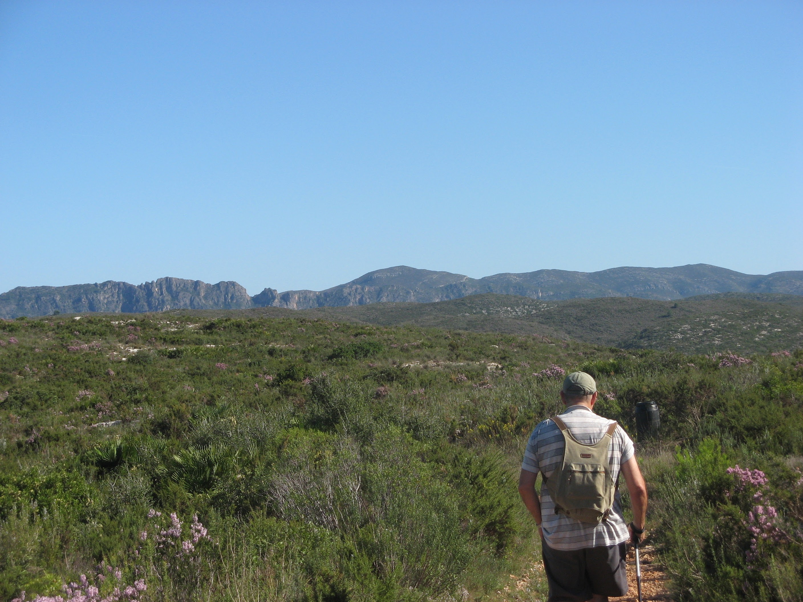
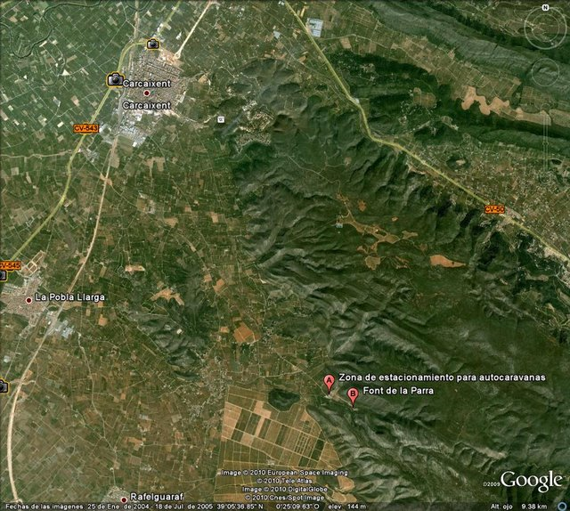

# Carcaixent
## 2009, julio

 

**Senderismo por las cumbres de Carcaixent**

Mi pareja y yo somos poco partidarios de las quedadas. Asistimos como mucho a un par de ellas al año y cuando nos marchamos no podemos explicarnos porqué no somos más partidarios puesto que, salvo la juerga nocturna, lo pasamos fenomenalmente además de conocer a mucha gente interesante.

En las quedadas cada uno da lo mejor de sí mismo y satisface además el espíritu gregario de la  persona. Compartir la comida y las ideas, incluso hablar de problemas y sus reivindicaciones son situaciones que nos acercan a los compañeros como personas.

 

 

**Visión de Google de Carcaixent y el área**

Acudimos el puente del Pilar invitados por ACAV a la salida del aniversario de su fundación en ;. Nos encontramos con unas sesenta tripulaciones en el área y nos instalamos entre ellas como una más. Participamos en las actividades típicas: concursos, comidas y festejos, pero la agradable sorpresa fue el entorno.

El área de Carcaixent, es una de las mejores instalaciones para autocaravanas que hemos utilizado nunca y, probablemente, una de las mejores existentes en Europa. Está emplazada en el antiguo huerto de naranjos Hort de Soriano, a unos seis kilómetros al sur de la población.

Este espacio ha sido acondicionado para servir de zona pública de recreo. Dispone de un lugar reservado para el estacionamiento de autocaravanas y área de servicios. Las plantaciones de chopos proporcionan una sombra agradable y el suelo compacto de las antiguas huertas en terrazas acogen los vehículos sin pendiente haciéndolo adecuado para la pernocta.

El entorno natural en el que está situada el área la hacen ideal para practicar el senderismo y la observación de la

**Un área con los estacionamientos en terrazas**

naturaleza en cualquier época del año. Rodeada de un terreno donde abundan las hierbas aromáticas como el brezo, el tomillo, el romero, las encinas y madroños y la visión de los huertos de naranjos en el valle como un mar verde. Pudimos ver el majestuoso vuelo de una pareja de águilas y escuchar el canto de la perdiz. El punto de partida de los senderos se sitúa en un paraje singular, la Font de la Parra, con cuya agua se riega la huerta.

A Carcaixent se puede acceder desde el área en bicicleta por un camino asfaltado entre naranjos, los seis kilómetros hacia la ciudad, con ligera pendiente, se recorren en veinte minutos y se invierten unos cuarenta en el regreso.

Ciudad de la seda y la naranja tiene distinción de haber sido la población en la que se plantó el primer naranjo para su comercialización, actividad que permitió el desarrollo de una de las bases de la economía de la Comunidad, por iniciativa del párroco Monzó a finales del siglo XIX.

La disposición de este espacio para autocaravanas se produce gracias a la iniciativa de los compañeros valencianos y, sobre todo, a la sensibilidad y visión de sus regidoresque  justifica haber hecho 1.200 kilómetros para disfrutar de una escapada en una agradable compañía y con la perspectiva en el futuro de volver a disfrutarla y ampliarla aprovechando las infraestructuras para el turismo en autocaravana creadas en la CCAA Valenciana, en especial la de Morella y el impagable complemento de las bodegas integradas en España Discovery.