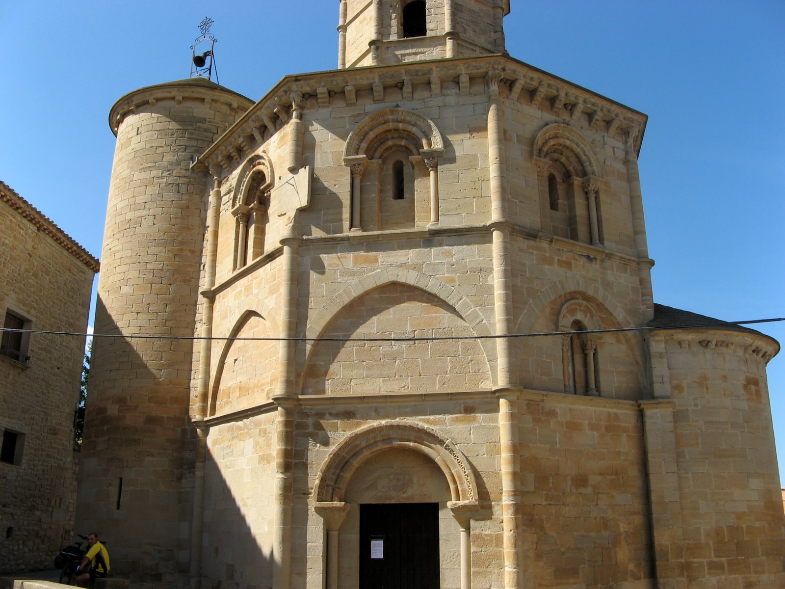
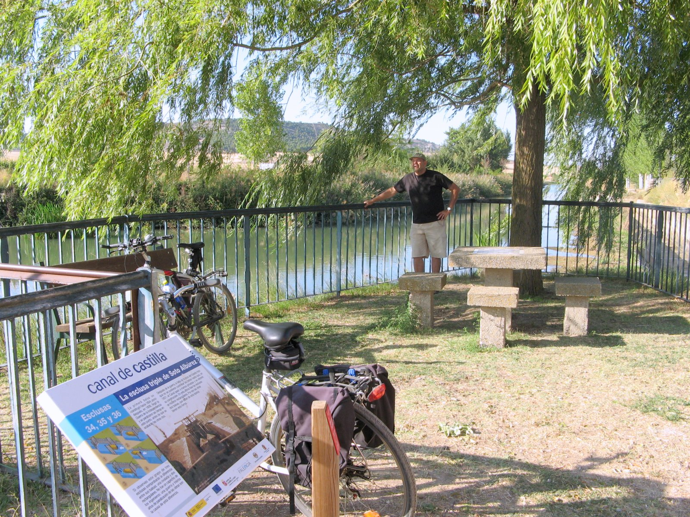
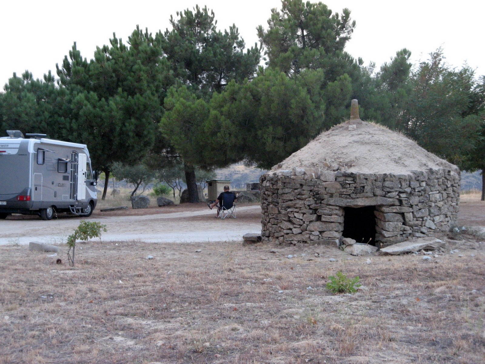
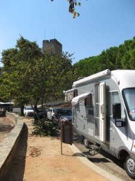
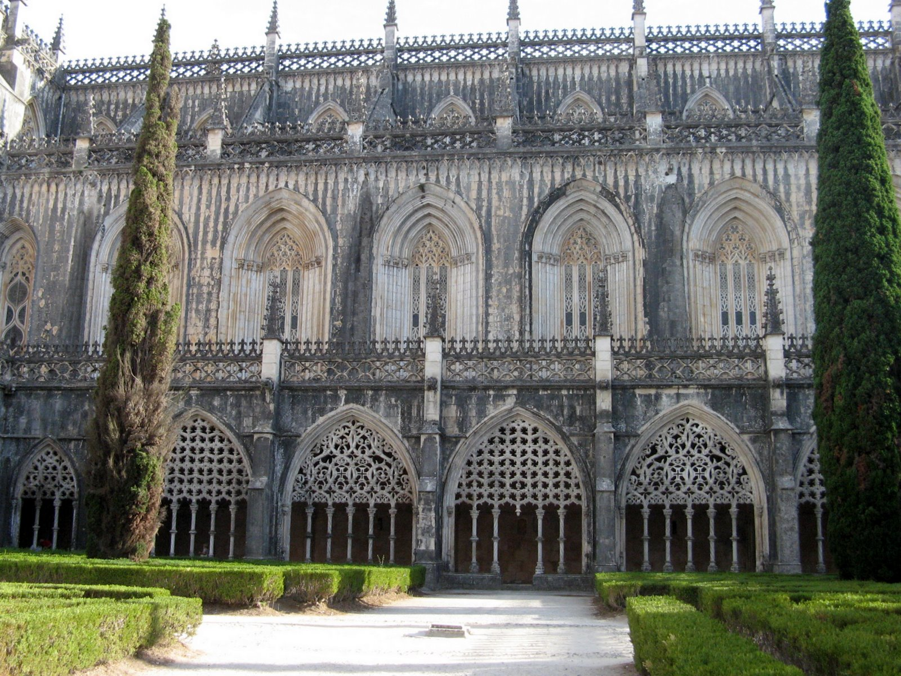
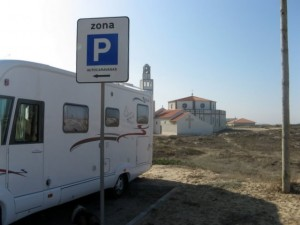
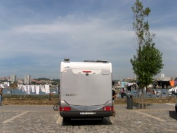
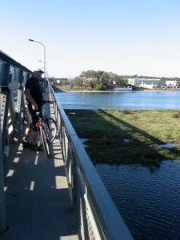
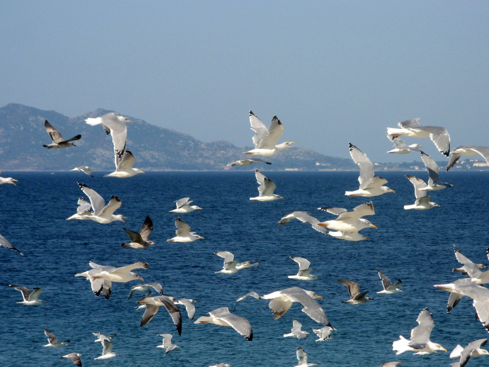
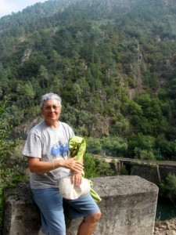

# Portugal y Galicia.
**2009, 10 septiembre - 4 octubre**

**Antes de emprender el camino**

Estar jubilados y disponer de una autocaravana es una combinación perfecta para viajar. La única motivación es la curiosidad y la necesidad de planificar o establecer un destino no es ninguna condición, de forma que el viaje en sí mismo y desde el inicio, es el propio destino cuando el medio, la autocaravana, proporciona el transporte y el alojamiento de acuerdo con las necesidades de cada momento.

Así es como este viaje, sin planificar en sus detalles, nos lleva por una serie de lugares de las tierras de España y Portugal con la vaga y atractiva idea de pasar unas semanas por las orillas del Atlántico y probar los primeros berberechos de este año en Noia.

Por ello no podemos sino relatar lo que hemos visto desde el comienzo y, sobre todo, describir los lugares que nos han proporcionado los medios adecuados para hacer etapas en la esperanza de que estos datos sean de utilidad a otros compañeros.

Queremos agradecer a Conchi y Toño por su ayuda para conocer los recursos logísticos de Portugal y por sus indicaciones sobre los lugares a visitar.

**Comenzamos el viaje**

Salimos de Pamplona, residencia provisional, el día 10 de septiembre. Cargamos agua en la estación de servicio de Acciona en la Autovía Pamplona – Logroño, en la  localidad Navarra de Legarda. Esta Estación dispone de un borne “Euro Relais” y un punto de vaciado, el precio por llenar el depósito de agua es de 2 euros, mediante una ficha que suministran en la oficina.

Paramos en Torres del Río para visitar la iglesia del Santo Sepulcro. Una iglesia atribuida a los Templarios de dimensiones reducidas y de planta octogonal, estirada hacia lo alto. El octógono regular se abre por completo en su lado oriental a un ábside semicircular al que precede un corto presbiterio rectangular.

En el interior dispone de una cúpula espectacular cuya nervadura parece cobijar a quien la contempla. En el simbolismo cristiano del románico el número ocho está asociado a las aguas bautismales y a la regeneración. Del octógono regular se pasa a la circunferencia, la perfección de la cúpula central.

**Logroño (10.09.2009)**

Después de comer nos desplazamos hasta Logroño. Estacionamos en el parking del club deportivo “Las Norias” y continuación realizamos un largo paseo en bicicleta que nos lleva por las riveras del Ebro y del Iregua. Después de unos treinta kilómetros, nos relajamos en la piscina del complejo deportivo (4,5 € para los jubilados). La piscina está abierta con Wi-Fi hasta las 21:00 horas y el complejo hasta las 23:00. Logroño es una ciudad acogedora que merece la pena visitar de vez en cuando.

Pernocta: Logroño, parking gratuito del ferial, 42º28'29,77''N / 2º27'15,21''W, junto al parque deportivo de Las Norias, en la margen izquierda del Ebro. Se trata de un amplio espacio cubierto por plátanos de porte alto.

**Palencia (11.09.2009)**

Salimos hacia Palencia donde llegamos a mediodía. Por la tarde recorremos en bicicleta el ramal del canal de Castilla que llega hasta la Dársena situada a doscientos metros del área y continuamos por el camino de sirga hasta Dueñas, unos treinta kilómetros en total. El camino es practicable para mi burra “Sócrates” aunque está mejor preparada para la ciudad. A pesar de ello se defiende con bravura en un camino empedrado.

Pernocta: Palencia, área gratuita, 42° 0′15.84″N / 4°31′59.02″W. Como siempre quedamos satisfechos de las prestaciones del área, una de las mejores de España, que compartimos con otras ocho familias, agradeciendo una vez más la labor de su incansable promotor con el que no pudimos compartir unas cervezas por hallarse fuera de la ciudad. Una de las mejores áreas de España.

Al día siguiente visitamos por fin la catedral de San Antolín, después de dos intentos fallidos anteriores, pues hemos coincidido con obras o estaba cerrada por alguna circunstancia. Nos impresionó especialmente la cripta, tanto la parte visigótica como la románica por la limpieza de sus líneas como por la seguridad con la que están levantadas en este primer inicio del románico.

Nos desplazamos hasta Baños de Cerrato para visitar la iglesia visigoda de San Juan de Baños. Construida en el S VII. Cabe destacar la armonía de las tres naves con arcos de herradura apoyados sobre columnas clásicas con capiteles decorados y la simpleza de las líneas, así como la decoración geométrica del friso y el pórtico de arco en herradura con una cruz esculpida en la clave.

**Aldeadávila (12.09.2009)**

Después de comer partimos hacia Zamora. Nuestra intención era visitar la ciudad y quedarnos a dormir, pero en el parking que habíamos previsto había un par de coches calcinados y el lugar parecía solitario al pié de la fortaleza, así que decidimos continuar viaje después de la visita.

Como siempre que visitamos la catedral nos impresiona el magnífico cimborio de influencia bizantina. Completamos el recorrido con una visita a la muralla y al castillo con los restos del antiguo alcázar. En uno de los laterales se estaban asando a fuego lento un par de terneros de los que se iban a dar cuenta a partir de las 8 de la tarde, lamentamos perdernos esta oportunidad de degustar este tipo de asado.

Pernocta: Área para autocaravanas de Aldeadávila en los Arribes del Duero, 41º13'º13''N / 6º36'50''W. Se trata de un área un poco en cuesta al lado de un albergue, lugar tranquilo y seguro donde los haya. Dispone de los elementos necesarios para vaciar y cargar depósitos cómodamente aunque la maniobra sea un poco complicada.

Salimos en bicicleta hasta el mirador de aves por unos caminos de tierra y piedra con algunas fuertes pendientes que hacen tirar del ronzal de nuestras “burras”, podemos avistar águilas y buitres, así como el impresionante paisaje de los arribes.

Una comida en el restaurante Rinconada de las Arribes, tabla de ibéricos, chuletón de morucha, postres, vino y café (42 €). Por la tarde damos un paseo hasta el Picón de Fermín y volvemos a la misma área para pernoctar.

**Tomar (14.09.2009)**

Salimos con destino a Portugal pasando por Ciudad Rodrigo, Fuentes de Oñoro y Castelo Branco hasta el área gratuita de Maçao. No tenemos prisa.

Pernocta: Maçao, 39°33′24.60″N / 7°59′57.23″W. Es una pequeña población situada a unos diez kilómetros al norte de la  carretera. Dispone de un parking gratuito sin espacio reservado para autocaravanas y un área de servicio con un borne Euro Relais gratuito.

Llegamos a Tomar con buen tiempo donde visitamos, en el interior del castillo, el Convento de Cristo. Una iglesia octogonal construida por los Templarios en el S.XII continuada hasta el S.XVII donde se mezclan los estilos románico, gótico, renacentista y manuelino. Destacan la cúpula de la iglesia octogonal “Charola de los Templarios” de dos pisos, sostenida por ocho pilares y profusamente decorada por pintores locales y la ventana manuelina del S.XVI que da al claustro de Santa Bárbara.

**Óbidos (15.09.2009)**

Continuamos el viaje hasta Óbidos donde visitamos la ciudad fortificada por la tarde haciendo el recorrido obligado por el perímetro interior de las murallas. La ciudad fue reconquistada en el S.XII reconstruyéndose como una fortaleza que vigilaba el litoral protegida tras un recinto amurallado.

Pernocta: Óbidos  39°21′22.97″N / 9° 9′25.63″W. Área privada de pago (6€ en temporada alta. Espacio para 21 AC, ocupada por una docena en su mayoría francesas. Dispone de un borne de servicios artesanal cómodo de utilizar. No dispone de electricidad ni de Wi-Fi. Es de destacar la extraordinaria amabilidad del empleado y la de Nuno, el responsable.

Para visitar Óbidos es necesario estacionar en el exterior de la plaza amurallada, hay varios parking para turismos de pago en los que no se permite estacionar AC. En las proximidades del acueducto es posible, en temporada baja, estacionar de forma gratuita aunque la pernocta es aconsejable hacerla en el área.

**Peniche  (16.09.2009)**

Salimos con destino a Peniche. Una población costera que controla la entrada a una península donde en el cabo Carboeiro se puede contemplar las rocas atormentadas del litoral. Es una zona llana que permite pasear en bicicleta y a pié. Tomamos el primer contacto con la playa y pasamos el día dedicados al “dolce far niente”.

Pernocta: Peniche 39°21′27.59″N / 9°22′39.08″W. Se trata de un parking gratuito situado en las proximidades del puerto, junto a las murallas y frente al parque de bomberos. En el parking es fácil encontrar unas decenas de autocaravanas francesas y británicas durante todo el año, en especial en temporada alta. Es un lugar muy recomendable.

**Alcobaça, Batalha (17.09.2009)**

Tomamos otra vez la carretera de Óbidos para girar al norte hasta Alcobaça y visitar el monasterio de Santa María, cuya iglesia es una de las más amplias  y altas de su estilo. Después de la restauración, ha recobrado la austeridad y nobleza de los edificios cistercienses.

Como nos apetece sol y baño y hace un tiempo adecuado, nos acercamos a Nazarè en cuya playa terminamos la mañana y comemos.

Por la tarde, nos dirigimos a Batalha para visitar el monasterio que se erigió para conmemorar la batalla de en la que se enfrentaron los dos pretendientes al trono de Portugal.

La iglesia destaca por la esbeltez y sobriedad de la bóveda y las vidrieras de la capilla mayor del S.XVI. Del monasterio lo más destacable es el claustro real donde la unión de los estilos gótico y manuelino se realiza felizmente. La sala  capitular alberga la tumba al soldado desconocido.

Otro elemento destacable del conjunto del monasterio son las capillas inacabadas del proyectado panteón para don Duarte. El maestro Mateus  recibió el encargo del rey Manuel de acabar el mausoleo. Realizó el pórtico de estilo de transición del gótico al renacentista. Las siete capillas radiales están separadas por los famosos pilares inacabados profusamente decorados en la piedra.

Pernocta: Batalha 39º39'40,88''N / 8º49'29,64''W. Se trata de un área gratuita para autocaravanas con doble bahía en el área de servicios con un borne “Euro Relais”.

**Figueira de Foz (18.09.2009)**

Al día siguiente continuamos viaje hacia Figueira da Foz donde llegamos a mediodía. Un paseo en bicicleta hasta el cabo Montego y una buena sesión de playa completan el día.

El inmenso parking está semi-cerrado para un evento juvenil musical del domingo por lo que nos recomendamos abandonarlo cuanto antes. A doscientos metros hay un mercado cubierto que es necesario descubrir donde compramos el primer frango churrasco del viaje.

Pernocta: Figueira da Foz  40° 8′51.45″N / 8°52′2.47″W. Se trata de un parking gratuito en el que estacionan libremente las AC. Son frecuentes los eventos y las ferias, por lo que es fácil que el espacio se vea reducido. En esta ocasión ocupamos el espacio libre una veintena de AC, otras tantas tuvieron que dar la vuelta a últimas horas de la tarde por falta de espacio.

**Aveiro  (19.09.2009)**

Retomamos el viaje temprano en dirección a Aveiro donde llegamos a media mañana.

Repetimos el programa: fuerte paseo en bicicleta por los canales hasta Praia da Barra y baño en la playa con tostado incluido, el paisaje de los canales y rías es espléndido. Se trata de una ciudad muy turística y bien preparada con edificios característicos de la zona.

Pernocta: Costa Nova do Prado  40°36′51.57″N / 8°45′7.44″W. Parking reservado a AC en uno de los lados de una calle que lleva a las dunas de la playa. La población está situada a unos cinco kilómetros al suroeste de Aveiro al que se accede a través de un espectacular puente sobre el canal. El lugar (una calle) está un poco inclinado y tiene capacidad para unas veinte AC.

Dispone de váteres públicos y se permite el acceso a un imbornable del alcantarillado donde se puede vaciar el váter o las aguas grises. Dispone también de un grifo desde el que es posible llenar el depósito de limpias. Ambas tareas deben realizarse con la ayuda de cubos.

A la mañana siguiente un paseo a pié de un par de horas nos lleva a recorrer el pueblo y sus alrededores partiendo hacia Oporto no sin antes pasar por el área de servicios de Estarteja (40º45'12.91N / 8º34'05.31''W), gratuito con un borne Euro Relais, donde vaciamos y llenamos depósitos más cómodamente que en Costa Nova.

**Oporto (20.09.2009)**

Llagamos a Gaia (A Afurada), al sur de Oporto, en la margen izquierda de la ría del Duero. Este parking gratuito, aunque solitario durante la noche, está bien iluminado y bien situado con acceso a los autobuses que acercan al centro histórico.La vista de la ría y de Oporto es magnífica. Destinamos e resto de la tarde a descansar.

Pernocta: Gaia (Oporto) 41°08′29.02″N / 8°38′59.27″W. Parking gratuito y tranquilo frente a la desembocadura del Duero. Oporto es una ciudad donde escasean los espacios para estacionar autocaravanas y en cuyo centro se han descrito algunos robos. El parking de Gaia está en el extrarradio aunque iluminado por la noche puede ser solitario, sin embargo no da sensación de inseguridad.

Circula información de que se puede pernoctar en la antigua Alfándega (aduana). Sin embargo ya no es posible entrar allí con autocaravanas. Está reservado como aparcamiento de turismos. Gaia es una buena alternativa para visitar la interesante ciudad de Oporto en especial la zona típica de La Rivera  en las inmediaciones del puente Luiz I, para el que salen, además, autobuses urbanos.

Por la mañana salimos en bicicleta por un camino mixto peatonal que recorre los cinco kilómetros que nos separan del puente Luiz I por la orilla izquierda del Duero, y subimos al centro en el funicular. Hacemos la compra (otro frango churrasco) y regresamos por el mismo camino. La vista del Centro Histórico de Oporto desde el Duero, de las bodegas, de sus puentes es excelente pues hacemos el mismo recorrido que los barcos para turistas.

Para hacer apetito continuamos el recorrido por un camino para bicicletas que nos lleva por la margen izquierda hasta más allá de Praia de Lavadores.

Después de comer nos dirigimos a un mayorista de vinos “Grossâo” 41º13'36,73''N / 8º40'42,16''W donde nos proveemos de unos excelentes reservas de denominación “Douro” de 2005 a un precio imbatible.

**Vila do Conde y Exposende (22.09.2009)**

Llegamos a Vila do Conde por la tarde y nos situamos en el parking gratuito del paseo marítimo, junto al castillo.

Pernocta: 41º20'41,73''N / 8º44'44,79''W, parking gratuito próximo al castillo no se ven más autocaravanas. Un poco ruidoso por la proximidad con la  carretera. Hay otros lugares donde estacionan AC.

Día completo de relax, paseo en bici por la costa hasta A Ver-o-Mar pasando por Povoa de Varzim, playa y reposo, el día es espléndido.

**Continuamos el viaje hasta Exposende.**

Pernocta: Exposende, 41º32′18,99”N / 8º46′42,99”W, parking gratuito junto a la estación de autobuses. Se trata de un enorme parking bien iluminado donde nos quedamos solos, se comenta que en este parking se va a construir un área de servicios para AC.

Impresiona un poco la soledad pero tampoco da sensación de inseguridad por la iluminación. Anteriormente se podía pernoctar en el puerto pesquero, pero últimamente está prohibido.

Hemos dormido con tranquilidad pues es lugar es silencioso, nos trasladamos para estacionar en el paseo marítimo y como hace buen tiempo recorremos en bicicleta la zona con un paisaje muy bonito.

A mediodía nos desplazamos a Barcelós al hotel Bogoeira, donde aparcamos enfrente 41º31'54,27''N / 8º37'01,95''W. Entrantes y una cazuela de “Galo”, cocido de gallo con su sangre con arroz. La cazuela que nos sacan con medio gallo son casi cuatro raciones que no podemos terminar. 39 euros con café y vino.

**Viana do Castelo (24.09.2009)**

Después de digerir la comida mediante un paseo por la población de los gallos salimos hacia el camping Orbitur situado en la playa de Cabedelo en las proximidades de Viana do Castelo. (14,5 euros)

El camping dispone de comodidades aunque con terreno un poco inclinado y el suelo de arena, la piscina está abierta y aprovechamos para hacer limpieza general y relajarnos.

**Pernocta: Viana do Castelo, 41º40'41.63''N / 8º49'34.99''W. Camping Orbitur**

**Portosin (25.09.2009)**

Una mañana relajada con un paseo en bicicleta nos repone y después de comer salimos con la intención de pernoctar en el parking de la ecopista de Valença do Minho. Sin embargo hace un calor enorme y el lugar cerrado no permite una brisa, así que decidimos continuar el viaje hasta el Cabo Udra en la ría de Pontevedra frente a la isla de Ons.

Pernocta: Cabo Udra, 42º20′04”N / 8º49′30”W, parking gratuito junto a un espacio de pic-nic. Estamos cuatro autocaravanas, dispone de agua. Lugar bonito y tranquilo aunque por la noche se llena de parejas.

Hemos dormido tranquilos, por la mañana un bonito paseo contorneando el cabo hasta un aula de la naturaleza con una espectacular vista sobre la ría de Pontevedra y la isla Ons se completa con una sesión de playa antes de comer.

Por la tarde vaciamos y llenamos depósitos en Boiro y llegamos a Portosin a última hora de la tarde. Una puesta de sol espectacular sobre la bocana de la ría de Noia-Muros despide el día.

Pernocta: Portosín, parking gratuito de la playa de Coira, 42º45'27.06''N / 8º57'01.80''W. Uno de los lugares más bonitos, tranquilos y seguros de todo el viaje.

Hemos dormido tranquilamente, nos reunimos con nuestros amigos Dora, Pepe e Ignacio y nos vamos a navegar a vela por las tranquilas aguas de la ría en un barco de crucero, una autocaravana marina de 14 metros con comedor para doce plazas.

A mediodía, atracamos en O Freixo y damos cuenta de unas fuentes de berberechos, almejas, navajas y calamares locales regados por un sorprendente godella con denominación de origen Valdeorras. Por la tarde un baño en las aguas de la ría que está 20 grados finaliza una jornada excelente.

Pasamos otra noche tranquila en la playa de Coira, visita al mercado dominical de Noia donde compramos una pota de unos divinos garbanzos con callos (6 euros para seis personas) que damos cuenta en Coira en compañía de Dora y Pepe después de un último baño en la playa.

**Boiro (29.09.2009)**

Por la tarde nos despedimos de nuestros amigos y nos desplazamos hasta la playa de Boiro. El bareto de la playa está cerrado y el cartel nos indica que debemos desplazarnos hasta el centro del pueblo para abonar la estancia. Nos quedamos en compañía de tres AC.

Pernocta: Boiro, área para autocaravanas 42º38'30.17''N / 8º53'48.54''W. El área es de pago (6€), pero el bareto está cerrado y un cartel nos remite al centro del pueblo a un par de kilómetros. Consultamos con otras tres autocaravanas alojadas y decidimos pagar si vienen a cobrar, cosa que no ocurre.

Los coches que pasan por la carretera meten bastante ruido, pero podemos dormir sin problemas. Vaciamos y llenamos depósitos y nos desplazamos hasta Portonovo con la intención de coger el barco de las 12 hasta la isla de Ons. Los viajes desde Portonovo se suspendieron el último fin de semana de septiembre, por lo que debemos desplazarnos hasta Bueu.

**Bueu (29.09.2009)**

Comemos en el restaurante “La Estrella”, Polvo a feira, mejillones y navajas con patatas hervidas (39 euros) y tomamos el barco de las 16:00.

La isla de Ons es un espacio natural protegido perteneciente al Parque Nacional de las Islas Atlánticas de Galicia. Hacemos un recorrido de un par de horas hasta el faro contemplando el impresionante paisaje de las entradas de las rías de Pontevedra y Arousa. Una excursión recomendable y para recordar.

Pernocta: Bueu, parking gratuito junto al puerto, 42º19'37.18''N / 8º47'09.54''W. Un poco justos de espacio entre los turismos, nos despierta el ruido de la actividad portuaria a las 08:00 de la madrugada.

**Ourense (30.09.2009)**

Compramos unas nécoras en el mercado y continuamos el viaje hacia Ourense. Hace un calor pegajoso.

Pernocta: Ourense, parking de las termas de Chavasqueira 42º20'55.28''N / 7º52'41.57''W, junto a los bomberos.

Ha sido una noche un poco ruidosa. Comenzó nuestro vecino, una Laika que puso el aire acondicionado con un generador. Afortunadamente acabó en una hora y media. El lúgubre mugido de las vacas del matadero próximo fue interrumpido por un par de salidas de los bomberos con todo lujo de sirenas. Pusimos a prueba los tapones de los oídos y así pudimos dormir bastante bien.

Nos despertaron los motores de los coches de bomberos que se pusieron en marcha simultáneamente a las 08:30 de la madrugada y nos fuimos con las bicis a dar una vuelta por la ribera del Miño entre la pasarela peatonal de Outariz y el puente romano en torno a un espacio público liberado en ambas orillas.

La ruta termal de Ourense ha sido un hallazgo para nosotros que justifica el viaje. Se trata de varios afloramientos termales a lo largo de un tramo del río. Chavasqueira es la más próxima al casco urbano, pero también están las de Tinteiro, Muiño, Outariz y Canedo.

Después del paseo en bicicleta nos da tiempo para visitar la catedral de san Martiño, una espléndida iglesia románica con un precioso cimborrio octogonal y el pórtico del paraíso del maestro Mateo. Destacan también los pórticos situados a ambos lados del transepto.

Nos desplazamos al parking situado en el área de recepción al lado del puente peatonal que accede a las termas de Outariz y, después de comer, visitamos las pozas de Outariz y burgas de Canedo, piscinas termales gratuitas.

**Pernocta: Ourense, parking gratuito de Outariz, 42º29'51.54''N / 7º54'47,95''W**

01.10.2009. Noche tranquila a pesar de la proximidad de la carretera. Desde primera hora de la mañana acuden coches con usuarios de las piscinas termales y pronto se llena el parking.

**Astorga (01.10.2009)**

Salimos ya de regreso casa parando en el área de Monforte de Lemos para vaciar depósitos y en a Rúa para comer en el área y dar un paso en bicicleta por las inmediaciones del embalse de Santiago.

Tomamos la carretera que bordea el Camino de Santiago entre Ponferrada y Astorga pasando por Foncebadón, Rabanal del Camino y Castrillo de Polvazares que tan buenos recuerdos nos trae y tan buenos paisajes proporciona.

Pernocta: Astorga, parking gratuito junto a las piscinas municipales 42º27'05,90''N / 6º03'28,52''W. Un lugar bonito, tranquilo (relativamente) y Seguro. Lo preferimos al área, más solitaria.

**Saldaña (02.10.2009)**

Continuando el viaje, paramos en Saldaña en la magnífica recién inaugurada área (42º31'06''N / 4º44'27''W), situada al lado de las piscinas municipales tomando el camino frente al mercado de ganado, donde vaciamos y llenamos depósitos.

Visitamos el pueblo y su museo, y nos desplazamos a la villa romana de La Olmeda, donde admiramos en especial los impresionantes mosaicos.

**De regreso (03 y 04.09.2009)**

Continuando el viaje paramos Santovenia de Oca (Bu), para visitar el monasterio de San Juan de Ortega cuya cabecera y transepto, románicos, son excepcionales. Se da la particularidad que el capitel historiado de una triple columna que soporta el ábside del evangelio y que reproduce de forma magistral el ciclo de navidad es recorrido por un rayo de luz vespertina durante los equinoccios.

Nos alojamos nuevamente en el parking de Las Norias en Logroño donde iniciamos el viaje y, después de recoger y limpiar la AC emprendemos el viaje de regreso a casa.

**Portugal y las autocaravanas**

No hay mucho que descubrir sobre los recursos que ofrece Portugal a los autocaravanistas. Solo podemos decir que en la zona que hemos visitado la actitud en general es excelente.

En las fechas en que hemos recorrido la costa al norte de Lisboa hemos encontrado muchos espacios y muchos lugares donde pernoctar. Entre Peniche y Oporto existen áreas de servicios suficientes como para vaciar y llenar depósitos sin necesidad de recurrir a las estaciones de suministro de combustible.

Es particularmente destacable que en la zona donde se concentra una parte del patrimonio histórico, Batalha, Leiria, Óvidos, Alcobaça o Fátima se encuentran accesibles áreas de servicios para autocaravanas.

La costa es particularmente interesante con grandes playas aunque con mar abierto y un ecosistema dunar aunque muy modificado por el hombre bastante bien conservado.

En la costa se nota un esfuerzo por ofrecer una calidad de vida al turismo y las zonas dunares están protegidos por largas pasarelas de madera que impiden que se invada las zonas críticas.

También se aprecia un esfuerzo por facilitar los desplazamientos en bicicleta con caminos específicos.

El precio del gasoil oscila entre los 1.24€ y los 1,36€ aunque se puede encontrar en algunas grandes superficies a 0,94, como en España en algunas grandes superficies. Sin embargo la comida es significativamente más barata que en el norte de España. Hay una excelente oferta de productos locales de las huertas y pescado en la costa.

En resumen, sin contar con los servicios de nuestros vecinos franceses podemos afirmar que la zona de la costa entre Lisboa y Oporto es un lugar donde merece la pena pasar una temporada en AC.

Miles de jubilados franceses, británicos y alemanes se concentran en la zona en especial en la costa y en el sur, pero en especial en Peniche, Figueira de Foz y Aveiro se pueden encontrar todo el año numerosas autocaravanas procedentes del centro y norte de Europa.