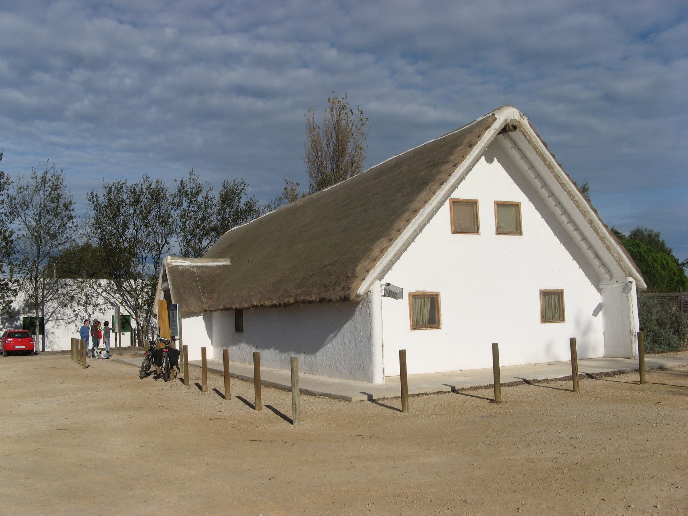
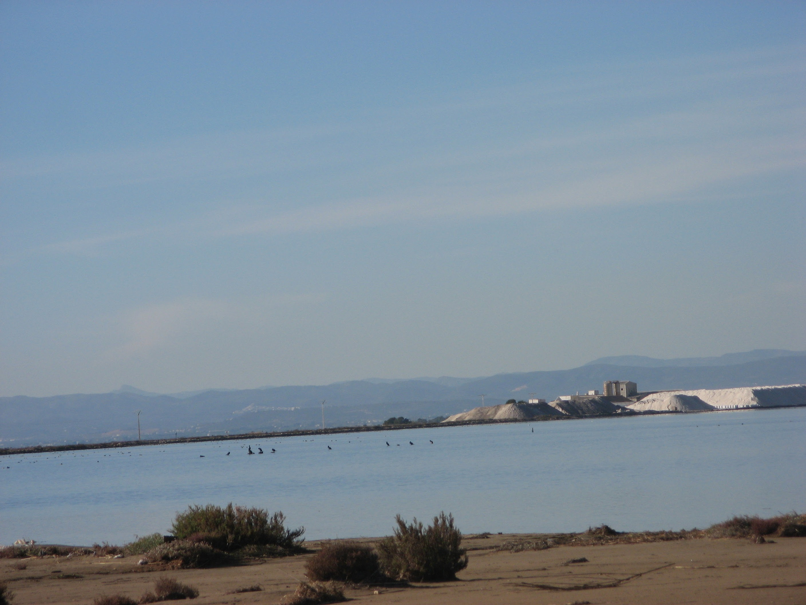

# Delta del l’Ebre
## 2009, 4 diciembre - 8 diciembre

 

**Atardecer en el Delta**

En primer lugar debemos agradecer a Carme y Damià por la información previa que tan amablemente nos facilitaron y que nos permitió planificar el viaje sin problemas.

El Delta del Ebro es un espacio formado por los sedimentos que aporta el río del mismo nombre, verdadero protagonista, en su conjunción con el mar Mediterráneo. Tiene una superficie de 320 km2.

La riqueza biológica contrasta con la intervención del hombre que ha humanizado el territorio dedicándolo a la agricultura en gran parte. La creación en el año de 1983 del Parque Natural del Delta de l’Ebre trata de armonizar los valores naturales de la zona y la actividad económica de sus habitantes.

Las características del terreno, el clima, su paisaje y la diversidad biológica le convierten en un destino privilegiado para el turista amante de la naturaleza. Si este turista utiliza la autocaravana como medio de transporte y alojamiento dispone de mayores oportunidades para disfrutar de un viaje inolvidable practicando una forma de turismo sostenible si, además, se respetan todas las limitaciones inherentes a un parque natural protegido.

Este relato resume nuestra actividad durante la semana de estancia en el Delta. La base de pernocta la situamos en Sant Carles de la Rápita aunque hay muchos otros lugares donde es posible la pernocta, sobre todo en otoño, invierno y primavera.

La mayor parte de la superficie del Delta está dedicada al cultivo del arroz, por este motivo el paisaje, plano como la palma de la mano, cambia de aspecto y de color a lo largo del ciclo del cultivo. En invierno, durante nuestra visita, los campos estaban inundados o con los restos de la siega entre los que predominaban los colores verde y ocre.

Los campos inundados y las lagunas acogen numerosas aves que pasan el invierno en la zona, se cuentan más de 350 especies, anátidas, ardeidas, limícolas, rapaces y fumarales, de las que las más llamativas son los flamencos y las garzas reales.

La llanura del terreno, los caminos para bicicletas y las carreteras con pocos obstáculos y una circulación razonable, así como los parajes protegidos, hacen del territorio un lugar ideal para el senderismo, la bicicleta en contacto con la naturaleza.

 

**Casa de la Fusta, punto de información del parque.**

**Recursos para autocaravanas**

Salvo en las áreas naturales protegidas de la playa de Trabucador y la margen izquierda de la desembocadura del Ebro en las proximidades del camping de la urbanización Riumar, donde está prohibida la pernocta por dudosas razones de protección medioambiental, se puede pernoctar en cualquier lugar donde se permita estacionar. En especial:

**L’Ampolla, junto a la playa, 40º47’50,45’’N / 0º42’3,40’’E**

**Deltebre (Urbanización Riumar), paseo marítimo, 40º43’35,77’’N / 0º50’39,50’’E**

**La Casa de Fusta, 40º39’29,10’’N / 0º40’29,22’’E**

**Poble Nou del Delta, 40º38’44,82’’N / 0º41’18,42’’E**

Sant Carles de la Rápita, Parc d’El Garbi, 40º36’55,86’’N / 0º35’31,56’’E

Hay un área para autocaravanas en Els Muntells, dispone de un acceso a las alcantarillas levantando una tapa en el suelo y un grifo roscado. El costo por pernoctar y vaciar es de 6 euros y de 3 solo por vaciar y llenar los depósitos. Un empleado se encarga de ir a cobrar los servicios.

También se puede vaciar en la estación de servicio CEPSA de Sant Jaume d’Enveja, Avda. Catalunya, 208, 40º42’22,34’’N / 0º43’43,29’’E, dispone de rejilla para el vertido de agua procedente del lavado de coches, váter exterior y grifo de agua limpia.

 

**Gastronomía**

Como es lógico, la gastronomía local se basa en los arroces, negro (con sepia en su tinta), a banda, caldoso, paellas, etc. Los mariscos del Delta son excelentes en especial los langostinos, las ostras, mejillones.

Hay una abundante y excelente oferta de restauración, nosotros probamos y podemos recomendar Can Machino, en Major, 129 de Els Muntells. Anguila amb suc, deliciosa bien especiada, arroz negre, cafés y vino para dos personas 38,00 euros. También tiene una justa fama el Restaurante l’Estany, situado al lado de la Casa de la Fusta, que cultiva la cocina local tradicional, destino de muchos autocaravanistas.

Los mejillones y las deliciosas almejas (20,00€ el kilo) las compramos en la depuradora que hay en la carretera de Sant Carles a Poble Nou, 40º37’35’’N / 0º37’54’’E.

Los langostinos en el almacén a la salida de l’Ampolla, a 700 metros del cruce con la carretera en dirección a Deltebre, también se puede encontrar buen marisco a precio razonable en la depuradora Devimar. El mercado de Sant Carles no es muy grande pero está muy bien surtido de hortalizas, fruta, pescado y marisco.

Una vez presentado el escenario, pasamos a relatar las excursiones realizadas con base, principalmente, en Sant Carles de la Rápita, lugar bonito, tranquilo y seguro para pernoctar o Poble Nou del Delta:

Cormoranes en la bahía de les Alfacs, junto a las salinas.

**Reserva Natural Parcial de la Banya**

Desde Poble Nou del Delta, en bicicleta hasta las salinas de la Trinitat (30 km), pasando por la playa y barra del Trabucador hasta el parque natural de la Banya, a la que se accede a través de una barra de arena de seis kilómetros que delimita la bahía del Alfacs.

Por razones de protección medioambiental está prohibido adentrarse en la La Banya, más allá de las salinas de la Trinidad donde existe un puesto de observación de aves. El acceso por la barra en bicicleta es fácil siguiendo las rodaduras de los camiones que transportan el material desde las salinas.

Pudimos observar varias especies de aves, aunque nos llamó la atención una numerosa colonia de cormoranes.

**La Tancada**

Una excursión memorable desde Els Muntells hasta la Tancada donde pudimos observar una colonia de flamencos compuesta por unos 2.000 ejemplares, según el guarda del parque.

**La Encanysada y la casa de Fusta**

Desde Sant Carles un paseo de 30 kilómetros para observar las numerosas especies que habitan en esta laguna rodeada de espadaña y cañizos. La casa de Fusta es una construcción emblemática de los años 20 del pasado siglo que alberga un museo y el centro de información del Parque Natural del Delta del l’Ebre.

Dispone de un estacionamiento, restaurante y una torre de observación a la laguna de l’Encanysada.

**Ruimar y desembocadura**

El parking situado en la margen izquierda de la desembocadura a la altura del camping de Riumar puede servir de base para la excursión, a pié o en bicicleta, por los caminos que llevan hasta la punta del Fangar, las playas de Ruimar y de la Marquesa.

Desde la torre de observación que existe en la desembocadura se puede observar la laguna de el Garxal y las islas de Sant Antoni y Buda.

**Los Ullals de Baltasar**

Una excursión interesante desde Sant Carles nos lleva a los ullals de Baltasar. “Ullal” vine de ojos y son surgencias de agua filtradas a través de una gruesa capa de hasta siete metros de turba que forman pequeños pozos de una media de cinco metros aunque el mayor llega a los 55 metros.

El agua cristalina contiene vegetación con presencia de nenúfares. Solo se pueden visitar la zona pública recreativa.

La exposición de estas excursiones no está ordenada de forma cronológica y son el objetivo de un tipo de turismo orientado a los valores medioambientales, en los que prima el contacto con la naturaleza a través de senderismo, la observación de la fauna y flora y la bicicleta.

Además, en temporada, hay playas de arena fina, locales de diversión en las ciudades, unos atardeceres que te dejan con la boca abierta, comercio próximo e incluso una piscina cubierta al lado del lugar de estacionamiento en Sant Carles, donde por un precio de 3,20 euros para los jubilados podemos hacer unos largos y usar las duchas sin restricciones. También en las proximidades del parking se puede acceder a la red de Wi-Fi en una cafetería cercana al puerto deportivo.