# El corazón de Marruecos
**2010, 24 marzo - 13 abril**

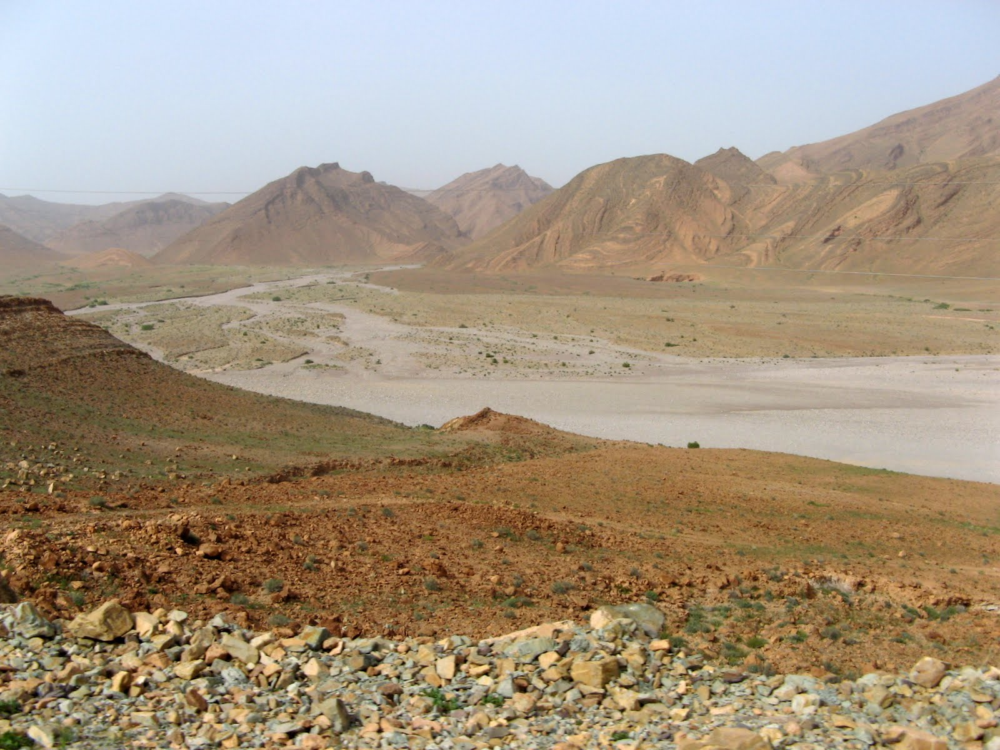

**Un paisaje típico al sur del Atlas Medio**

Hemos tardado cuatro años en regresar a Marruecos. No teníamos muy claras las sensaciones del primer viaje en el que llegamos hasta el desierto de arena Erg Chebbi a través de Meknes y Fez y regresamos por Ouarzazate y Marrakech a través del Tizi-n-Tichka para visitar Rabat y Casablanca.

En esta ocasión deseábamos experimentar lo mismo que los miles de jubilados, en especial franceses en la costa atlántica. Con este objetivo partimos el 23 de marzo de 2010 por el corredor del Atlántico con la intención de llegar a Sidi Ifni.

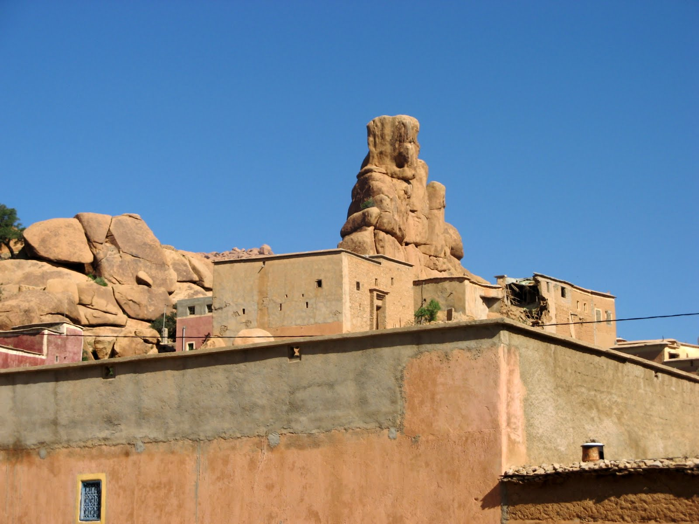

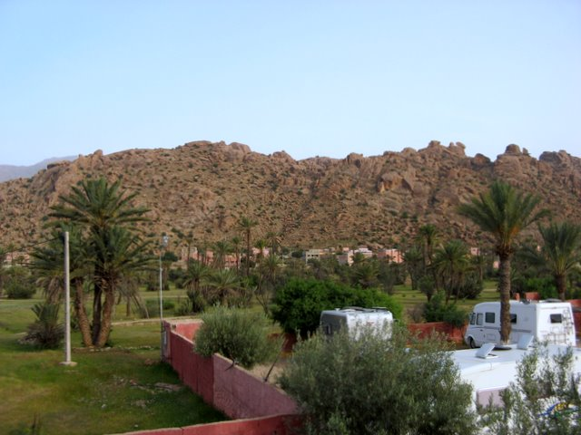

**Casa en la rocas en las proximidades de Tafraute**

**Preparación del viaje**

Había escrito un tocho con la introducción del relato que preferí publicarlo aparte como ayuda para la preparación del primer viaje a Marruecos en AC o como recordatorio a los compañeros que se decidan a hacerlo. En este trabajo pretendo transmitir las sensaciones que hemos experimentado con realismo.

Estas sensaciones, producto de experiencias personales, no reflejan más que una opinión personal a la que debemos añadir la convicción de muchos otros compañeros españoles y franceses con los que hemos intercambiado nuestras experiencias y que regresan año tras año fascinados por los paisajes y la cultura de un país que no deja indiferente a nadie.

Hemos utilizado el mismo viejo mapa Michelin de 2006 “Ediciones de Viaje” 959, lleno de anotaciones y de recuerdos que dejamos al final mucho más deteriorado y pintado. La guía Gandini de los Camping de Marruecos y algo más, edición de 2009-2010. Y el fiel TomTom (V=7.917) en la PDA con la cartografía de Marruecos (v840.2573) que nos fue de una gran utilidad, así como la misma guía Lonely Planet de 2006, también garabateada con muchos apuntes.

Sin embargo, el mejor bagaje fue la experiencia de un viaje anterior y sobre todo la decisión de disfrutar de un país con lo mejor que puede ofrecer una autocaravana: amplio margen a la improvisación y carencia de la necesidad de una planificación para decidir la próxima etapa.

**Vista del camping Tazka de Tafraute**

**Iniciamos el viaje**

El 23 de marzo después de cruzar el estrecho en el ferry de Balearia entre Algeciras y Ceuta, donde pernoctamos, atravesamos la frontera sin mayores dificultades. Pasamos por Assilah a la que realizamos un breve visita a las murallas construidas por los portugueses en el S.XV llegando a pernoctar en el camping l’Ocean Bleu en Mohamedia (33º44,24’N / -07º19,45’W), correcto,  con Wi-Fi gratuito (75DH).

El 24 de marzo recalamos de paso en el camping La Calme, en Ida Ougourd (31º26,46’N / -09º41,84’W), a 17 kilómetros de Essaouira en la carretera a Marrakech, camping que ya conocíamos del viaje anterior situado en un bosque de arganes. (90DH).

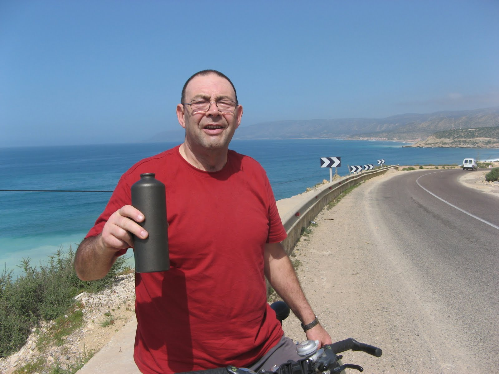

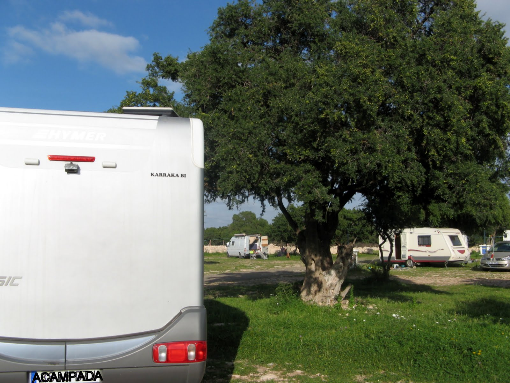

La carretera a orillas del Atlántico en las inmediaciones de Agadir

**Agadir**

El 25 de marzo llegamos al camping Atlántica Parc situado en Imi Ouadda a 27  kilómetros al norte de Agadir (30º35,24N / -09º45,08’W). Se trata de un complejo turístico enorme orientado principalmente al campismo en autocaravana en una urbanización de ladrillo en construcción en la costa y con todas las facilidades para el mantenimiento de las autocaravanas.

Confección de tapices para no pisar la tierra, toldos y tiendas complementarias, reparación y mantenimiento de la mecánica de las autocaravanas y área de mantenimiento de AC del grupo Trigano, pescadería con productos de la costa, Internet, alquiler y venta de parábolas para la recepción de satélite y un excelente complejo acuático gratuito para los residentes al precio de 105 DH diarios para estancias de menos de siete días.

La costa entre Agadir y Sidi Ifni según nos informan los veteranos, ha acogido y acoge miles de jubilados, en especial franceses y alemanes. Del camping salvaje, prohibido en la actualidad por las autoridades marroquíes, han pasado en su mayoría al campismo regulado con estancias prolongadas durante los meses de septiembre a mayo.

Agadir es una ciudad demasiado europea y turística en la que prima el cemento y dispone de una playa y un paseo marítimo realmente notables. Permanecimos dos días en el camping que aprovechamos para pasear en bicicleta por la costa y patear el paseo marítimo de Agadir.

**Arganiere del camping "La Calme" cerca de Essaouira**

**La costa atlántica**

El 27 de marzo llegamos al camping Internacional Wassay Beach en Sidi Wassay (situado al el borde del mar, en el Parque Nacional de Souss Massa. Este parque que se puede visitar en todo-terreno, y es una reserva biológica en la que se pueden observar aves y mamíferos y e incluso algunos ejemplares de gacelas.

El paisaje es interesante pero los atractivos consisten en el “dolce far niente” costero. Estimamos que todo lo que vamos a encontrar en la costa al sur es más de lo mismo y decidimos entrar en el Marruecos que buscamos, el desierto, las aldeas, las tradiciones: los zocos, las medinas, la tajina y el cuscús caseros.

**Tiznit**

No pareció interesante la ciudad en la guía y recalamos en el camping Internacional de Tiznit (29º41,65’N / -09º43,57’W), 70DH incluida la electricidad.

Un buen paseo en bicicleta y una visita medina inicia el contacto con el Marruecos que buscamos. El interesante zoco de las joyerías completa la visita a la ciudad.

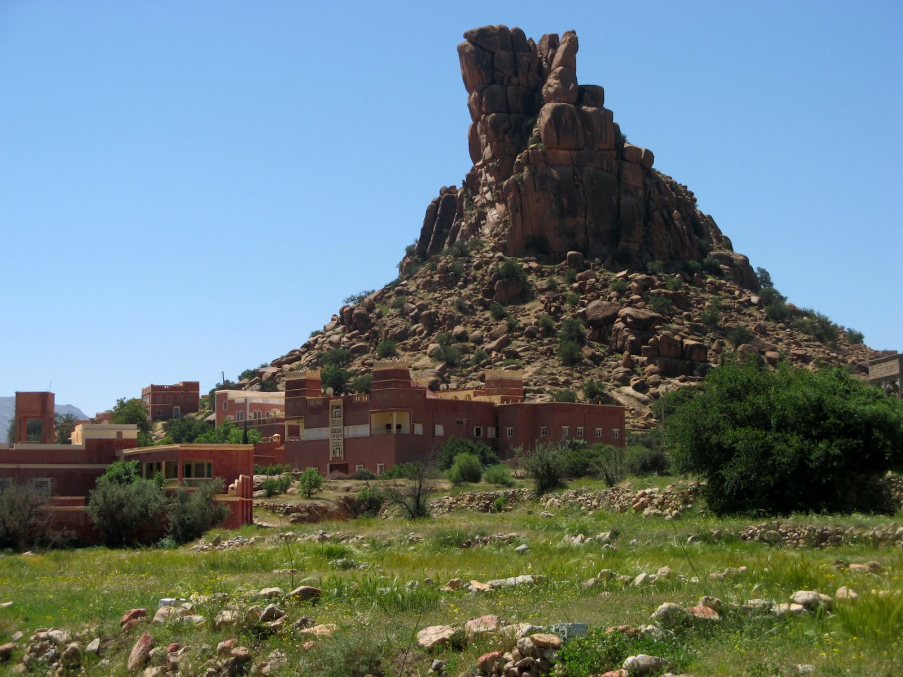

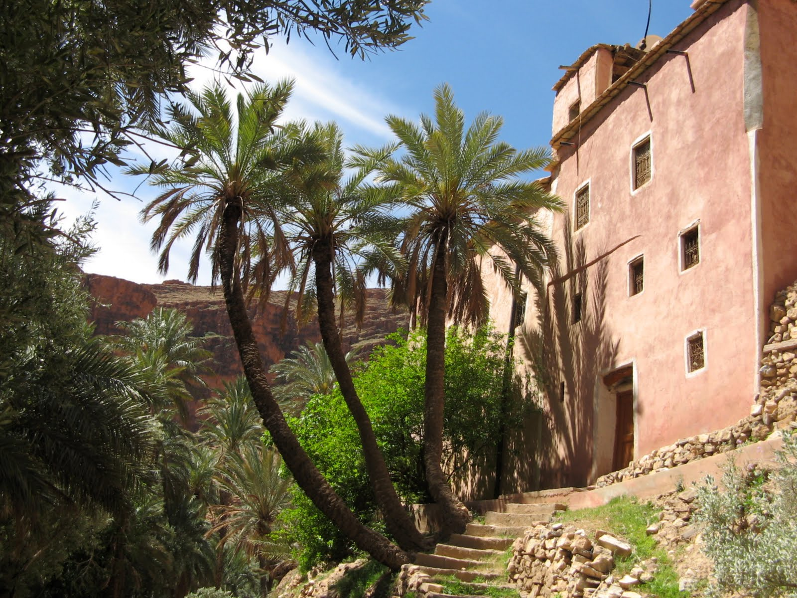

Cabeza de león en las rocas visto desde el camping Tazka en Tafraute

**Tafraute**

El 29 de marzo decidimos viajar hacia el interior del país hasta la población bereber de Tafraute a mil metros de altitud recalando en el camping Tazka (29º42,93’’N / -08º59,16’W). Un camping tranquilo, con Wi-Fi y algo sombreado con almendros (70 DH). Luce el sol y hace calor pero está mitigado por una ligera brisa a 1.000  metros de altura sobre el mar.

Hay tres camping rodeados de un formidable palmeral donde también se puede hacer camping salvaje, el vigilante cobra 10 DH al día, pero nadie nos ha podido explicar donde se vacían los depósitos.

Tafraute es la ciudad de las babuchas. En el zoco se pueden comprar con y sin talonera, de cuero crudo o teñido, con suela de plástico o de neumático, cosidas o pegadas por unos 60 DH a 80 DH. Los miércoles hay un zoco donde se pueden comprar verduras frescas. Los comerciantes acostumbran a visitar el camping para ofrecer sus productos o viajes con guía a los residentes.

**El "Sombrero de Napoleón", cerca de las rocas azules**

En el camping el cocinero Moha prepara de encargo unas tajinas o cuscús de pollo o vacuno exquisitos por 50 DH, por la tarde sirve de encargo una harira, la sopa tradicional marroquí, excelente. Todas las tardes hay un torneo de petanca. Y a un par de kilómetros está el restaurante Chez Brahim, que ofrece al margen del teatro típico local una excelente muestra de la comida tradicional en especial la pastilla de pollo (130 DH) que degustamos con placer.

Sin embargo, lo interesante de la población está en su excepcional entorno. Muros de granito rojo tallados por el viento y la erosión que cambian de color con la luz a lo largo del día tomando formas variadas cuya principal figura recuerda la cabeza de un león combinando las formas con las sombras del atardecer.

Al norte se encuentra el valle de Amelne, rodeado de montañas con cotas de 2.200  metros (Jebel Lesk, 2359 m), y a escasos diez kilómetros las rocas pintadas de azul por el artista belga Jean Veran, en 1984 y la formación rocosa conocida como el “Sombrero de Napoleón”. Estos lugares los recorrimos en bicicleta durante los cuatro días que permanecimos encantados en Tafraute.

**Palmeras en el desfiladero de Aït Mansur**

El cuarto día aparecieron nuestros amigos Iñaki y Begoña y Pablo y Tamara, socios de club Sorbeltz. Entre los seis alquilamos un taxi (700 DH) que nos llevó hasta las gargantas de Aït Mansur.

Este paraje, con el río encajonado, contrasta el verdor del palmeral del oasis con las impresionantes paredes verticales rojizas. Se puede acceder en autocaravana a pesar de que hay que vadear el río y pasar unos cientos de metros de carretera sin asfaltar. Había media docena de autocaravanas francesas establecidas hace meses al abrigo del restaurante y la atenta mirada del vigilante que cobra los 10 DH diarios de tarifa.

Nos despedimos de la población con pesar para continuar nuestro camino.

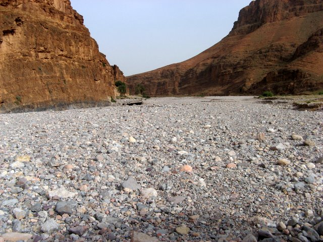

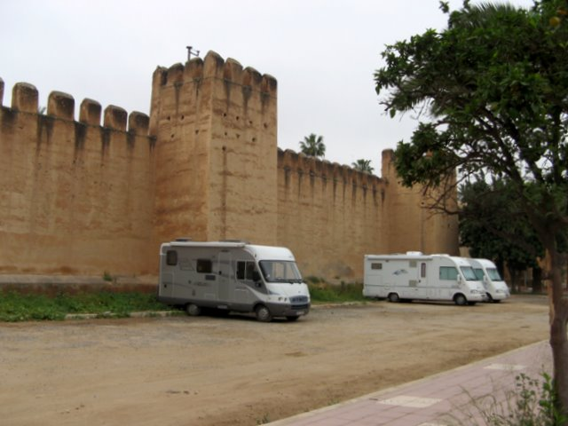

**La plaza principal en Tata.**

**Tata**

El 3 de abril sin prisa tomamos la carretera 7040 hasta Tiguermine, luego la 7038 hasta Olgherm para continuar por indicaciones del Tom Tom por la 7085 hasta Tata. Las carreteras citadas están asfaltadas pero cuando nos cruzamos con otro vehículo es necesario que ambos vehículos salgamos al arcén.

Las lluvias de este invierno las han dejado muy maltrechas y es necesario rodar despacio para evitar saltar demasiado en los badenes y en los vados de los ríos secos o dejar las ballestas en los baches. La media que obtenemos es muy baja, de esta forma llegamos a Tata al atardecer con 42 grados de temperatura a la sombra.

Cuando llegamos el camping municipal estaba completo y no había espacio para más autocaravanas por lo que siguiendo el consejo de la propia policía municipal estacionamos y pernoctamos en un parking junto a otra autocaravana francesa.

Tata es el punto de partida para muchas expediciones al desierto ya que está situada próxima a la frontera con Argelia. Paseamos por sus calles e hicimos algunas compras, entre ellas una chilaba de algodón (115 DH)

**Vadeando un río seco camino de Taroudant**

**Taroudant**

El 4 de abril después de guisar una tajina de cordero a la cocote nos despedimos de nuestros amigos que se encaminaban hacia Sidi Ifni, al suroeste, mientras nosotros tomábamos la carretera 7086, recientemente asfaltada, hacia el norte, en dirección de Taroudant situado en el valle del Sous al sur de la cordillera del Anti Atlas, y la 7025  a partir de Olgherm.

Antes tuvimos que soportar un par de los típicos incidentes locales durante las paradas en la carretera para comer. La presencia insistente de niños y menos jóvenes que aparecen de la nada para solicitar un regalo. Nuestra decisión fue no entregar nada en estos casos por considerarlo negativo, sin embargo la actitud agresiva (solo verbal) de uno de los jóvenes nos trastornó una de las comidas.

La carretera está en algunos puntos muy dañada por las abundantes lluvias del invierno pasado. El paisaje es impresionante: las montañas compuestas de piedra caliza, rocas de granito y basalto quemadas por el sol, el río seco cuyo cauce transcurre en el desierto de piedra mientras se suceden algunos oasis llenos de verdor con palmerales y olivares tupidos. Los pliegues de las montañas que forman dibujos gigantescos son espectaculares y las aldeas se mimetizan en el paisaje en el que predominan los colores ocres.

**Fermín, Arsenio y Cía en las murallas de Taroudant**

En el lado negativo, los niños se abalanzan a nuestro paso gesticulando en las poblaciones que atravesamos pidiendo caramelos. Llegamos a Taroudant al atardecer y nos alojamos en el parkinh del hotel Palais Salam, junto a la kasba, (10 DH).

Tenemos la alegría de encontrarnos con compañeros de ACpasion en el mismo parking. El día siguiente lo dedicamos a recorrer las murallas y la medina así como los zocos y la plaza al-Alaouyine. Una medina muy interesante con una plaza abigarrada donde conviven contadores de cuentos, curanderos y encantadores de serpientes.

Para evitar el calor nos desplazamos a un parking gratuito pero sombreado situado a 100  metros donde pernoctamos tranquilamente en compañía de una veintena de autocaravanas.

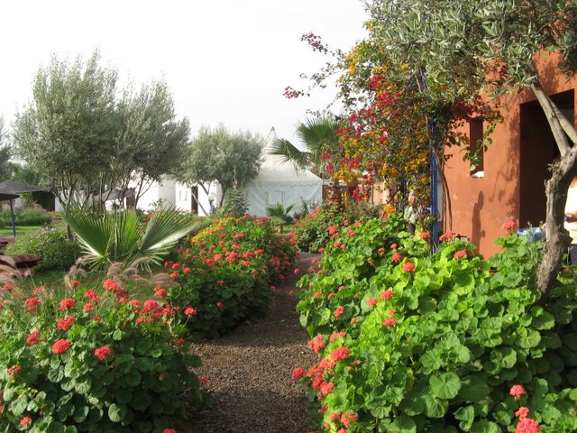

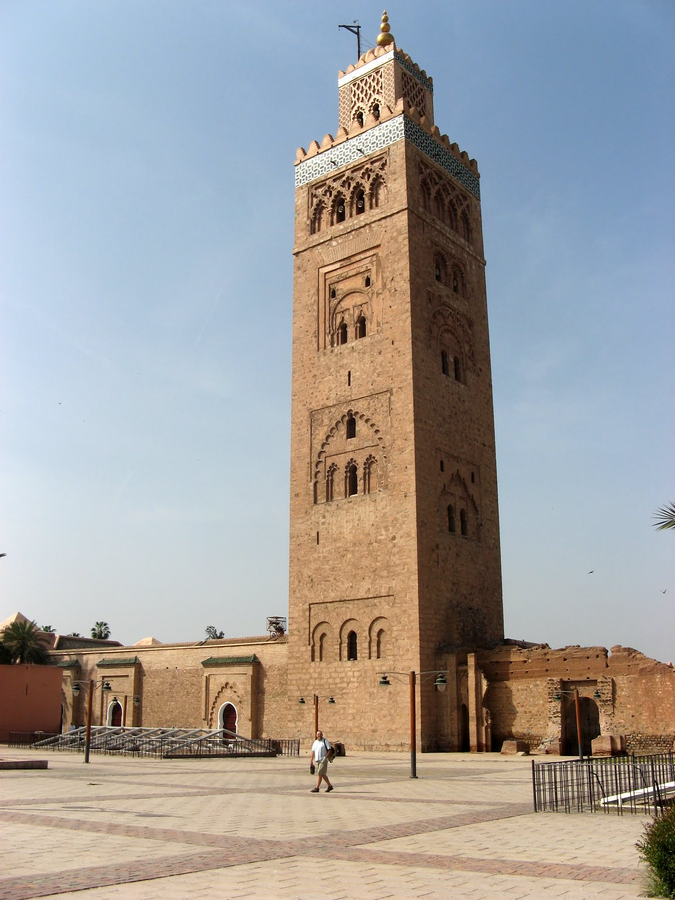

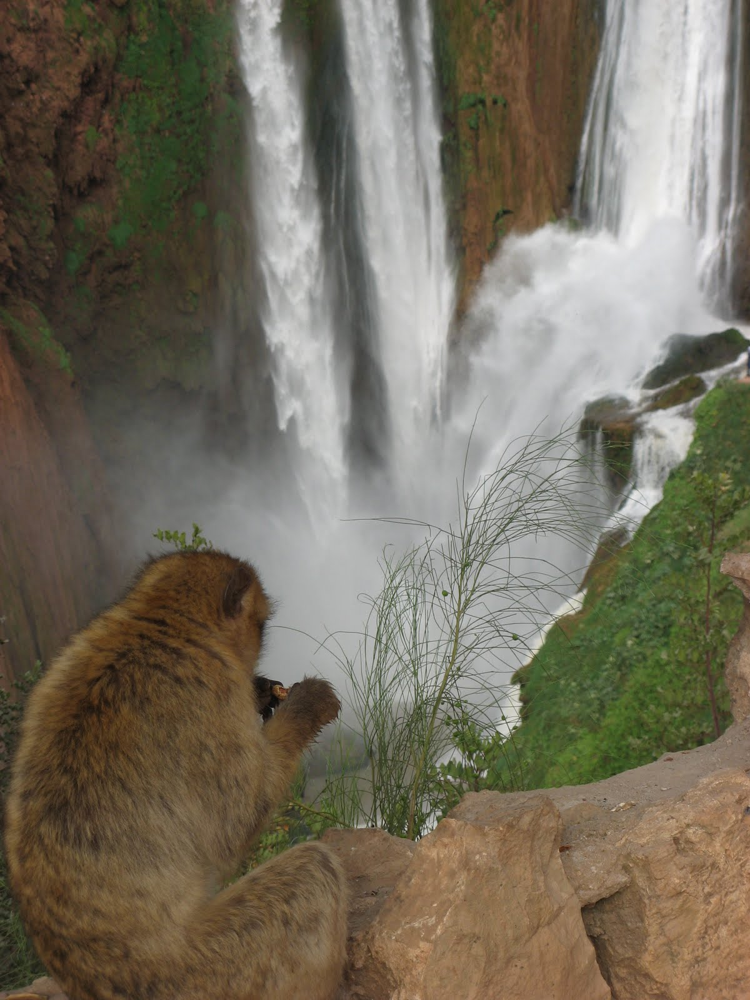

**Camping "Le Realais de Marrakech"**

**Marrakech**

A la mañana siguiente, el 6 de abril, salimos temprano en dirección a Marrakech con la intención de coronar el temible Tizi-n-Test que atraviesa la cordillera del Alto Atlas a 2.100 metros de altura. Este puerto transcurre por una carretera estrecha, también deteriorada por las lluvias y con unos precipicios de vértigo. En dirección a Marrakech casi todo el recorrido transcurre por el lado de la montaña.

Llegamos a mediodía al camping “Le Relais de Marrekech” (31º42,24’N / -07º59,68’W), (100 DH). Un camping lujoso que responde a los estándares europeos y que dispone de acceso a Internet vía Wi-Fi y una hermosa piscina bien entretenida, ambos servicios gratuitos.

Dedicamos la tarde a descansar y al día siguiente cometimos heroicidad o la imprudencia de ir hasta la medina de Marrakech en bicicleta distante unos quince kilómetros, por una carretera sin arcenes saturada de todo tipo de vehículos de dos o cuatro ruedas con o sin motor mecánico.

**La Koutoubia**

Visitamos los zocos, la Kotubia y la plaza Djma-el-Fna sin perdernos y regresamos sorprendentemente sanos y salvos. En la visita a los zocos tuvimos que soportar la mala educación de algunos vendedores y los insultos de unos de ellos por negarnos a entrar a su establecimiento.

**Las cascadas de Ouzoud**

Salimos el 8 de abril hacia el poblado de Ouzoud donde está la falla que origina unas impresionantes cascadas, nos alojamos en el falso (según la guía Gandini) camping Amalou, (32º0,82’N / -06º43,04’W) (50 DH sin electricidad), a la sombra de unos enormes olivos centenarios. Desde luego los servicios son impracticables, vetustos y sin mantenimiento. Los vertidos van directamente al río que alimenta la cascada.

**Las monas de berberia en las cataratas de Ouzoud**

Por la tarde hicimos una visita previa y al día siguiente una visita completa en la que pudimos contemplar cómo evolucionan ante los turistas las famosas monas de berbería en peligro de extinción. Bajamos hasta el fondo de las cascadas por la margen izquierda y subimos por la margen derecha después de vadear el río en unas peculiares barcazas.

El paisaje y el lugar son impresionantes aunque la improvisación, la falta de mantenimiento y el afán de extraer un beneficio inmediato con un turismo masificado están degradando el entorno de forma acelerada en especial un olivar centenario con ejemplares de un tamaño impresionante.

La  guía Gandini indica como posible para las autocaravanas un circuito por el Alto Atlas coronando puertos de más de 2.200 metros. No lo hemos intentado aunque al parecer, el circuito transcurre por carreteras estrechas pero acondicionadas. No podemos recomendar en absoluto hacer estos recorridos sin el testimonio de otros compañeros que las hayan hecho previamente, sin embargo nos quedamos con la impresión de que con otros vehículos podría ser una auténtica gozada.

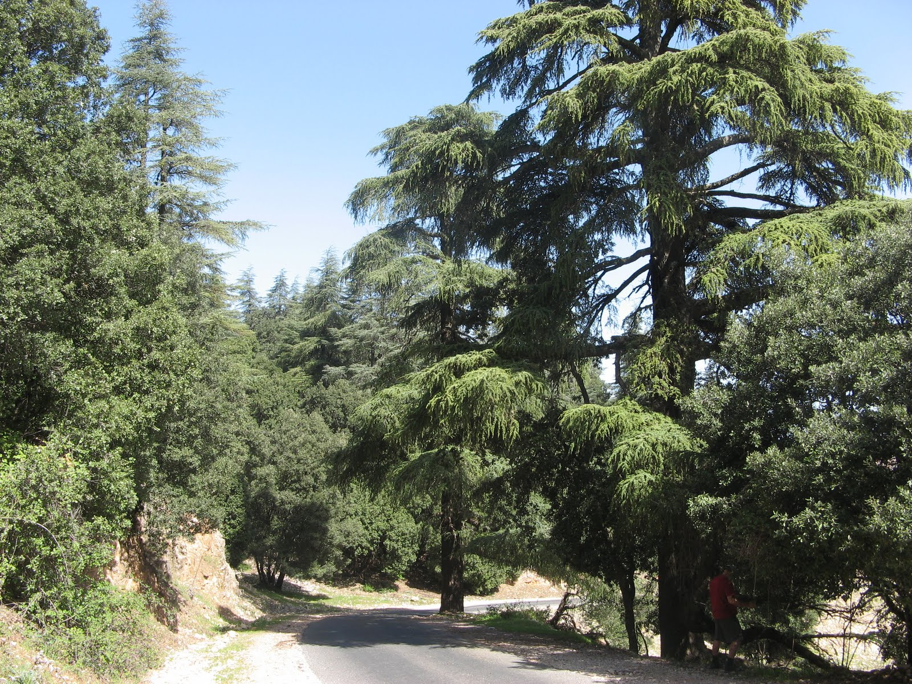

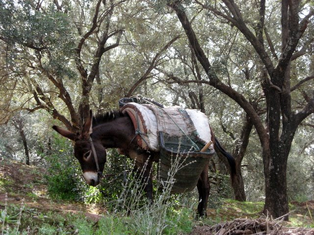

Calma a la sombra de un huerto de cerezos en el camping Amazigh de Azrou

**Azrou y el Parque Nacional de Ifrane**

El día 10 de abril llegamos al camping Amazigh en Azrou (33º26,96’N / -05º10,22’W), a la sombra de un huerto de cerezos en flor (50 DH sin electricidad).

Durante el camino padecimos la presencia en la carretera de niños que hacían el gesto de coger piedras para tirarlas. Alguno de los compañeros franceses nos mostraron las huellas en su carrocería y nosotros pudimos sentir la agresión de varios niños con tirachinas y la huella de un impacto en la carrocería.

Esta circunstancia ya la describe Gandini en su guía y es una costumbre que será difícil que desaparezca por una serie de razones entre las que cuentan la cultura y la educación.

Las cerezas de Sefrou tienen fama en todo el país, sin embargo los habitantes de Azrou dicen que las suyas no son peores. Lo cierto es que el valle en el que está situado el camping estaba poblado de cerezos en flor y la sensación de acampar bajo su sombra aportaba una sensación de calma y belleza excepcional.

Los cedros del Atlas en el Parque Nacional de Ifrane

El valle que discurre bajo los cedros del vecino parque Nacional de Ifrane, situado en el Atlas Medio, proporciona un espléndido paisaje salpicado de manchas de cerezos en flor. Hicimos una salida a pié que duró unas tres horas y nos llevó hasta la entrada del Parque. Un bosque que comienza con unas espectaculares encinas y corona con los famosos cedros del Atlas.

**Fez**

Al día siguiente, el 11 de abril, tomamos el camino de vuelta con la decisión de volver a visitar Fez. Ésta fue una de las ciudades que más nos impresionó en la primera visita y teníamos pendiente el reto de saber si éramos capaces de penetrar en lo más intrincado de sus zocos, encontrar las tenerías y salir sin necesidad de pagar los 250 DH que nos cobró Ahmed (además de la comida) por hacer de guía oficial.

Unas veces tirando de un carro y otras al volante...

Llegamos al camping “Le Diamant Vert” (33º59,15’N / -05º01,05’W), (90 DH) y nos instalamos recogiendo la información necesaria.

A la mañana siguiente, temprano, cogimos el autobús 17 en la parada frente a la puerta del camping que nos dejó en el centro de la ciudad. Desde allá tomamos un taxi (70 DH), hasta la puerta Bou Jeloud, donde partimos a la aventura con la única guía de la correspondiente página del Lonely Planet.

Seguimos un recorrido fácil en línea recta por la calle Talaa Kebira hasta la mezquita de Kairaouine. En este punto nos planteamos llegar hasta las tenerías cosa que hicimos no sin antes dar unas cuantas vueltas y regresamos al punto de partida extenuados y hambrientos.

En el recorrido pudimos disfrutar del encanto de unos zocos de lo más genuinos de Marruecos pudimos, durante todo el recorrido, establecer una negociación a varias bandas de un tablero de marquetería hecho en Essauira con madera de raíz de tuya para jugar al backgammon que comenzó en una tienda en 1.200 DH y terminó en otra diferente en el otro extremo en 600 DH.

Pudimos visitar también la madraza Bou Inania una maravilla del arte benimerí donde comprobamos desolados que nos habíamos dejado la cámara fotográfica en la AC.

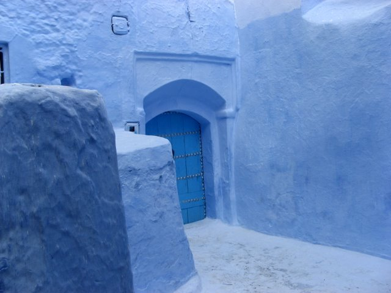

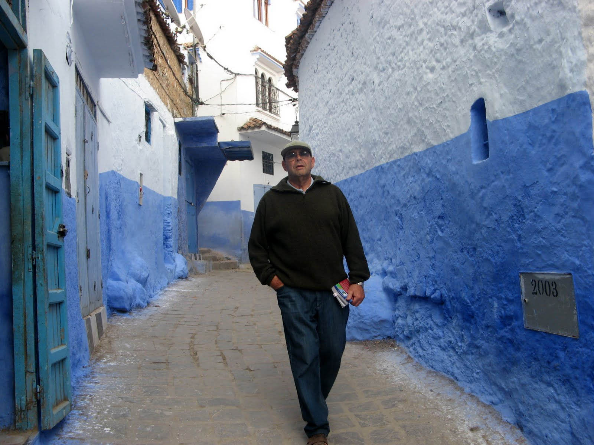

**Paisaje en azul**

**Chefchaouen (Xauen)**

De regreso decidimos pasar por una población de la que nos habían hablado con admiración sobre el conjunto y los colores en una región montañosa. De esta forma llegamos a Chefchaouen el 13 de abril al camping Municipal Azilan (35º10,50’N / -05º16,03’) (90 DH) que estaba repleto.

El camping está situado en la parte más alta de la población por encima de un cementerio donde pacen las ovejas y las cabras y los jóvenes se pierden sospechosamente recordando que nos encontramos en un centro productor de hachís.

Esperamos a la mañana siguiente para visitar la población que nos dejó maravillados tanto por su conjunto blanco azulado, por el paisaje montañoso del entorno y por las calles pintadas de blanco y azul.

Nos gustó pasear por los zocos y compramos varios complementos de vestido rifeño en algodón tejidos a mano (50 DH).

La población nos resultó encantadora y regresamos satisfechos por la visita.

**Paseo bicolor**

**Regreso**

Pasamos el estrecho en el mismo ferry en el que iniciamos el viaje, el día 15 de abril rumiando muchas de las sensaciones experimentadas. Pasamos la travesía hablando entre nosotros de las sensaciones contradictorias y haciendo el balance de un viaje que ha supuesto más de cinco mil kilómetros con la conclusión de que ha merecido la pena, que ha sido tan positivo como los más positivos realizados por el norte y que ha sido positivo precisamente por la intensidad de las sensaciones y experiencias que han inclinado la balanza a pesar de que para disfrutarlas haya habido que pasar por otras sensaciones menos agradables.

Al final del viaje prevalecen las mejores impresiones pero es importante saber que cada compañero que decida visitar este país deberá estar preparado para afrontar sus carreteras, sus recursos y las actitudes de algunos de sus habitantes en relación a nosotros, turistas europeos, pichones a los que hay que desplumar a toda costa.