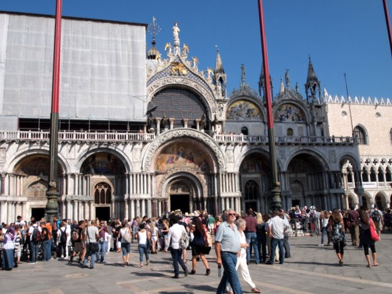
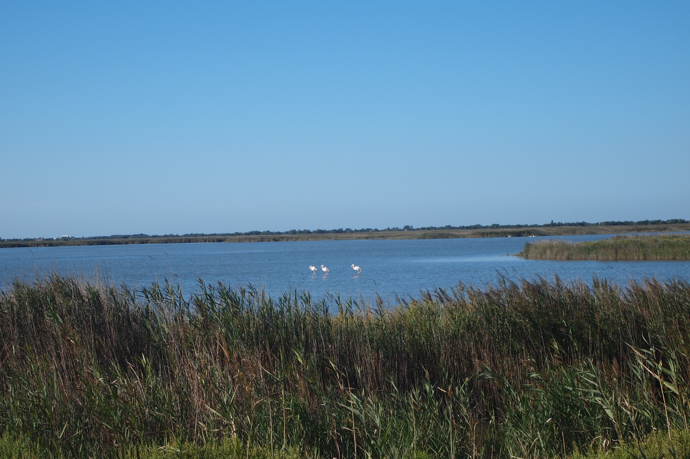
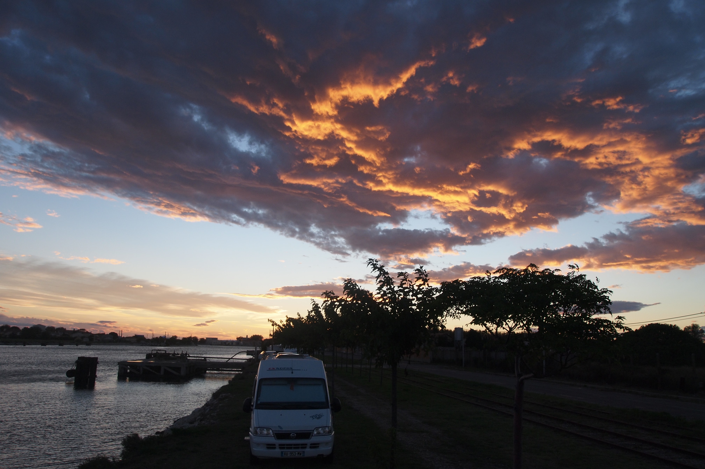
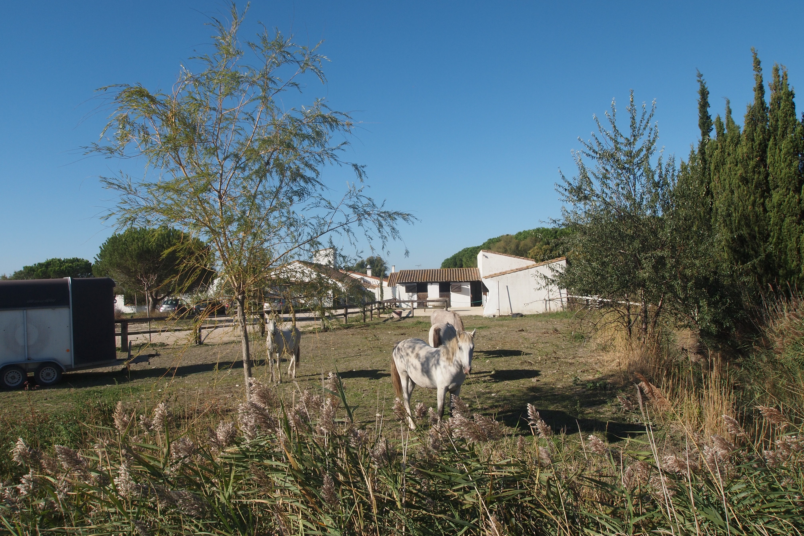
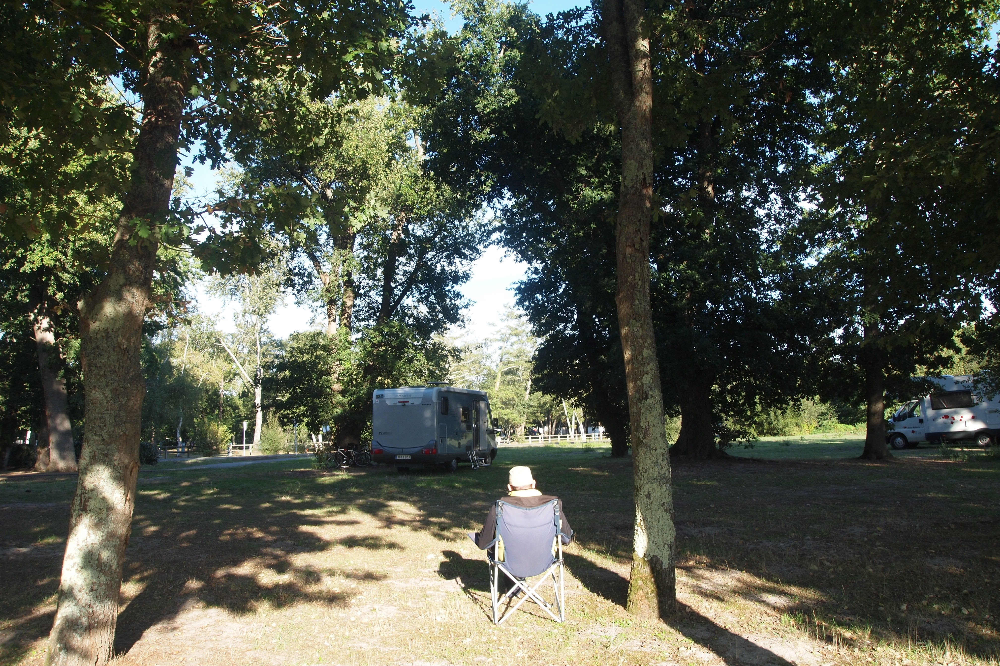

# Los Dolomitas en Autocaravana
**2010, 5 septiembre - 29 septiembre**

**Recorrido del viaje**

**Prolegómenos**

Contar un viaje en autocaravana no debe significar un relato cronológico del mismo. En este relato trataré de describir los lugares de interés visitados y los recursos para hacer una etapa.

El viaje ha durado cuatro semanas y hemos recorrido unos 3.500 kilómetros. En el mismo hemos visitado diferentes lugares que cada uno, por sí mismo, puede ser un objetivo. El conjunto de todos ellos ha sido nuestro viaje de otoño de 2010.

El destino principal o más lejano ha sido los Dolomitas en Italia y el núcleo del viaje los Alpes. Durante el camino hemos tenido la oportunidad de recorrer algunos lugares que no conocíamos y otros que habían nos habían dejado ya un grato recuerdo.

**Parking de la Ciudad del Espacio - Toulouse**

**Toulouse**

Esta es una etapa inicial que ya la conocíamos por haberla visitado en varias ocasiones en coche y hotel. Deseábamos recordar las visitas anteriores.

El patrimonio histórico de Toulouse es amplio e importante. La basílica románica de Saint Sernin, les Jacobins, Agustinos, Sainte Maria Taur, Sainte Marie de la Daurade y la catedral de Sainte Etienne, entre otros edificios que albergan verdaderos tesoros del arte.

**Órgano Cavaillé-Coll de Saint Sernin - Toulouse**

Estas iglesias contienen una de las más importantes colecciones de órganos, en especial Saint Sernin, cuyo instrumento está considerado una obra maestra de la organería romántica, construido por Arístide Cavaillé-Coll en 1893.

Toulouse no dispone de áreas para autocaravanas. En el foro de CC-Infos se cita el parking del puerto de la vecina población  de Ramonville St. Agne. Cuando llegamos el día 5 de septiembre, nos encontramos con la sorpresa de que todos los parking disponen de barras de altura para impedir el estacionamiento de autocaravanas. En las inmediaciones hay un área acondicionada para nómadas en la que entramos por error siendo invitados amablemente a abandonarla.

**Ábsides de la iglesia de Saint Sernin - Toulouse**

Como reserva teníamos el parking de la Ciudad del Espacio al que llegamos el día 5 de septiembre por la tarde. Está situada a unos ocho kilómetros del centro. El parking es gratuito.

Toulouse dispone de una importante industria aeronáutica y aeroespacial. La Ciudad del Espacio es un complejo educacional y lúdico dedicado a la astronaútica. El lunes está cerrado por lo que el parking quedó solitario. En torno al parque hay algunos parking más que el que utilizamos pero todos ellos protegidos por gálibos de 2 metros de altura.

Pernoctamos tranquilamente y por la mañana nos desplazamos en bicicleta hasta el centro haciendo una visita a fondo de la ciudad en especial la basílica de Sant Sernin. Durante todo día estuvimos paseando por las calles hasta que comenzó a llover.

**Pequeños pero estrechos túneles en el Tarn**

**Las gargantas del Tarn**

Ya conocíamos estos parajes por haberlos recorrido en sentido descendente. En esta ocasión tuvimos la oportunidad de hacerlo en sentido contrario.

Las gargantas del Tarn es una enorme brecha que el río ha abierto en la roca. Un serpenteante cañón de roca caliza entre cuyas paredes verticales discurre el río Tarn durante cerca de 90 kilómetros en el Parque Natural de les Grandes Causses. Es una zona a la que acuden muchas personas para practicar deportes de aventura en especial el descenso de aguas bravas y la escalada.

**Un alto en la carretera**

El paisaje es atractivo y merece la pena recorrer la sinuosa carretera que discurre entre paredes verticales y el río cuando no atraviesa unos estrechos túneles abiertos en la roca.

Para iniciar el recorrido con todo el día por delante paramos a pernoctar en el área de Pont le Salars, 32 kilómetros al oeste de entrada en las gargantas.

En el recorrido hay lugares donde se puede estacionar durante el día pero está prohibido hacerlo durante la noche fuera de los numerosos camping con ofertas especiales para autocaravanas hasta llegar a Florac e Ispagnac donde existen sendas áreas.

**Parking a pié del Montblanc**

**Chamonix**

Llegamos al área del parking de la telesilla a  l’Aiguille du Midi, el día 9 de septiembre a mediodía.

Dispone de área de servicios y estacionamiento compartido con todo tipo de vehículos, incluidos en esta ocasión los de un circo. El suelo es de asfalto y no dispone de sombra. El costo es de 11,00€/24 horas incluidos los servicios. La situación es excelente para acceder a la población y a los medios de remonte.

**3842 metros de altitud**

Para los viajeros que solo buscan paisajes y senderos de fácil acceso, Chamonix dispone de lugares en abundancia donde satisfacer la curiosidad.

Una bonita población de montaña con remontes para acceder a diversos lugares. Tomamos un abono de un día que para los mayores de 65 años nos cuesta 39,00€.

A la mañana siguiente con el cielo despejado remontamos hasta los 3776 metros donde nos deja el segundo tramo del teleférico a l’Aiguille du Midi cuyo punto de salida está situado a cincuenta metros del área.

A esta altitud se nota la falta de oxígeno y los movimientos se hacen costosos y debemos movernos con lentitud hasta la terraza a la que se accede por un tramo de escaleras.

**La vista es impresionante**

La vista del macizo de los Alpes y la proximidad de la cumbre del Montblanc, el techo del Oeste de Europa, rodeado de glaciares, es inenarrable. La sensación es tan intensa que será difícil de olvidar.

Bajamos poco antes de comer. Por la tarde, por el mismo precio nos montamos en el tren cremallera que nos lleva a Montenvers al pié del glaciar Mer de Glace a 1913 metros de altitud y que permite disfrutar con la visión del Drus y los Grandes Jorasses.

Al día siguiente tomamos el teleférico al Brevent que nos deja en Planpraz a 2000 metros, nos cuesta unas tres horas recorrer una maravillosa cornisa frente al Montblanc, desde donde se divisan un paisaje grandioso. Llegamos hasta la cabina del Flégère que nos desciende hasta la población de Les Praz en al que tomamos un autobús hasta Chamonix.

**El Mar de Hielo**

Con esta excursión damos por finalizada una visita maravillosa a unos de los lugares emblemáticos de Europa visitando también una población preciosa que dispone de toda clase de servicios incluido Wi-Fi gratuito en la oficina de turismo.

**Una vista del Cervino desde el área para autocaravanas**

**Breuil-Cervinia**

Conocíamos la imagen del Matterhorn desde Gornergrat en Suiza. Esta vez deseábamos contemplar al Cervino desde el sur y realmente mereció la pena.

Breuil-Cervinia es una pequeña localidad de los Alpes Italianos a la que accedimos el 12 de septiembre después de pasar el Gran San Bernardo y la población de Aosta.

El área gratuita para autocaravanas es inmensa y está situada a un par de kilómetros de la población. En la población está prohibido estacionar autocaravanas. Dispone de un borne de servicios también gratuito.

**Sol del atardecer en la cumbre del Cervino**

La vista del valle con el Cervino al fondo es impresionante. La luz, desde el sur, ilumina la cumbre al atardecer y dejamos que el día termine con la imagen de la emblemática montaña en el parabrisas de nuestra autocaravana.

Una visita al pueblo nos permite comprobar que se trata de una estación de esquí preparada para acoger a deportistas con toda clase de lujos. Mientras tanto nos proveemos de alimentos y comenzamos a probar la pasta.

Al día siguiente hacemos un pequeño recorrido a pié hasta el lago Azul, cuyas aguas verdes reflejan un paisaje de ensueño.

Con esta visita completamos la que hicimos en el año 2006 a Alagna Valsesia y cerramos las vistas más espectaculares del Monte Rosa y el Cervino.

**Llegada en el vaporetto**

**Venezia**

Ya habíamos visitado esta ciudad en autocaravana hace unos años. Nos quedó pendiente una visita a la iglesia de San Marcos que no pudimos completar por llevar en aquella ocasión pantalones cortos, inapropiados según los guardianes de la moral.

Descartamos el área del parking del Tronchetto por caro y por el riesgo de robos que indicaba algún comentario en CC-Infos. Decidimos ir a Punta Sabioni y por falta de información complementaria acabamos en Lido-Jesolo, en el área privada Dom Bosco. El costo es de 10,00€ sin electricidad.

**La fachada de la basílica de San Marcos**

A la mañana siguiente tuvimos que tomar dos autobuses y el vaporetto (16,50€) para llegar al centro. Probablemente no hice los deberes a tiempo y estoy seguro que podíamos haber encontrado un área más próxima en Punta Sabioni e incluso más barata. Por el camino hemos pernoctado y visitado Cremona.

Nos perdimos entre las callejuelas y los canales e hicimos una visita a fondo a la Basílica de San Marcos, obra maestra del arte bizantino. Admiramos a fondo las portadas, las esculturas, los adornos y los mosaicos culminando una visita pendiente.

Comimos en un restaurante, dos ensaladas, cervezas y una pizza, 39,00 euros, exagerado y dos cafés en la terraza del Florian, en la plaza de San Marcos, 29,00€, nos pareció un atraco.

Regresamos a Lido-Jesolo con los mismos medios que a la ida.

**Área de Belluno**

**Los Dolomitas**

La región de los Dolomitas debe su nombre al tipo de roca dolomítica (carbonato de calcio y magnesio) de la que se componen sus montañas mas altas que superan los 3000 metros. Forma parte de los Alpes Orientales y está declarada Patrimonio de la Humanidad por la UNESCO en 2009.

El 16 de septiembre llegamos al parking exterior de la ciudad de Belluno, capital de la provincia en cuyo territorio está situado la mayor parte de los Dolomitas. Es un parking disuasorio con un espacio reservado para el estacionamiento de las autocaravanas y con un área de servicios exterior gratuita.

**Área de Fiames en Cortina d'Ampezzo**

El costo del estacionamiento de 12 horas diurnas es de 12,00€. La noche y los días festivos son gratuitos. Desde parking parten unas escaleras mecánicas salvando una altura considerable hasta el centro de la población.

Aprovechamos la tarde para visitar la población y aprovisionarnos. A la mañana siguiente partimos para Cortina d’Ampezzo con el cielo cubierto y sin posibilidad de ver el paisaje.

Llegamos al área gratuita de Fiames. Esta área está situada a cuatro kilómetros del centro de Cortina d’Ampezzo, en un antiguo campo de aviación. Hay una línea de autobuses que llega hasta el centro cada media hora.

**La capital de la jet-set**

Cortina es una localidad alpina con fama internacional, destino de la jet-set, donde se celebraron los juegos Olímpicos de Invierno en 1956. También sirvió de escenario para varias películas. En toda ella, en los escaparates de las numerosas tiendas de moda, deportes o joyería se advierte el lujo. Los hoteles, las casas y el paisaje urbano está cuidado con exquisitez, hasta la presencia de los policías y servidores públicos dan una imagen al servicio de un turismo de lujo. Es de destacar la extrema belleza del valle en el que está situada.

A pesar de nuestras ideas sobre la sociedad o el consumo, el espectáculo es por lo menos impactante. Durante la visita nos vemos sorprendidos por el paso de una docena de deportivos Porsche seguidos por la calle principal de la población.

**Lugares de ensueño - Misurina**

El día 17 de septiembre amanece con el cielo despejado. El Tofane (3244 metros) se eleva por encima de un anillo de nubes que se aferran en sus empinadas laderas.

Emprendemos un circuito al norte de Cortina por el paso Cimabanche y Misurina. Hacemos una parada en Misurina para contemplar el monte Cristallo (3221 metros) y Tre Cime de Lavaredo (2999 metros).

En Misurina hay un área y el pueblo está situado en un precioso lago de montaña. Esta pequeña población turística está considerada como la perla de los Dolomitas. Situada a 1754 metros de altitud es una parte de Auronzo de Cadore al abrigo de las Tres Cimas de Lavaredo.

**Montañas impresionantes - El Pelm0 (3218 metros)**

Subimos en el telesilla de la localidad Río Gere, a siete kilómetros de Cortina, que nos llevó a 2134 metros de altitud, hasta las pistas de esquí de Faloria en el monte Cristallo, desde donde se divisaba un panorama espléndido.

Regresamos a Belluno por Cortina, San Vito de Cadore y Vodo entre las cimas de los Montes Antellano (3263 metros) y Rite (2181 metros). Pernoctamos en el mismo lugar.

Al día siguiente decidimos recorrer la SR203 por Agordo y Alleghe donde comimos y recorrimos las orillas del lago disfrutando del paisaje típico de los Dolomitas con las agudas agujas del monte Civetta (3218 metros) al fondo.

**Bellos lugares. Estación de esquí**

Accedimos al valle de Zoldo por el paso Forcella Staulanza (1773 metros) pudiendo contemplar el impresionante monte Pelmo (3168 metros) continuamos ya el viaje iniciando el regreso hasta el área gratuita de Feltre.

Visitamos la ciudad y al regreso nos encontramos con la desagradable sorpresa de una rueda pinchada. Los servicios de asistencia en carretera de Allianz se ocuparon de que un “gomista” nos desmontara la rueda, la llevara a un taller y la volviera a colocar en su sitio.

**Oferta turística en Saintes Maries de la Mer**

**La Camargue**

De regreso, decidimos hacer un alto en la Camargue. Esta región protegida de Francia, es un Parque Natural delimitado por las dos bocas de la desembocadura del Ródano.

Tomamos la carretera de la orilla oeste del lago Garda, una preciosa pero estrecha carretera que transcurre entre roca y túneles con un tráfico muy denso, pernoctando otra vez en el área de Cremona. Ingresamos en Francia a través del puerto de Montgénevre para pernoctar de nuevo en Briançon cuya área gratuita ya conocíamos y que está provista de un borne Flot Bleu que acepta monedas de 2,00€.

**El anfiteatro romano de Arles.**

La siguiente etapa la hicimos en el área gratuita de Carpentras después de recorrer la carretera que bordea por el sur el Parque Nacional des Ecrins. Una manifestación de funcionarios en huelga reclamando las pensiones nos ha atrapado durante un par de horas en Gap y la huelga de correos nos impide enviar las acostumbradas postales a las nietas.

En en vértice superior de la Camargue está la ciudad de Arlés a la que hicimos una interesante visita puesto que dispone vestigios de la ocupación romana en el siglo I anterior a nuestra era. Particularmente está bien conservado el anfiteatro cuya visita merece una parada en la ruta.

**Flamencos en una de las lagunas de la Camargue.**

Llegamos al área de Port Saint Louis y nos encontramos con que había sido trasladada de lugar. El área de servicios queda en el mismo lugar pero el parking ha sido transferido a la antigua dársena del puerto. El costo es de 6,00€/24 horas y su pago da derecho a una ficha para llenar el depósito del agua.

No nos gustó el lugar y pernoctamos en la orilla opuesta de la dársena junto a otra docena de autocaravanas a pesar de que estaba prohibido y corrimos el riesgo de que nos echaran del lugar.

**Área para autocaravanas en Saintes Maries de la Mer**

Permanecimos en el lugar un día aprovechándolo para dar los consabidos paseos en bicicleta hasta la desembocadura del Gran Ródano.

Al día siguiente nos desplazamos hasta Saintes Maries de la Mer en cuya área, al borde del mar, permanecimos un par de días (9,50€/24 horas). Esta área, con una capacidad para doscientas autocaravanas, dispone de tres puntos de vaciado y es una de las dos que tiene la localidad, lo cual da la medida de la importancia que las autocaravanas tienen para el turismo local.

**Lugar de pernocta en Port Saint Louis**

La Camargue es una isla triangular formada por los aluviones que ha depositado el Ródano en su desembocadura. Está limitada al norte por la ciudad de Arles, al sur por el mar y los dos lados que forma el triángulo por las dos bocas del Ródano. El Gran Ródano que desemboca en Port Saint Luis y el Pequeño Ródano que desemboca en Saintes Maries de la Mer.

El terreno está surcado de canales, arrozales y el centro está ocupado por un gran lago, el estanque de Vaccares. Es una Reserva Natural y se pueden observar multitud de especies locales y migratorias.

**Caballos de raza camarguesa**

La cultura local gira en torno al turismo, la cría de la raza autóctona de caballos y de toros bravos. Visitamos Saintes Maries de la Mer, una ciudad turística que contiene una pequeña joya románica fortificada que conserva las reliquias de Santa Sara, patrona de los gitanos y que es objeto de una importante romería anual.

El terreno es propicio para los grandes paseos a pié y en bicicleta para lo cual aprovechamos el sol a pesar del fuerte Mistral que sopla sin descanso pero que no impide disfrutar de la playa.

**Regreso**

**Área de Sainte Eulalie in Born**

Finalizada la visita iniciamos el regreso pernoctando en el área gratuita de Castres situada en un parque precioso al borde un campo de golf. En esta área solo se permite estacionar de noche y los servicios de un borne artesanal son gratuitos. Podemos dar un bonito paseo ante de reanudar el viaje.

Nuestro destino es el área de Sainte Eulalie en Born. Es nuestro lugar favorito para descansar de un viaje, recoger y hacer limpieza general. Permanecemos en el área un par de días y aprovechamos el jueves para acudir al mercadillo de Parentis in Born a 10 kilómetros.

Los paseos en bicicleta nos relajan y puedo poner en orden los apuntes que vana servir para el relato. También puedo verter al ordenador algunas reflexiones sobre las observaciones que he ido recogiendo sobre la marcha después de casi cuatro semanas por Francia e Italia.

Finalmente decido tomar unos apuntes para realizar un relato sobre la regulación del uso de las autocaravanas en una población que dispone una de las mejores áreas que conocemos y que puede ser el paradigma del sistema francés de ordenación del uso de las autocaravanas como vivienda en una zona cuya presencia de nuestros grandes cubos blancos es realmente significativa.

**Planificando y tomando notas durante el viaje.**

**Conclusiones**

El autocaravanismo es una forma de viajar cuyo principal atractivo es la libertad de movimientos. Para un autocaravanista con alguna experiencia le es fácil encontrar recursos para convertir las etapas de un viaje en el propio destino.

Hemos hecho casi 3.500 kilómetros por lugares conocidos y desconocidos y hemos hecho también bastante etapas, más de veinte, lo que significa más de veinte lugares donde estacionar y pernoctar.

Lo hemos hecho en dos países que ofrecen la infraestructura para autocaravanas más abundante y mejor dotada de Europa y la hemos compartido con cientos de autocaravanistas de todas nacionalidades sin ningún problema.

Todo esto ha sido posible gracias a una cobertura inteligente de una necesidad. Ha sido posible porque allá donde hacíamos una etapa las autocaravanas existen. Existen para sus usuarios y para la administración que proporciona la infraestructura. Ha sido posible porque el uso de las autocaravanas estaba regulado.

Hemos encontrado lugares cuyo uso era gratuito o de pago, esto es indiferente, pero siempre ese uso estaba regulado. Junto con la oferta de servicios está siempre una regulación. El uso libre del espacio supeditado a las normas de estacionamiento ha sido la excepción cuando la norma constante ha sido la regulación del lugar, del tiempo o del modo del uso de una autocaravana como alojamiento.

Esta es la lección que nos imparten unos países cuya flota cuadruplica como mínimo la de España y cuya recepción de turistas en autocaravana es varias veces superior. Una lección que la tendremos que aprender por las buenas o por las malas.