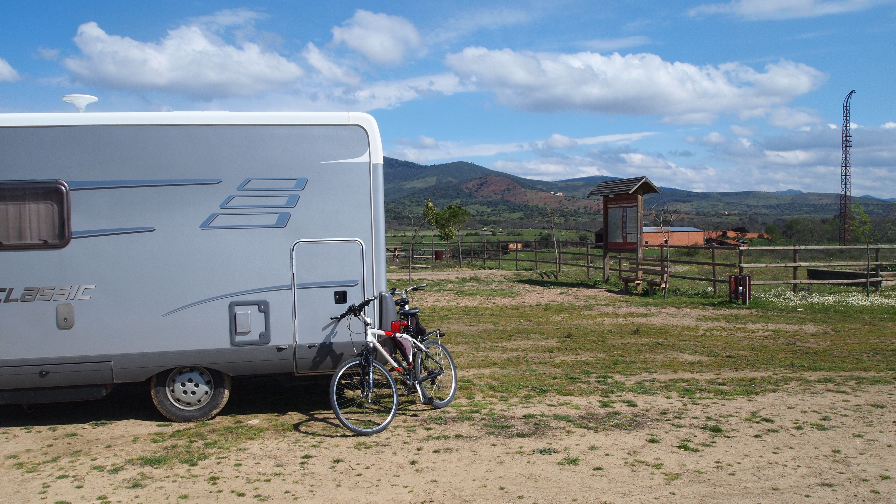

# La vuelta a España en autocaravana en ochenta áreas
**2011, 19 marzo - 3 abril**

Una salida por la Península Ibérica en autocaravana satisface siempre las expectativas. Estar en contacto con la naturaleza o admirar, una vez más, nuevos matices del extenso patrimonio histórico que atesora.

Es evidente que el título es exagerado ni es una vuelta a España ni son ochenta áreas las visitadas. “Una vuelta por España” hubiera sido más indicado, pero menos poético o llamativo.

Lo cierto que hemos recorrido en círculo media Península Ibérica y nos hemos alojado en unas cuantas áreas para autocaravanas. Compartir con los lectores la experiencia de dónde hemos estado, qué hemos hecho o hemos visto en este viaje es el objetivo de este nuevo relato.

La idea inicial era viajar hacia el sur en paralelo con Portugal hasta Huelva, recorrer el Algarve portugués y regresar hacia el norte por el interior de éste País. Sin embargo aprovechando la principal característica del turismo en autocaravana improvisamos el regreso desde Huelva visitando Andalucía y recorriendo algunos lugares de Castilla-La Mancha.

**Vitoria – Gasteiz (19.03.2011)**

Pasamos la noche en el área de Vitoria. Completamos la única plaza que quedaba libre en el área reservado para AC. En el parking quedaban mucho espacio y también estaban estacionadas más autocaravanas y alguna caravana.

Pasamos la noche tranquila, el área es perfecta para visitar Vitoria desde donde se puede llegar hasta el centro histórico en caminos para bicicletas. La catedral está abierta por obras y es interesante en esta fase participar en una visita guiada para conocer cómo se construyó. También es interesante recorrer la Vía Verde del Zadorra.

**Valladolid (20.03.2011)**

Nos alojamos en el área de Valladolid sin problemas para encontrar espacio para estacionar. Se trata de un área limpia y bien cuidada en un parking público próxima al centro histórico. El pago se realiza por medio de una máquina expendedora de tickets, pero los fines de semana es gratuita.

En la tarde del domingo realizamos un bonito paseo en bicicleta por el Parque Rivera de Castilla en las orillas del Pisuerga. Al día siguiente acudimos a pie a visitar el Centro Histórico y la catedral.

**Logrosan (21.03.2011)**

Paramos a visitar el Real Monasterio de Santa María de Guadalupe de paso para Logrosán en cuya área nos alojamos.

Logrosán dispone de área de servicios, recientemente inaugurado, accesible y limpio en las afueras de la población y en cuyas inmediaciones se puede estacionar y pernoctar. No existen espacios delimitados como parking, pero es posible hacerlo en la zona verde arbolada aun cuando son vías de acceso para vehículos.

Al día siguiente recorrimos, en bicicleta y en ambos sentidos, quince kilómetro del camino natural de Las Vegas del Guadiana. Una vía verde muy bien acondicionada de tierra batida.

Un paisaje realmente bonito, verde, surcado de arroyos con agua merced a las recientes lluvias. Pudimos fotografiar a algunas cigüeñas en sus nidos.

Iniciamos el recorrido desde la antigua estación de FC abandonada a la que accedimos con la AC desde una carretera estrecha que se inicia en el centro de la población.

**Zafra (23.03.2011)**

Continuamos el viaje hasta el área de Zafra. Está situada en un espacio cerrado que pertenece al recinto de la Feria Internacional Ganadera. El área de servicios está algo descuidado con uno de los sumideros atascados. No hay plazas señaladas para AC y el piso asfaltado está en pendiente. A pesar de todo y de que un par de veces al año está cerrada por celebrarse ferias de ganado, es un área interesante que debemos agradecer y que merece la pena cuidar.

Visitamos el interesante centro histórico de la población e hicimos las compras necesarias en especial de charcutería local.

**Valverde del Camino (24.03.2011)**

Paramos en Fregenal de Sierra donde visitamos la población y el castillo. Visitamos también las minas de Rio Tinto contemplando con un sentimiento de sorpresa y horror la capacidad del hombre para modificar el entorno. El paisaje modificado no deja indiferente y nos invita a reflexionar.

Terminamos la jornada en Valverde del Camino en cuya área nos alojamos. Se trata de un área de servicios muy cómoda y accesible situada en un estacionamiento a la entrada norte del pueblo por la carretera de Zalamea a la que se accede desde la N-405.

Junto al borne de servicios existen tres bahías de la que una estaba ocupada por un autobús local. Al fondo del área hay mucho más espacio.

Una población interesante. Nos aprovisionamos en el comercio local y accedemos al Wi-Fi de la biblioteca situada en la Casa de Cultura en las proximidades del área.

Al día siguiente recorrimos en ambos sentidos veinte kilómetros de la Vía Verde de los Molinos de Agua. Una antigua vía de FC bien cuidada aunque algo pendiente entre pinares y jara en flor.

**Punta Umbría (25.03.2011 )**

Llegamos al parking de Punta Umbría recomendado en las guías. Se trata de espacio de estacionamiento autorizado sin asfaltar en el extremo de la población. Nos pareció algo solitario y mal iluminado por lo que pernoctamos en el parking de una urbanización próxima. La impresión es que en temporada vacacional será difícil encontrar lugares libres para pernoctar.

Al día siguiente dimos un bonito paseo en bicicleta por el paraje natural de los Enebrales de Punta Umbria, un ecosistema dunar entre enebros, sabinas y pinos piñoneros que todavía, a duras penas, respeta el ladrillo y el cemento.

**Castro Marim (26.03.2011 )**

Continuamos el viaje con la intención de recorrer el Algarbe haciendo la primera etapa en Castro Marim que dispone de un área para AC gratuita (37,2203,-7,4449). El área estaba completa con autocaravanistas procedentes del norte de Europa, Noruega, Finlandia, Alemania y Francia, las más numerosas. Pernoctamos en un parking próximo y procedimos a vaciar y llenar los depósitos.

Al día siguiente visitamos el castillo desde donde se divisa el paisaje de las salinas y marismas del río Guadiana que sirve de frontera entre España y Portugal.

Desistimos continuar el viaje por Portugal y optamos por regresar a España para apurar las vías verdes y visitar lugares conocidos pero interesantes.

**Isla Canela (27.03.2011 )**

Llegamos a Isla Canela sin una referencia donde pernoctar. Encontramos varias AC estacionadas en el extremo oeste del paseo marítimo (Avda.de los Gavilanes) en un parking situado en la c/ de Mirlos (37,1731,-7,3821) con acceso directo a la playa. Dos de las AC pertenecían sendos matrimonios guipuzcoanos que nos dieron una información interesante sobre la zona.

Había espacio libre de sobra y más en una zona próxima más solitaria y más expuesta al viento aunque más discreta. Pasamos cuatro días con un paréntesis para visitar Ayamonte y para vaciar y cargar depósitos en el vecino Castro Marim. Es lógico pensar que en temporada alta será muy difícil encontrar un espacio libre.

No tuvimos ningún problema para pernoctar ni encontramos ninguna señal que lo prohibiera, tanto en Isla Canela como en Ayamonte.

La playa y los paseos en bicicleta fueron las principales actividades. El paseo marítimo hasta el puerto deportivo Marina Isla Canela es precioso pero deprimente. Se pueden ver grandes urbanizaciones montadas a la sombre de unos beneficios inmediatos que han provocado la crisis económica del ladrillo. Los carteles de “Se vende” proliferan en las ventanas y balcones.

A lo largo del paseo, entre las urbanizaciones hay abundantes parking, demasiado solitarios en estas fechas pero con posibilidades para el verano si se permite estacionar autocaravanas pues posible que se traten de espacios privados.

Ayamonte es una bonita población que dispone de espacios para estacionar y pernoctar, en especial en la salida este, en la avda.del Alcalde José Antonio González Sánchez (37,2141,-7.3992). Junto a este estacionamiento donde se pueden ver camiones y autobuses aparcados, nace la Vía Verde del Litoral que discurre por las marismas del Odiel.

Una vía mal cuidada con el suelo irregular pero practicable que pudimos recorrer en nuestras bicicletas de ciudad. Un paseo muy interesante con un paisaje realmente bello a pesar de las basuras y vertidos que encontramos al atravesar el Paraje Natural de las Marismas de Isla Cristina. Visitamos el molino mareal restaurado “El Hombre y la Marisma” y el palomar “Huerta Noble” que llegó a albergar treinta y dos mil palomas.

**Matalascañas (30.03.2011)**

Llegamos a Matalascañas después de recorrer la carretera A-494. Paramos en alguna de las áreas de recreo del parque natural que bordea la carretera. Los agentes del servicio de vigilancia nos indicaron que estaba estrictamente prohibido pernoctar en AC, pero, por lo que pudimos ver, no se persigue el abandonar basura y acampar durante el día con cualquier clase de vehículos.

Nos situamos en un parking de tierra en el extremo este del paseo marítimo de Matalascañas (36,9835,-6,5292) justo a la entrada de una de las puertas para acceder al Parque Natural de Doñana. El dueño del chiringuito situado en el parking nos informa que es frecuente encontrar autocaravanas estacionadas y que no está perseguido.

Visitamos la zona recorriendo en bicicleta los caminos de madera que bordean el Parque Natural admirando el bosque de pinos piñoneros y un precioso sabinar.

También recorrimos el paseo marítimo que bordea la playa durante unos seis kilómetros y vimos abundantes grupos de turistas de nuestra edad que ocupaban algunos hoteles. Sin embargo la sensación es de abandono, de urbanizaciones sin terminar y de falta de limpieza en un entorno natural agredido por el cemento y el ladrillo.

Nos fuimos con la sensación de falta de infraestructura para el turismo en autocaravana ya que en toda la costa oeste andaluza no hay una sola área de servicios para autocaravanas.

**Sevilla (01.04.2011 )**

Paramos por el camino en El Rocío donde comimos. El lugar es precioso con las marismas, los caballos y los flamencos. Visitamos la ermita de el Rocío en Almonte.

La Guardia Civil nos informó que estaba estrictamente prohibido pernoctar.

Llegamos al área privada del puerto de Gelves por la tarde. La zona de autocaravanas estaba completa y nos colocaron junto al área de servicios (Un sumidero en el cemento y un grifo).

Esta área a nuestro juicio es la mejor opción para visitar Sevilla. Dispone de medios para vaciar y llenar depósitos, está vigilada y próxima a medios de transporte público (autobús cada veinte minutos) al centro de la ciudad. El precio es razonable aunque el Wi-Fi no funciona, al parecer habitualmente.

Al día siguiente visitamos una vez más una ciudad que nos atrae. La catedral incluida la subida a la Giralda, los Reales Alcázares y el paseo a fondo por el barrio de Santa Cruz. Comimos en un restaurante de este barrio la comida del turista estándar.

Una noche más en el área soportando hasta una hora bastante avanzada el ruido de la música y las conversaciones en voz alta de los asiduos a las terrazas de los bares que hay en el puerto aunque esos inconvenientes afortunadamente no alteran nuestro sueño.

**Alcaudete (03.04.2011 )**

De camino a Jaén pernoctamos en Cabra en el área situada en el centro de la población (Avda.Pedro Iglesias). El área de servicios está situada en un parking público asfaltado sin espacios reservados y en pendiente. El sumidero está obstruido. Pernoctamos tranquilamente y sin sobresaltos.

Al día siguiente pasamos para comprobar la situación del área de la calle Juanita La Larga. La situación del área es deplorable, de los grifos no mana agua aunque el sumidero está operativo procediendo a vaciar los depósitos. Los espacios del estacionamiento público están ocupados.

Es lamentable que una población como Cabra que dispone de nada menos que de dos áreas, ninguna de las dos esté operativa al 100%.

Paramos a pernoctar en la recientemente inaugurada área de Alcaudete. El área está situada al pie del castillo. Un castillo cuya construcción se comenzó en el S.XII y se reformó en el XVI que no pudimos visitar porque estaba cerrado.

El área de servicios está situada a la entrada del pueblo que se accede desde la N-432. La subida es estrecha y muy empinada, debiendo ponerse el máximo cuidado con los vehículos que circulan en dirección contraria y con el suelo, si está mojado.

El acceso al área de servicios es amplio y cómodo. Los grifos para el suministro de agua y limpieza están encerrados en una arqueta cuya llave hay que solicitar en la oficina de la policía local.

Es relativamente problemático encontrar un lugar para estacionar. El pueblo está en pendiente y no es posible acceder al centro desde el área de servicios. En las inmediaciones hay pocos lugares para estacionar y el estacionamiento al pie de la iglesia es pequeño y está bastante ocupado por los turismos que impiden la maniobra de las autocaravanas en especial si pasan de los seis metros.

Pernoctamos en la vía pública frente al área de servicios en un lugar que únicamente cabe una autocaravana. Esta calle tiene un tráfico bastante intenso los días laborables por las mañanas.

Al día siguiente paramos en Martos para hacer la Vía Verde del Aceite hasta Torredelcampo y continuamos el viaje hasta Jaén.