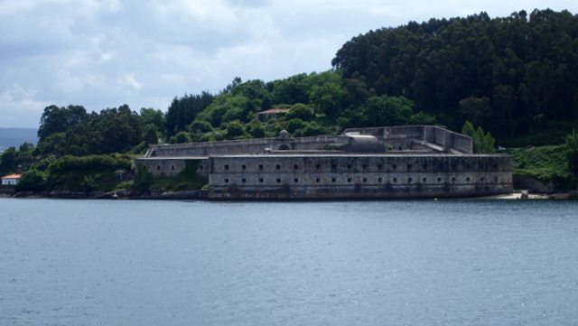
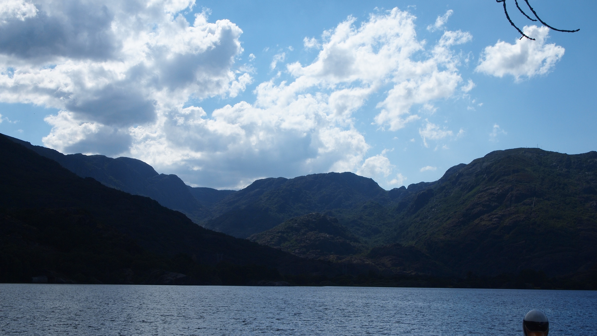
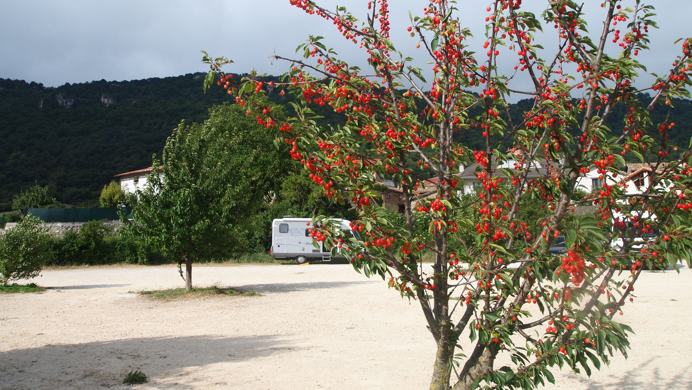

# Por el noroeste de la península en autocaravana
## 2011, 30 mayo - 7 junio

 

**Área para autocaravanas de León**

Hay muchas formas de viajar. Una de ellas recorrer, por ejemplo, 2.000 kilómetros, utilizar un hospedaje, visitar la zona y regresar por medio de un vehículo, un tren o un avión. Otra forma es recorrer los mismos kilómetros y visitar muchas zonas mientras se viaja.

Nosotros hemos optado por esto último, pero para ello es necesario disponer de tiempo y un alojamiento móvil con la posibilidad de ubicarlo en cualquier lugar apto y próximo para realizar una etapa fuera de un lugar preconcebido, como un camping, por ejemplo.

Estamos jubilados y poseemos una autocaravana con lo cual cumplimos los primeros requisitos, además, tenemos curiosidad y deseos de conocer mundo. Asturias y Galicia son los objetivos de este viaje que relatamos a continuación.

 

**Getxo (Punta Galea, 30.05.2011)**

**Vista sobre El Abra y la ría del Nervión**

Pasamos por el área de Lekeitio para comprobar que el área estaba operativa y casi finalizada a falta de una fuente fija. Ligeramente en pendiente y con plazas señaladas. Un poco lejos de la población, el comercio y las playas.

La primera etapa fue corta, hasta Getxo donde recalamos en Punta Galea, un parking extenso, con vistas espectaculares sobre la ría del Nervión y el gran puerto de El Abra. La idea inicial era acercarnos hasta la margen derecha del puente colgante de Portugalete, Patrimonio de la Humanidad.

El mal tiempo nos hizo desistir aunque por la tarde pudimos realizar un bonito paseo por los acantilados.

A partir de media tarde aparecieron algunos turismos ocupados por jóvenes que aparentemente se dedicaban a esperar otros e intercambiar objetos. Consultamos con un guarda de la seguridad privada que vigila la zona residencial vecina y nos comentó que no había historial de incidentes, que los jóvenes se ocupaban únicamente de sus cosas.

Nos quedamos a pernoctar y avanzada la noche quedó el parking solitario pudiendo dormir plácidamente. Este parking no es recomendable para las personas impresionables aunque no tuvimos sensación de inseguridad.

**Gijón (El Rinconín, 31.05.2011)**

Pasamos por el área de Lekeitio que nos pareció bien construida aunque alejada de las playas y ligeramente en pendiente. El borne estaba operativo aunque faltaba colocar la fuente.

Paramos también en el área de Ribamontán al Monte en la autovía del Cantábrico A-8, donde vaciamos. Un borne de servicio operativo y cómodo.

Llegamos a media tarde al parkíng de El Rinconín en Gijón, lugar de lujo para pernoctar. Había media docena de autocaravanas.

Pudimos perdernos en bicicleta, como en otras ocasiones, por el paseo marítimo de la playa de San Lorenzo y sus alrededores. Pernoctamos plácidamente.

 

 

**Tuñón (Senda del Oso, 1.06.2011)**

**Santa Cristina de Lena**

Nos dirigimos a Tuñón en el valle del Trubia. Recorrimos parte de la Senda del Oso en bicicleta y pernoctamos plácidamente en el parking del centro de BTT. El relato de la estancia en Tuñón se accede desde este enlace.

Nos acercamos a la parroquia de Felgueras para visitar la iglesia Santa Cristina de Lena de estilo pre-románico datada en la mitad del S.IX. Llamamos a la guardesa que nos dio acceso al interior. Nos llamó especialmente la atención el gran iconostasio formado por tres arcos peraltados soportados por cuatro columnas con bellos capiteles.

**Avilés (2,3 y 4.06.2011)**

**Centro Niemeyer**

Después de resolver un problema que se nos había planteado en la centralita que regula la carga de las baterías auxiliares nos pusimos en marcha hasta llegar al área privada del restaurante Rías Baixas de Avilés. Donde pernoctamos por el precio de 8,00€.

A la mañana siguiente nos desplazamos a pié hasta la Ría de Avilés y visitamos el Centro Internacional Cultural Oscar Niemeyer, recientemente inaugurado. Luego nos perdimos entra las calles de la parte vieja y comimos en el Rias Baixas.

Por la tarde nos desplazamos para visitar a nuestros amigos salud y Oscar con los que pasamos, como siempre que estamos con ellos, un par de días felices.

 

 

**Ribadeo (As Catedrais, 5.06.2011)**

**Faro del Cabo San Agustín**

Comimos en el Cabo de San Agustín en Ortiguera en la ría del Navia, un lugar con vistas espectaculares sobre la costa y con lugares que anotamos para una eventual pernocta. Pudimos dar un hermoso paseo hasta una pequeña playa a la que se accedía por un empinado sendero.

Llegamos al parking de la playa As Catedrais con marea alta y con tiempo irregular paseamos un par de horas por el acantilado contemplando uno de los paisajes que más nos impresionan aunque lo hayamos visitado ya varias veces.

Nos quedamos solos en el parking a pernoctar, la Guardia Civil y la policía local pasaron varias veces sin que hubiera el mínimo problema, dormimos plácidamente.

**O Vicedo (Playa Xilloi, 6.06.2011)**

**Vista espectacular desde el semáforo de Estaca de Bares**

Después de vaciar en el área de Burela llegamos al parking de la playa de Xilloi en O Vicedo. Lloviznaba pero pudimos dar un paseo por una playa bien cuidada en un paraje atractivo.

Pernoctamos en solitario sin problemas y durmiendo a pierna suelta.

A la mañana siguiente salimos a visitar el puerto de estaca de Bares y el semáforo desde donde se contempla un paisaje espectacular de la ríad de Ortigueira y de Barqueiro. El cabo de Estaca de Bares es el punto más septentrional de la Península Ibérica y marca la separación entre el océano Atlántico y el mar Cantábrico.

De camino a Cedeira pasamos por la sierra Capelada desde cuyos acantilados de más de 600 metros de altura, uno de los de mayor altura de Europa, se divisa un paisaje impresionante de la costa más agreste de la península. Pasamos también por el santuario de San Andrés de Teixidó. Con esta peregrinación hemos cumplido el precepto en vida ya que la leyenda dice que “a San Andrés va de muerto quien no fue de vivo”. Eran asignaturas pendientes de un viaje anterior en el que la niebla nos impidió contemplar el apisaje.

 

 

**Cedeira (7.6.2011)**

**Puerto de Cedeira**

Cedeira es una población que ya habáimos visitado anteriormente. Aparcamos al final del parking que hay a lo largo dela playa de la Magdalena, frente al puerto. Al otro extremo. Teníamos la experiencia anterior de que los coches que pasaban por el pavés metían demasiado ruido. Había sitio de sobra (estuvimos solos toda la tarde) y dormimos sin problemas.

Tuvimos también la oportunidad de darnos un paseo en bicicleta por la población.

**A Coruña (Torre de Hércules, 8.06.2011)**

**Vista del Castillo de la Palma en Ferrol**

Salimos temprano hacia Ferrol en cuya área nos encontramos con nuestro amigo Manolo. El área está un poco apartada pero cómoda y dotada de un borne de servicios bien diseñado.

Tuvimos en Manolo un excelente guía que nos llevó a visitar el impresionante castillo de San Felipe, del S.XVI en la entrada al puerto. Frente a él el castillo de la Palma que guardan la entrada al puerto. Nos explicó la historia de Ferrol y paseamos por el casco histórico en una ciudad cuyo desarrollo y población está ligado al destino de los astilleros y la base naval desde hace siglos.

Comimos muy bien en el restaurante A Marola las especialidades de la casa: hígado de ternera encebollado, chipirones a la plancha y croquetas de bacalao regado con un buen ribeiro, todo ello con una excelente relación calidad/precio.

Después de un paseo a pié de regreso al área, salimos para A Coruña.

Nos habían recomendado llegar al parking de la Torre de Hércules a última hora de la tarde porque se suponía que habría más espacios. Pues no. Ocupamos uno de los pocos espacios que quedaban libres y el único aceptable para una autocaravanas. Había varias estacionadas (media docena en total).

El parking de la Torre de Hércules es, según informan, una de las mejores, si no la mejor, opciones para estacionar y visitar A Coruña. Tiene mucha demanda y es a primera hora de la mañana cuando observamos, por lo menos en esta ocasión, que había mayor cantidad de plazas libres. No tuvimos mayor problema para pernoctar salvo el lógico ruido de una zona en el casco urbano de una gran ciudad. Está en ligera pendiente por lo que se hacen necesarios los calzos.

Visitamos la Torre de Hércules y a la mañana siguiente hicimos una visita a pié a la ciudad regresando en el tranvía turístico.

 

 

**Milladoiro (9.06.2011)**

**En Santiago está prohibido pernoctar**

Pasamos por el área de Bertamirans y el parking estaba petado. No había ni una plaza libre y el acceso al borne se hacía difícil por lo que optamos por ir al área de Milladoiro.

El área de servicios ofrece el mismo sumidero con una tapa que hay que levantar para vaciar el depósito de aguas grises y el váter, así como una fuente de suministro de agua. Está situada al lado del parking del polideportivo con plazas libres abundantes ligeramente en pendiente que es necesario resolver con los calzos.

Un paseo y lectura nos llevó a una noche plácida, poco ruidosa a pesar de la proximidad de la calle.

A la mañana siguiente intentamos llegar a Santiago en bicicleta, pero las dificultades del camino portugués en el tramo final nos hicieron desistir y decidimos acudir a estacionar en el parkíng de Salgueiriños en Santiago, cuya vista la relatamos aparte.

**Portosín (10 y 11.06.2011)**

**Faro de Corrubedo**

Llegamos a Portosín al caer la tarde y nos reunimos con nuestros amigos Dora y Pepiño, pasando con ellos un par de días, disfrutando de la playa de Coira y paseando por Portosín y Noia en cuyo bien surtido mercado dominical hicimos la compra. Siempre que pasamos por Noia llenamos una pota de callos con garbanzos para un regimiento ¡por ocho euros! Para unos jubilados de Donostia estos y otros precios nos tientan a mudarnos a vivir a Galicia.

De camino a Boiro visitamos las dunas y el faro de Corrubedo.

 

 

 

**Boiro (12,06.2011)**

**Paisaje de la Isla de Arosa**

Utilizamos el área dela playa de Barraña en Boiro para vaciar y llenar depósitos y pernoctar de paso. También hicimos la compra en el mercado de la población mientras nos dimos el consabido paseo en bicicleta. El área de Boiro es un lugar conocido para nosotros y lo utilizamos en compañía de media docena de autocaravanistas.

**Illa de Arousa (13 y 14.06.2011)**

**Faro Punta Cabalo**

Nuestros amigos Salud y Oscar nos habían hablado de la belleza de esta isla. Se quedaron cortos. Nos quedamos un par de días recorriendo la costa y sus playas y dejamos pendiente algunos rincones para otra ocasión que esperamos que se produzca. Pernoctamos en el parking de la playa de Bao y el relato de la visita a la Illa de Arousa está publicado aparte.

**Pulpo y ribeiro un contubernio**

Pasamos por el área de servicios de Pontevedra. Se compone de un borne en que la plataforma de vaciado es cómoda aunque hay que acceder con precaución. El sumidero para vaciar las aguas negras está cubierto por una tapa de hierro fundido de 40x40cm, lo mismo que la toma para enganchar la manguera del agua, bajo suelo, en una arqueta del mismo tamaño y peso. Tuve que pedir ayuda para poderla abrir.

El área de servicios está situada en un parking en las afueras de la población aunque no lejos a la que hay que acceder a pié, donde es factible pernoctar aunque la zona aparece algo descuidada.

De camino a Rivadabia paramos en Ponte Caldelas donde paramos a comer en el parking junto al área de servicios para autocaravanas en la rivera del río Verdugo. Un área cómoda tanto para vaciar como para cargar depósitos.

 

 

**Ribadavia (15.06.2011)**

**Un rincón en Rivadabia**

Llegamos al atardecer a un parking entre plátanos junto al cuartel de la Guardia Civil (42.2856,-8.8647) donde pernoctamos sin problemas tras un paseo por el pueblo.

Por la mañana siguiente hicimos una visita de la población a fondo. La ciudad, declarada Monumento Histórico Artístico, dispone en su casco antiguo de un barrio judío muy bien conservado. Hicimos acopio de vino Ribeiro y dulces de tradición judía.

Por la tarde pasamos por Celanova donde visitamos en monasterio de San Salvador y partimos hacia Bande donde visitamos la iglesia visigótica de Santa Comba de Bande. La iglesia construida en el S.VII, está compuesta por una nave con crucero y ábside.

**Lobios (16, 17 y 18.06.2011)**

**Piscina termal de Riocaldo**

Riocaldo (Lobios) era uno de los objetivos de nuestro viaje. También fue el de la primera visita que hicimos con un vehículo vivienda a Galicia, hace diez años. Nos habían dicho que se había reconstruido la piscina termal de Riocaldo y aprovechando las áreas de Entrimo y Lobios decidimos visitar el entorno del Parque Natural de Baixa Limia y Serra de Xures. Nos quedó pendiente para otro viaje una estancia en el área recreativa del embalse de Lindoso del que guardamos un excelente recuerdo.

El área de Lobios está inconclusa y los servicios no estaban operativos pero Entrimo dispone de un excelente área de servicios. La posibilidades de Riocaldo, Lobios o Entrimo como base para una visita al Parque Natural y sus atractivos están descritos en otro relato.

 

 

 

 

**Bragança (Portugal, 19.06.2011)**

**Castillo de Braganza desde el área**

Salimos hacia Portugal por la carretera OU-312, que enlaza en la Portela d’Home, frontera, con la N-308.1 portuguesa en el Parque Natural de Peneda Gerès. Es necesario pagar en Portugal una tasa de 1,50€ y atravesar algo más de veinte kilómetros de carretera estrecha, revirada y sorteando las ramas de los robles que desde ambos lados llegan hasta el centro con una circulación endiablada de fin de semana.

**Castillo de Pobla de Sanabria**

La carretera atraviesa el PN de Peneda Gerès hasta pasar la Albufeira da Caniçada, donde la adrenalina se situó en los niveles normales, no sin antes escuchar el sonido de la chapa de un par de turismos que se alcanzaron por detrás de nuestro vehículo, y enlazar la carretera que nos llevaría a Bragança.

El área de Bragança es excelente, nuestros hermanos portugueses saben hacer las cosas. Un área de servicios cómoda y bien diseñada y un espacio reservado para autocaravanas que estaba lleno cuando llegamos. Ocupamos un lugar en una de las terrazas que dispone el parking al pié de castillo y nos dedicamos a la lectura y a ver alguna película.

A la maña siguiente salimos a pasear por el bonito castillo, que visitamos, así como el Domus Municipalis de S.XII.

**Pobla de Sanabria (20.06.2011)**

**Lago de Sanabria**

Fuimos directamente al parque natural Lago de Sanabria donde comimos y paseamos, cerca de la población de Ribadelago donde nos dejaron bien claro que estaba prohibido pernoctar y que la GC denunciaba por acampar. Como no encontramos en Ribadelago un buen lugar para hacerlo auque nos informaron que en la población era posible hacerlo sin ser denunciados, decidimos salir para pernoctar en Pobla de Sanabria.

Después de buscar entre las calles de las afueras, decidimos pernoctar en el parking de la estación de ferrocarriles (42.0507,-6.6352). No pudimos encontrar a nadie para

**Un rincón en Pobla de Sanabria**

pedir permiso y nos quedamos en la duda de si vendría alguien a echarnos. Dormimos bien mientras no pasaron los dos o tres trenes nocturnos que meten un ruido impresionante al parar y arrancar pero, seguros. Hay otros lugares adecuados para pernoctar en la orilla del río.

A la mañana siguiente vistamos la población. Para nosotros, que no la conocíamos, fue una grata experiencia. Una población llena de rincones pintorescos y con unos edificios de arquitectura rural perfectamente rehabilitados, al final la cámara de fotos echaba humo. Aprovechamos para reponer nuestras reservas de alubias.

 

**León ( 21.06.2011)**

Paramos en La Bañeza para comer y hacer la compra de garbanzos y cecina de camino a León. Llegamos al área a media tarde y ocupamos el único sitio libre en el que cabíamos en el espacio reservado a las autocaravanas. Hay poco espacio, con el tamaño justo y a veces las plazas están ocupadas por los turismos, sin embargo es un lujo contar con estos espacios en núcleo urbano de una población tan importante como León. Lo primero que hicimos nada más llegar es dar un largo paseo en bicicleta por las orillas de río. Desistimos de vaciar y llenar depósitos por la incomodidad que representa el acceso a los sumideros y al grifo.

A la mañana siguiente nos acercamos en bicicleta hasta el centro para visitar una vez más la basílica de San Isidoro y posteriormente la catedral en la que pudimos acceder a un andamio instalado con motivo de las restauración que se está realizando de las vidrieras.

De camino a nuestra última etapa paramos en el área de Carrión de los Condes para llenar y vaciar depósitos, un área bien diseñada y cómoda y en el área de la ES de Meroil en Osorno para repostar combustible. Un área de servicios que dispone de todo lo necesario.

**Baquedano (Navarra, 22.06.2011)**

**Parking de Baquedano**

De regreso a casa planeamos quedarnos una noche en el parking de Baquedano con el fin de hacer limpieza general y recoger las ropas de cama, también con la intención de comer al aire libre en Urbasa. La lluvia y el mal tiempo nos hizo desistir, a cambio llenamos la cesta de la fruta con las abundantes cerezas y guidas maduradas en los árboles del parking.

Finalizamos el viaje a media tarde sin más incidentes y contentos por la experiencia acumulada en un viaje por el noroeste de la Península que nos hemos prometido repetir.