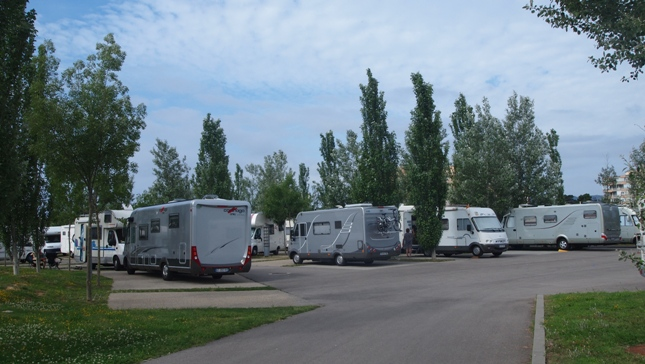

# El Mediterráneo en autocaravana
## 2012, 30 mayo - 8 junio

Salimos después de nueve meses en el dique seco debido a una enfermedad y una desafortunada operación quirúrgica. Todavía no estoy repuesto del todo pero hay mono de autocaravana y es necesario aprovechar el tiempo.

Tomamos el camino con la intención de llegar al Mediterráneo en busca de sol y buen tiempo. Como no tenemos prisa, decidimos realizar la primera etapa en la recientemente inaugurada área de Falces.

 

**Falces, 28 de mayo.**

Se trata de un lugar tranquilo a la orilla del río Arga. Las instalaciones son cómodas y limpias en las inmediaciones del campo de fútbol.

Realizamos un paseo en bicicleta por el camino que lleva a Peralta por la margen derecha del Arga. No podemos llegar a nuestro destino pues a los seis kilómetros de la salida hay un obstáculo insalvable para mi pierna debilitada. Emprendemos el regreso observando cómo una colonia de buitres compuesta por unos veinte individuos planea sobre los barrancos de las afueras de la población.

**Ascó, 29 de mayo.**

**Torre mudéjar del Monasterio de Rueda**

Continuamos la segunda etapa de aproximación parando a comer en el parking del Agua de la Expo en Zaragoza capital y visitando por la tarde el monasterio cisterciense de Rueda en la localidad zaragozana de Sástago, cuya construcción se inicia en la segunda mitad del S.XII y se concluye un siglo más tarde, finalizando el conjunto de la fábrica a principios del S.XV.

Hemos pasado en varias ocasiones por las inmediaciones del monasterio dejando pendiente la visita. En la actualidad, el conjunto está muy restaurado y bien conservado, en especial la iglesia y el claustro. El antiguo palacio abacial y el edificio de la galería corredor se ha convertido en una hospedería de Aragón.

Es notable que situación del monasterio junto a un tramo del río Ebro, en aquél tiempo navegable. La restauración de las estructuras del acueducto y de la noria nos dan una idea de la economía de la región en la edad media.

Soportamos el ataque desaforado de una miríada de mosquitos de lo más agresivo a pesar de todos los repelentes con que nos embadurnamos y que, según nos indicaron en la portería del monasterio, hacía cuatro días habían invadido el lugar. Gastamos un tubo de crema con corticoide para mitigar el picor de los habones que nos produjeron los muy malditos.

Llegamos al anochecer al área de Ascó, bien diseñada con un borne de servicios cómodo y limpio. Dormimos bien a pesar de que el área está situada al borde la carretera y junto a las vías del tren.

 

 

 

Cambrils, 30, 31 de mayo y 1, 5 y 6 de junio.

**Paseo marítimo de Cambrils**

Llegamos al Camper Park “Las Moreras” en Mont Roig por la tarde. Se trata de una parte del camping  Miami Playa. La zona para autocaravanas está situada en la parte más próxima a la playa, una cala con bastante piedra, pero apta para un baño con precaución y, como es lógico, para tomar el sol. Las parcelas disponen de un pequeño arbolado y el suelo es de hierba.

El área es sombreada, llana y los accesos adaptados a las autocaravanas, las parcelas abundantes y el camping, familiar y tranquilo, está limpio así como las instalaciones comunes. Cada parcela dispone de suministro de agua y toma de electricidad, incluido en el precio. También está incluido en el precio el uso de las instalaciones generales.

Hay una rejilla para el vaciado de las aguas usadas y un sumidero cómodo para vaciar el casette del váter.

**Camper Park de Mont Roig**

El precio que abonamos es de 9,50€/24 horas (Más el 7% de IVA), incluida la electricidad. Los meses de julio y agosto que se abren los servicios complementarios, entre ellos la piscina, tienen otros precios más altos.

La estancia en el Camper Park la dedicamos al “dolce far niente”, paseo diario hasta Cambrils en bicicleta a unos seis kilómetros, parte por la carretera N-340, que aunque soporta bastante circulación dispone de unos amplios arcenes.

El día 1 de junio marchamos al Delta pero regresamos el 5 huyendo de los mosquitos y el calor ya que aunque las temperaturas eran altas, la brisa marina mitigaba el calor y espantaba los mosquitos haciendo de la estancia una muy agradable experiencia. Los propietarios del camping están volcados en la experiencia de ofrecer un servicio exclusivo para las autocaravanas, esperemos que les sea positiva y productiva ya que es una excelente opción para los usuarios de autocaravanas.

**Deltebre, 2 de junio.**

**Observatorio de aves en el Delta del Ebro**

Llegamos al área del restaurante l’Estany, junto a la casa de Fusta y nos encontramos que una buena parte del área estaba ocupada por un grupo de autocaravanistas catalanes. Nos acomodamos según lo previsto y pernoctamos el sábado. Al día siguiente salimos a dar la consabida vuelta en bicicleta a la laguna de la Encanyzada. Comimos en el restaurante, después de saludar a Luis, su propietario. Dos raciones de un más que notable arroz con pato y una ración de almejas con alcachofas, con una buena garnacha y café nos costaron 45,00€.

 

 

 

**Trabucador, 3 de junio.**

**Playa Trabucador**

El domingo, pasamos el día en la playa del Trabucador, un poco agobiados por el calor y los mosquitos, decidimos pernoctar en el parking de la escuela de kiteboard “muchokite”. Había varias autos alemanas y francesas que nos informaron que no había problemas para hacerlo. Descansamos en un lugar privilegiado. Al día siguiente nos desplazamos en bicicleta a lo largo de la barra de Trabucador hasta La Banya.

**Prohibiciones ilegales en Riumar (Deltebre)**

Nos informaron que la colonia de flamencos se desplazaba a diario hasta el estanque de Els Calaixos en la isla de Buda, por lo que decidimos acercarnos hasta la playa de la Alfacada y de allí al observatorio de aves, pero ni vimos los flamencos ni nos gustó el ambiente de la playa por lo que decidimos ir a pernoctar, como en algunas ocasiones anteriores, a la urbanización Riumar en Deltebre, próxima a la desembocadura.

**A pesar de todo en Riumar (Delta del Ebro)**

Cuando llegamos al paseo marítimo nos encontramos unas señales que indicaban que estaba prohibido estacionar autocaravanas. Las señales eran dudosamente legales. No había ninguna otra señal prohibitoria ni en Deltebre ni  en Poblenou, por lo que dedujimos que era posible que no hubiera una Ordenanza Municipal y podríamos afrontar una denuncia por aparcamiento indebido. Además a ambos tripulantes se nos despertó el espíritu guerrero y decidimos que no se lo íbamos a poner fácil a ningún agente de la autoridad que pretendiera echarnos del lugar. Nos quedamos al final del paseo marítimo en compañía de dos autocaravanas más.

**Riumar, 4 de junio.**

Nadie nos incordió, así que un poco agobiados por el calor, decidimos regresar al Camper Park de Mont Roig, no sin antes de aprovisionarnos de anguila ahumada en Deltebre.

Decidimos también ir a Vic a revisar la centralita de la autocaravana que nos estaba fallando, por lo que cambiamos el rumbo sur por el norte.

 

 

**Avignonet, 7 de junio.**

**Josep el anfitrión.**

De camino para Vic hicimos una etapa en el área del viñedo de Art Cava en Avignonet. El lugar es magnífico, con la vista en el horizonte de Montserrat y una extensión enorme de viñedos en la comarca de El Penedés,  la cuna del cava. El área dispone de un punto limpio para el tratamiento ecológico de residuos y suministro de agua limpia y un hermoso parking a la sombra de unos cipreses.

Josep, el anfitrión, nos dio una lección magistral sobre la elaboración del cava. Se trata de un gran viñedo de las variedades macabeo, parellada y xarel.lo; también cultivan chardonnay. La cava tiene una pequeña producción artesanal que se vende en su mayor parte en la propiedad. Según nos indicó Josep la producción se adapta a la más pura tradición artesanal permitiéndonos catar las especialidades de la bodega. Compramos una caja de los productos más aequibles.

Cuando escribo estas líneas, ya de regreso, la caja de cava ha desaparecido en el estómago de los hijos, hijas, yernos y nueras.

**Platja d’Aro, 8 y 9 de junio.**

**Platja d'Aro llena de autocaravanas**

Llegamos el viernes por la mañana al área de Platja d’Aro. Aceleramos la llegada porque intuimos que el fin de semana podría estar petada. No nos equivocamos porque durante el fin de semana estuvimos más de sesenta instalaciones.

El área de Platja d’Aro, está situada en un parking general. No hay plazas reservadas para las autocaravanas y cada cual aparca donde le parece. Las plazas son cuadradas, muy anchas para turismos y muy cortas para autocaravas, de forma que muchas de ellas ocupaban dos plazas. La tarifa es de 8,00€/24 horas que recauda una máquina. Únicamente un par de autocaravanas teníamos expuesto el ticket en al parabrisas.

Ante los rumores que se difunden el foro de ACP decidí preguntar en la policía municipal la situación del área. Me informaron que la intención del ayuntamiento era cerrarla y hacer un parking para autobuses. Al parecer la actual corporación no considera de interés el área creada por los anteriores ediles y había mucho descontento en el ayuntamiento sobre la utilización de la misma. Además, me añadieron que una de las regidoras es propietaria de un camping.

Platja d’Aro es una bonita población con una hermosa playa y un paseo marítimo por el que se puede pasear en bicicleta. La estancia es agradable aunque nos fuimos con una sensación de anarquía por el uso área, sin que las autoridades locales se preocupen de poner orden, como es su deber, presintiendo su próximo cierre si no se modifican las circunstancias.

Salimos el día 9 hacia Ripoll con una para en Banyolas, junto al lago, para darle la vuelta en bicicleta y comer.

 

 

**Ripoll, 10 de junio.**

Visitamos una vez más el monasterio de Santa María de Ripoll, contemplando la imponente fachada presidida por el campanario. Admiramos de nuevo el pórtico impresionante en su sencillez, obra maestra del románico catalán, la iglesia y el claustro.

Después nos dimos un paseo, en bicicleta naturalmente, de un par de horas por la vía verde del Hierro y del Carbón. Esta vía verde está sombreada, verde, con abundante vegetación y muy bien conservada.

Partimos en dirección a Vic en cuya área municipal comimos a la espera de que abrieran en Autosuministros Vic. El área municipal de Vic es un espacio muy acogedor. Dispone de diez plazas reservadas para el estacionamiento de las autocaravanas en una zona verde arbolada y con vistas al valle donde está situada la población. El borne de servicios es cómodo y bien diseñado. El precio es de 5,00€ por un día de estancia.

Finalmente nos desplazamos a la vecina población de Gurb donde están emplazadas las instalaciones del importador de Hymer donde compramos la autocaravana en cuya área de servicios vaciamos los depósitos. Nos prestaron una centralita vieja mientras la nuestra viaja a Alemania para ser reparada, tardaron un par de horas, de forma que a las seis estábamos de camino para Tamarite de Litera en cuya área nos plantemos hacer la última etapa del viaje.

**Tamarite de Litera, 11 de junio.**

El área de Tamarite de Litera es nueva, limpia y cómoda aunque el acceso se hace a través de una rampa de unos veinte metros en pendiente, próxima a la población. Es un excelente lugar para hacer una etapa durante un viaje.

El día 12 reemprendimos el camino de regreso llegando al área de Illumbe en Donostia donde limpiamos la auto y vaciamos depósitos a la espera del próximo viaje.