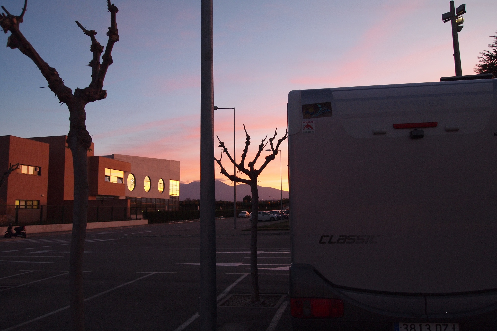
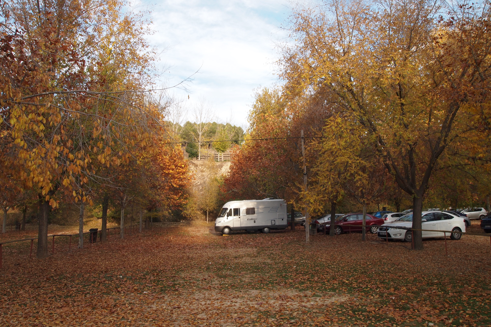

# En autocaravana por Cascante y aledaños
## 2010, 3 noviembre - 15 noviembre

 

**Atardecer en el parking del Termolúdico**

Cascante es un población de poco más de cuatro mil habitantes situada cerca de muchos lugares y en medio de otros tantos. Una población, en suma, a la que vale la pena acudir desde un punto de vista turístico, que está más cerca de lo que parece y que constituye un enclave desde el cual es ideal para descubrir un interesante patrimonio histórico, un paisaje peculiar y una gastronomía basada en los productos de la tierra.

 

 

 

 

 

**El Moncayo nevado desde el parking del Termolúdico**

Uno de las atractivos locales, al que acuden numerosos paisanos de las poblaciones limítrofes, es el Termolúdico. Una instalación moderna dotada de una laguna interior de hidroterapia a 32º/34º e instalaciones complementarias que la hacen interesante a unos precios moderados.

Este espacio dispone de un amplio aparcamiento en el que se puede pernoctar en autocaravana y con un borne para el vaciado y tratamiento ecológico de los residuos de las autocaravanas así como suministro de agua gratuito.

**Por la Vía Verde del Tarazonica hasta Tarazona**

La economía de Cascante se basa en la vid y el olivo así como los frutales y la huerta. El aceite de la variedad empeltre, suave y afrutado, y de arbequina, se pueden encontrar en las almazaras locales en especial en la artesanal Casa del Aceite. También hay un excelente vino en las bodegas de la localidad.

Cascante está en el centro de la Vía Verde El Tarazonica. A mitad de camino entre Tudela y Tarazona pudiéndose acceder en bicicleta a ambas localidades de las que dista unos 11 kilómetros con un bonito paisaje que domina el majestuoso Moncayo.

**Girola y ábside del Monasterio de Fitero**

La zona dispone de numerosos lugares donde se puede estacionar y los servicios se complementan con la oferta de un borne en la Estación de Servicio de la carretera de Ablitas (N-121c) a un par de kilómetros de Tudela.

Próxima a Cascante está la población de Ablitas donde un compañero autocaravanista nos puede facilitar en el mismo productor, Conservas María Jesús, una variedad de conservas de pimientos del piquillo, espárragos y, sorprendentemente, de bonito, a precios de fábrica.

**Parking exterior del Monasterio de Piedra en otoño**

La visita a la comarca se puede complementar con Tudela cuya catedral es digna de una detallada visita disponiendo de un gran parking en la entrada de la ciudad donde se puede pernoctar sin problemas.

Tarazona es un conjunto monumental donde destaca la catedral de Nuestra Señora de la Huerta, de estilo gótico mudéjar, actualmente en restauración. Tarazona dispone de un amplio aparcamiento a la entrada de la ciudad desde el sur por la carretera N-122.

**Una vista de Tarazona**

Los monasterios cistercienses Veruela en las faldas del Moncayo, de Fitero, excelentemente restaurado y el de Tulebras en el que habitan un par de decenas de monjas, que ofician unas pastas divinas, completan los lugares interesantes de la zona que, extendiéndose un poco, se puede llegar hasta el Monasterio de Piedra en Nuévalos en cuyo aparcamiento exterior se puede, todavía, pernoctar hasta que los propietarios, hartos de los abusos coloquen un cierre durante la noche.