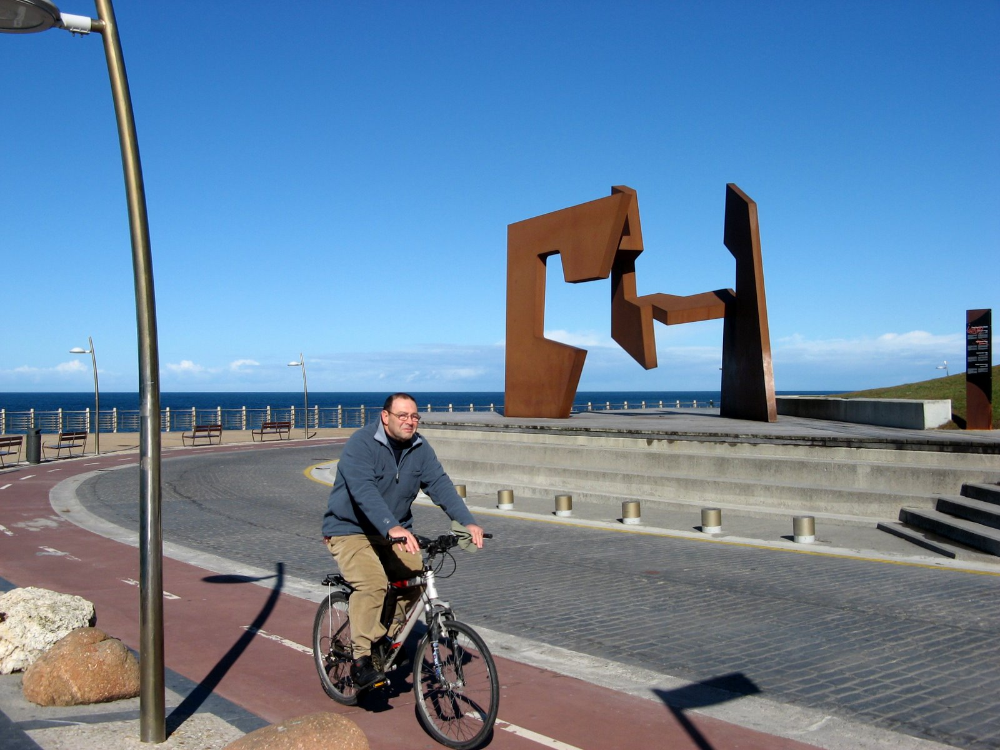
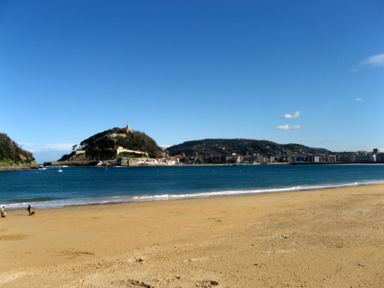

# San Sebastián en AC

San Sebastián es un destino apetecible, bien sea para una escapada de fin de semana o como una etapa dentro de un recorrido más amplio. Perfectamente comunicada por autopista desde el Cantábrico, Francia, Mediterráneo o el Centro de la península, está al alcance de cualquier autocaravanista que desee conocer una de las ciudades más interesantes de la costa del Cantábrico.

Los atractivos que ofrece San Sebastián satisfacen a través de todos los sentidos. La perspectiva que ofrece la bahía de la Concha desde diferentes lugares de observación como Igueldo al que se accede en un pintoresco funicular que parte de Ondarreta en un lugar cercano al Peine del Viento, conjunto arquitectónico que simboliza los elementos de la naturaleza: la tierra, el fuego, el viento y el agua. Un lugar privilegiado para contemplar el mar y recuperar el equilibrio emocional donde el horizonte y el mar se funden con el arte que expresa la obra de Chillida.

**El paseo marítimo por las tres playas**

Un paseo marítimo que transciende más allá de su dimensión física y que transcurre a lo largo de las tres playas, cuidadas como corresponde a un tesoro que la naturaleza ha regalado. Un paseo que es imprescindible recorrer como lo hacen a diario los miles de turistas que visitan la ciudad y lo convierten en un muestrario cosmopolita de gentes.

Desde Ondarreta se accede al palacio de Miramar, residencia de la reina de España a finales del siglo XIX, el paseo de la Concha, los jardines de Alderdi Eder, el antiguo casino, ahora ayuntamiento, y el puerto.

Desde el mismo puerto se accede al Paseo Nuevo que comienza en el Acuario y en el primer tramo, la escultura de Jorge Oteiza “Espacio Vacío”, premiada en la bienal de Sao Paulo de 1957.

En este paseo se muestra con todo rigor la furia del Cantábrico en los días de temporal reclamando para sí el terreno arrebatado. El paseo Nuevo finaliza en la desembocadura del Urumea y nuestro paseo en la punta de Monpas, desde donde se divisa en el horizonte la línea de la costa y el mar abierto con unas puestas de sol llenas de color. Antes de llegar al final es obligado pasar por la tercera playa, la Zurriola, sobre la que se insertan los “Cubos Varados” de Moneo que albergan el Palacio de Congresos del Kursaal.

Entre el puerto y el Paseo Nuevo parten varios caminos que nos llevan al monte Urgull y al castillo de la Mota que es parte importante del complejo defensivo de la ciudad, cuya historia destaca el papel militar desempeñado hasta finales del siglo XIX y desde donde se obtienen vistas privilegiadas sobre la bahía. En su falda se puede recorrer el coqueto paseo de los Curas con una original perspectiva del puerto.

Una oferta turística interesante es el paseo por la costa a bordo del catamarán “Ciudad de San Sebastián” que se toma en el muelle del puerto.

**Lugares para visitar**

El conjunto arquitectónico de la ampliación de la ciudad, a caballo entre finales del siglo XIX y principios del pasado siglo, conocido como el área romántica, alberga un conjunto de edificios notables entre los que destacan antiguo casino y actual ayuntamiento, la catedral del Buen Pastor, el teatro Victoria Eugenia y el hotel María Cristina, un interesante conjunto que abarca desde el Boulevard, la margen izquierda del Urumea, los jardines de Alderdi Eder y el Buen Pastor.

La parte vieja es también un lugar de culto que además de ser guardiana de las tradiciones locales alberga algunos edificios notables como la basílica de Santa María del Coro, barroca, y la iglesia de San Vicente del siglo XVI, ambos templos disponen de sendos órganos románticos Cavaillé-Coll de finales del siglo XIX en los que se celebra todos los años junto a la Quincena Musical un ciclo de música romántica para órgano.

También se encuentra el museo de San Telmo, recientemente abierto después de un largo período de restauración y ampliación, cuyos fondos se exhiben en un convento dominico del siglo XVI en cuya iglesia, se encuentran expuestos los 11 grandiosos lienzos de Sert que narran historias de la vida de Guipúzcoa. La oferta museística de San Sebastián se completa con el acuario y, hasta hace poco tiempo, con el ahora cerrado por razones económicas, museo de Chillida Leku dedicado a la obra del escultor universal Eduardo Chillida.

**La oferta cultural**

El Jazzaldia comienza la temporada para continuar con la Quincena Musical y finalizar con el Festival de Cine.

San Sebastián ha sido elegida como Capital Europea de la Cultura 2016.

San Sebastián es una ciudad que ha apostado por potenciar el uso de la bicicleta y cuenta con más de 40 kilómetros de caminos acondicionados para su uso, los “bidegorris” (caminos rojos) perfectamente señalizados y que llevan a cualquier parte de la ciudad.

**La oferta gastronómica**

La gastronomía es una forma de cultura en Gipuzkoa y el centro está en su capital. Dejando a un lado las grandes estrellas de Michelín podemos diferenciar varios grupos o formas de entender la gastronomía.

El asador, donde se concentra una oferta de carne, fundamentalmente txuletas y pescado: rape, cogote de merluza, besugo o rodaballo salvaje y la cocina clásica continental.

Mis favoritos entre la buena y abundante oferta, como asador, Portuetxe (55/60 euros por persona) y como restaurante clásico Urepel, (menú de degustación 50 euros, carta 50/70 euros). Una alternativa que siempre me ha proporcionado satisfacciones a medio camino entre el asador y el restaurante clasico es el Rekondo, (solo carta 60/65 euros) y uno de los más serios de la cocina innovadora es el Arbelaitz de Miramón con un menú de negocios de 30 euros, (carta entre 50/85 euros).

En Donostia lo difícil es comer mal incluso los menús de trabajo, en la cocina tradicional podemos encontrar el Anastasio. (14/24 euros) o la Muralla con cocina innovadora y un menú de entre semana de 23 euros.

En cualquier caso, en todos los aspectos, a Donostia se le pueden aplicar muchos adjetivos, pero seguro que el de barato no está entre ellos, sin embargo, el concepto caro o barato es subjetivo, lo importante es si lo recibido se ajusta a lo pagado.

En las proximidades del área de Berio se puede comer dignamente en la cafetería de la UPV, situada en el edificio del aulario por 7 euros aproximadamente y platos combinados o menú del día en el bar Ostadar al inicio de la subida de la avda. Berio.

Una manifestación gastronómica muy arraigada en Donostia es la cocina en miniatura, los pintxos, que de por sí constituyen un atractivo más dentro del ámbito de la gastronomía.

**Tráfico y las autocaravanas**

El ayuntamiento de San Sebastián observa una política neutral con respecto a las autocaravanas ateniéndose a las leyes de tráfico. Por otra parte, es muy difícil estacionar en el centro, incluso para un turismo salvo en los numerosos estacionamientos de pago cubiertos, donde nuestras autocaravanas no tienen cabida.

El estacionamiento en todo el casco urbano está regulado como “zona azul” (OTA u ORA) con plazas en rotación y durante el horario comercial no se puede estacionar mas que un tiempo limitado. En estas zonas existen algunos lugares que disponen de tarifas de larga duración donde se podría estacionar durante 24 horas o un fin de semana. Principalmente en las inmediaciones de la Ciudad Deportiva de Anoeta, el paseo de Errondo en Amara Berri y el Paseo Nuevo en la falda del monte Ulía.

Sin embargo, a la hora de pernoctar en una AC, es necesario tener en cuenta algunas limitaciones, por ejemplo: estar pendientes del ticket, el ruido del tráfico en paseo de Errondo, los partidos de fútbol o algunos eventos que cierran la zona deportiva de Anoeta, las regatas o las barracas de la Semana Grande en Agosto que cierran el Paseo Nuevo o los temporales que representan un riesgo para los vehículos estacionados en este lugar.

San Sebastián, en términos generales, es una ciudad segura, aunque como en todas las concentraciones humanas no se puede descartar el riesgo de que una autocaravana sea objeto de robo, por ello es imprescindible tener en cuenta las habituales medidas de seguridad a la hora de estacionar o pernoctar.

Hay lugares que se deben evitar: el parking de la playa de la Zurriola por las quejas del vecindario que provocan actuaciones indiscriminadas de las policías sobre autocaravanas siempre mal aparcadas por la escasez de las plazas.

Otro lugar que se debe evitar es el parking de la playa de Ondarreta porque se aplica con rigor las limitaciones de estacionamiento para todos los vehículos, incluidos los fines de semana. Hay otros lugares en los barrios periféricos que, siempre que se haga un uso racional del estacionamiento, no creará problemas el estacionamiento y la pernocta.

La zona de estacionamiento libre del campus y  donde era frecuente encontrar autocaravanas estacionadas se  ha delimitado como zona de estacionamiento en rotación (OTA u ORA). Los estacionamientos del campus permites estancias de hasta cinco horas o más (Con la tarifa II aplicable a las autocaravanas) por 2,60€.

El horario de aplicación va de 9:00 a 13:30 y de 15:30 a 20:00 horas de lunes a viernes, los fines de semana y festivos es gratuito. Salvo los meses de vacaciones en la Universidad no es recomendable utilizar estas plazas para pernoctar.

**Recursos específicos para autocaravanas**

San Sebastián dispone de un área para autocaravanas con 44 plazas y un área de servicio en Berio. Esta área tiene una tarifa similar a las de larga duración del centro: 6 euros en verano y 3 euros en el resto del año. Está vigilada por agentes de la OTA y se paga mediante una máquina que expende tickets. El tiempo de estancia máximo, que solo se aplica con rigor en verano, es de 48 horas y no se permite, aunque se tolera cuando hay discreción, el despliegue de elementos. Debido a la proximidad de vecinos y la posibilidad de quejas el ruido, la polución visual o el escándalo son las causas más frecuentes del rechazo. En el uso del área para autocaravanas de Berio, en San Sebastián es el sentido común y el respeto al entorno la guía más importante para un correcto disfrute.

Recientemente se ha abierto un nuevo estacionamiento en el paseo de Miramón, junto a la plaza de toros de Illumbe,. Es un amplio parking con más de 150 plazas que permanece vacío la mayor parte del tiempo. En él, bajo los tableros de las vías de acceso a la ciudad desde el corredor del Urumea, se ha construido un una nueva área de servicios para autocaravanas. (Ver mapa de San Sebastián).

El parking es gratuito, tiene una ligera pendiente y está algo alejado del centro, pero es una alternativa cuando el resto de la población está lleno de vehículos como ocurre en verano. No tiene limitaciones para el estacionamiento y únicamente es necesario tener en cuenta los eventos que se celebran en la plaza de toros o en Anoeta. No impiden estacionar pero la demanda puede ocasionar molestias así como algo de “ambiente” que puede haber los fines de semana.

San Sebastián dispone además de un camping en Igueldo, en un lugar tranquilo y con unas vistas extraordinarias, magníficamente equipado, a cinco kilómetros del centro. Una línea de autobuses llega hasta las mismas puertas cada media hora. En temporada alta, cuando escasean las plazas se puede pernoctar con la autocaravana, si está completo, en el parking exterior por 12 euros (tarifa de 2011) con derecho a utilizar los servicios auxiliares.