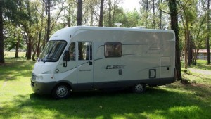
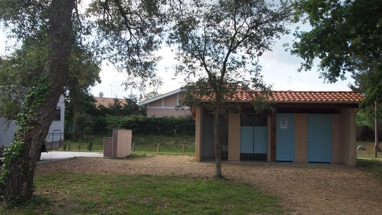
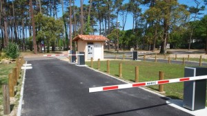
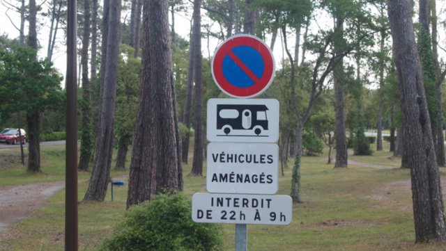
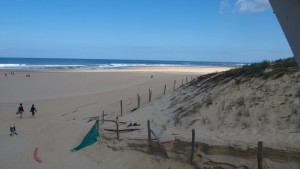

# Moliets-et-Maa
**2011**

**Área sobre hierba, bajo pinos**

Las Landas es un departamento de Aquitania situado al sur-oeste de Francia. El límite al oeste transcurre a lo largo de unos 100 kilómetros de costa atlántica constituida por playas y dunas interrumpidas únicamente por la desembocadura de pequeños ríos o corrientes de agua procedentes de numerosos lagos próximos a la costa. Arenas y bosque de pinos con pequeñas poblaciones orientadas al turismo en contacto con la naturaleza componen una gran parte del territorio.

**Todos los servicios**

En este territorio existen numerosas áreas para autocaravanas. Muchas de ellas se encuentran situadas a la sombra de grandes pinos centenarios, sobre terreno arenoso cubierto de hierba. Una de ellas es la de Moliets-et-Maa. Situada a cien metros del acceso a la playa. Esta área puede ser un modelo de gestión de recursos destinados a satisfacer las necesidades que plantea la demanda del turismo en autocaravana.

Está perfectamente integrada en el entorno y solo denota su presencia por las propias autocaravanas que está alojadas. El cerramiento es discreto compuesto por estacas de madera y setos bajos. La entrada y salida se realiza por medio de dos barreras automáticas dobles gestionadas por medio de tarjetas de pago que expende una máquina que acepta monedas o tarjetas bancarias.

**Nadie se escapa sin pagar**

El estacionamiento es diáfano, sin parcelas marcadas y no hay prácticamente ramas que obstruyan el paso de las autocaravanas. Dispone de postes con cuatro tomas de electricidad cada uno cuyo uso está comprendido en el precio de la estancia. Hay dos bloques sanitarios con váteres y fregaderos. El borne de servicios es artesanal, de cerámica, limpio, cómodo y sencillo y el acceso para la plataforma de servicios es muy accesible.

El costo es de 11,00€ de abril a septiembre y 5,00€ el resto del año. Es de notar que en las proximidades, al otro lado del vial de acceso, hay un camping que oferta más de 5.000 plazas y que en verano está al completo de ciudadanos alemanes y de los Países Bajos, además de los españoles y franceses.

**Solo se pernocta en el área**

Como en el resto de las poblaciones francesas en las que la presencia de autocaravanas es significativa, está prohibido estacionar entre las 20:00 y 08:00 horas fuera del área.

Los alicientes para visitar la zona son numerosos. Una playa salvaje abierta en la que es posible practicar el surf, paseos en bosques donde predominan los helechos bajo pinos centenarios, alcornoques y acebos. Es posible contemplar las ardillas, los conejos silvestres y no es raro ver fugazmente a una manada de ciervos.

**El Atlántico siempre bravo**

Está próxima a el Espacio Natural de la corriente de Huchet en la que se pueden realizar paseos en barco, pescar en el mar o en los lagos próximos y jugar al golf en uno de los dos campos a precios accesibles. Uno de nueve hoyos y el otro de dieciocho en el que se celebran competiciones internacionales, Para completar los alicientes dispone de acceso a pistas para bicicletas en terreno llano cuya longitud es de cientos de kilómetros.

Naturalmente en el área se pueden desplegar elementos, mesas sillas y el toldo esta forma de acampar está autorizada en toda el área.

Hemos permanecido un par de días disfrutando de muchos de los alicientes ofertados en una forma de hacer turismo en contacto con la naturaleza.