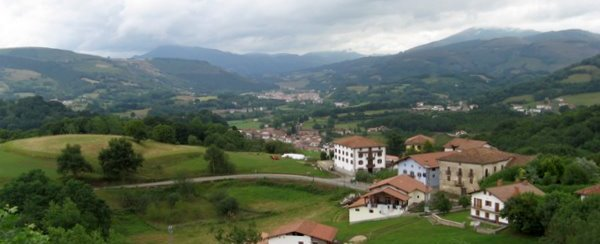
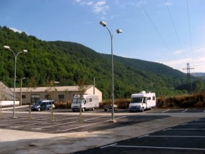
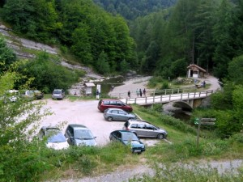
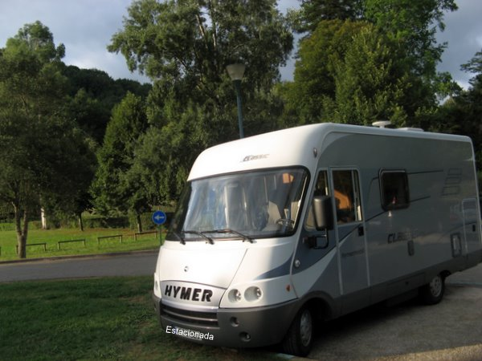
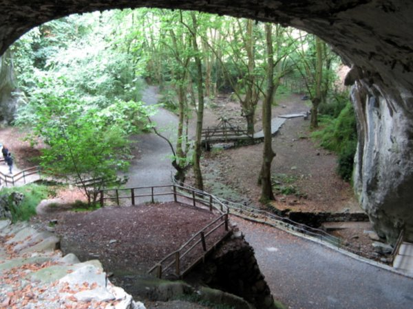
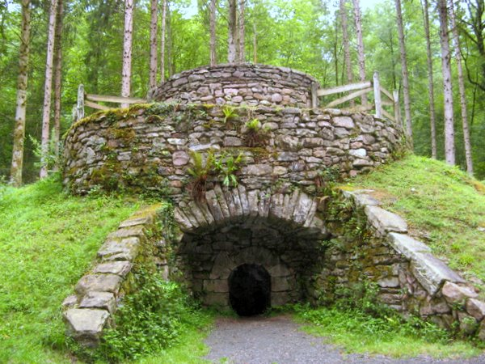

# Pirineo Navarro

**Vista del valle del Baztan desde Ciga**

Algunos lugares próximos que conocemos por razones de trabajo o por otras circunstancias los vamos dejando de lado por otros destinos más lejanos hasta que nos decidimos visitarlos con los ojos y la mentalidad de un viajero.

Navarra atesora una extraordinaria variedad de paisajes, además de un patrimonio histórico excepcional. Los Pirineos constituyen una serie de valles donde se conservan una serie de tradiciones que mantienen vivos los recuerdos y costumbres que contribuyen a configurar el paisaje rural de un pueblo que vive todavía en contacto con la naturaleza.

En esta salida, durante una semana hemos recorrido dos de los valles  tradicionales del Pirineo Navarro: Salazar y Baztán, tierras de leyendas como los akelarres o los agotes.

La pernocta en la autocaravana no presenta ningún problema en una zona que no está saturada. La falta de infraestructuras la hemos resuelto vaciando y llenando los depósitos en las estaciones de servicio, en especial la de la carretera de Pamplona a Arre que dispone de instalaciones adecuadas.

**Valle de Salazar**

Comenzamos la visita pernoctando junto a otra autocaravana y dos furgonetas en el fondo del parking de la estación patatera de Otsagabia, Lugar tranquilo donde los haya, dormimos plácidamente.

Otsagabia es la capital de valle de Salazar, testigo de las guerras realistas del S.XIX, mantiene un casco histórico bien conservado con casas tradicionales de los siglos XVII y XVIII, entre las que destacan el ayuntamiento y la iglesia parroquial.

Para los amantes de la gastronomía es de destacar el cordero y la txistorra que el carnicero fabrica artesanalmente. El queso en el valle de Salazar es de oveja latxa, similar al de Idiazabal pero diferente al del vecino valle del Roncal.

**Selva de Irati**

La primera excursión la realizamos al embalse de Irabia en pleno bosque Irati. La selva de Irati es una de las mayores y mejor conservadas manchas de hayas (fagus sylvática) del sur de Europa. El parking está situado a 23 kilómetros de Otsagabia por la NA2012, junto a las ruinas de unos acuartelamientos de principios del S.XIX y de la ermita de Nuestra Señora de las Nieves.

Existe una caseta de información con guardas forestales. Hay bastante espacio para estacionar y no se permite pernoctar desde hace unos tres años, cuando los responsables de Medio Ambiente encontraron los estacionamientos copados por sesenta autocaravanas y furgonetas.

Desde este punto se pueden hacer varios recorridos a pié y en bicicleta. Nosotros ya conocíamos la SL53C que sigue la orilla norte del embalse. En total, el recorrido de ida y vuelta suma veinte kilómetros incluyendo los cuatro de aproximación hasta la casa forestal por la SLNA63A. Esta pista forestal tiene algunos repechos que nos obligan a echar pié a tierra llevando la [bicicleta] burra “Sócrates” del [manillar] ronzal.

Todo el recorrido, por la pista forestal (sendero local), no ofrece dificultades para nuestras bicicletas aunque están calzadas para andar por la ciudad.

Nos dejamos cautivar una vez más por el hechizo de un bosque mágico con categoría de selva. Unos árboles majestosos de un bosque en transformación gracias a cuidado de los servicios forestales de Navarra que intentan retroceder hasta el origen. Un bosque que ha sido explotado para fabricar los barcos con los que España se enfrentó a la “pérfida Albión” a principios del S.XIX.

Las hayas alternan con magníficos ejemplares de abeto blanco (abies alba). El embalse regula las aguas del río Iratí. Se construyó en 1921 para controlar el agua, producir energía y permitir la flotación de la madera que se bajaba en almadías hasta el Ebro. Actualmente todos los años se recrea el trabajo tradicional de los almadieros.

Tierra de tradición y leyendas de Basajaun y Basandere, señor y señora de los bosques. Un mundo rural que mantiene un buen grado de calidad en el que el turismo ha entrado de refilón, como un complemento.

Regresamos a Otsagabia en medio de una intensa niebla. Durante aproximadamente tres kilómetros apenas se puede vislumbrar la carretera más allá de los diez metros. Extremamos las precauciones y llegamos sin novedad al parking de la estación patatera.

**Excursión a la ermita de N.S.de Muskilda**

Animados por los responsables de Medio Ambiente (gracias Mikel), decimos realizar un paseo circular de 6,5 kilómetros por la SLNA65. Una senda flaqueada por hermosos bojes nos hace ganar altura rápidamente hasta uno de los más hermosos paseos bajo hayas que hemos visitado nunca. Un bosque joven cuyas ramas tamizan la luz y proporcionan sombra abundante.

Dentro del bosque, entre las hayas, podemos observar una muestra variada de ejemplares de robles (quercus robur) y avellanos (corylus avellana) cargados de frutos, así como grandes ejemplares de acebo (ilex aquifolium).

Al iniciar el descenso topamos con la ermita de N.S.de Muskilda, Construida en el S.XII y reformada en el S.XVII, cuya imagen del S.XV es objeto de devoción local.

Llegamos a tiempo de comer en la sidrería Kixkia una excelente menestra y un buen ajoarriero, 35 euros los dos menús.

**Valle del Baztán**

Nuestra intención era pasar a Francia por Belagua y comprar queso de Irati en una borda francesa al lado de la frontera y visitar las gargantas de Kakueta, pero el cierre de la carretera a Francia y la niebla que domina el puerto de Larra nos hace desistir y decidimos realizar una visita al valle del Baztán.

Vaciamos, de camino, en la estación de suministro de combustible de Villaba y llegamos a última hora de tarde a pernoctar en el parking del Señorío de Bertiz en Oronoz-Mugairi.

Sin problemas aunque con la compañía de unos jóvenes que aporrean unos bongos hasta media noche pernoctamos junto a otra auto y un par de furgonetas. A la mañana siguiente nos confirman que está permitido pernoctar una noche (sin ser estrictos).

A la mañana siguiente hacemos un recorrido a pié de unos ocho kilómetros por la carretera de Aizkolegi. Tomamos esta carretera sin asfaltar y a unos cuatro kilómetros un desvío a la izquierda nos deja en una senda en medio de un bosque de hayas. Las hayas son una especie predominante en el norte de Navarra y constituyen un tipo de bosque característico en continua formación.

Los ayucos, fruto de las hayas, al caer en el manto de residuos vegetales acumulados por la caída de las hojas dan origen a numerosos brotes. Las zonas de bosque tupido incluyen a unos árboles de más de treinta metros de altura cuyas hojas tamizan la luz y proporcionan una cómoda sombra en los días calurosos.

Un bosque de hayas constituye un ecosistema en equilibrio que la intervención del hombre hasta la era industrial mantenía una relación sostenible.

La explotación tradicional de la madera para carbón y la construcción naval no afectaron a la sostenibilidad hasta que la producción de hierro en la era industrial y la necesidad de naves para la expansión y mantenimiento del imperio exigió talar superficies extensas de bosque que se convirtieron es pastos para el ganado.

En la actualidad se puede comprobar cómo la política conservacionista del último propietario del Señorío de Bertiz y el actual administrador, la Diputación Foral, están recuperando un bosque cuyo ecosistema se mantiene en equilibrio con una intervención tradicional sostenible del hombre en la que el turismo es una actividad complementaria que crea puestos de trabajo en las numerosas casas rurales y restaurantes locales sin afectar gravemente al ecosistema gracias a la labor de información y formación.

Hay muestras de caleras y de la actividad carbonera cuya huella se puede advertir en las hayas mutiladas.

**Las cuevas de Zugarramurdi**

Salimos por la tarde en dirección a la frontera con Francia haciendo una parada en Elizondo, la capital del valle del Baztán, para recorrer el mercadillo donde cenamos una especie de torta de maíz con queso joven de vaca (talo) y comprar algunas golosinas del excelente chocolate de casa Malkorra. Actividad altamente perjudicial para la salud.

Llagamos al aparcamiento de Zugarramurdi donde pernoctamos sin problemas y en paz a pesar de que está situado junto a uno de los mayores restaurantes de la pequeña población fronteriza dedicada anteriormente al contrabando y en la actualidad a suministrar a los vecinos del norte, alcohol (pastis), tabaco y pitxiak.

A la mañana siguiente visitamos las cuevas. Una gran cavidad en la roca caliza donde según la tradición se celebraban aquelarres en un prado frente a la cueva las noches de luna llena. Al parecer, las aguas que se filtran en las paredes de la cueva contienen fósforo y calcio, las brujas desnudas se impregnaban el cuerpo que brillaba en la noche. El recorrido por el recinto es espectacular y nos lleva un par de horas.

**Otra vez el Señorío de Bertiz**

Es domingo y decidimos terminar el recorrido de Bertiz en bicicleta por lo que regresamos al parking del Señorío de Bertiz donde reposamos la tarde con un tiempo húmedo de lloviznas intermitentes.

Otra noche más, tranquila, nos deja relajados para emprender un paseo en bicicleta por la pista de Aizkolegi para tomar una bifurcación a la derecha de unos seis kilómetros hasta el camino de Orabidea.

El piso está empedrado en algunos tramos lo que dificulta la progresión con nuestras “burras” de ciudad. La pista va ganando altura a medida que avanzamos con algunos tramos tan empinados que mi burra “Sócrates” se niega a llevarme a lomos y me obliga a echar pié a tierra tirando del ronzal.

Un paseo extraordinario bordeando una regata de aguas vivas cuya huella, que deja a su paso en las orillas, está presente en las rocas y vegetación. El silencio del bosque permite escuchar el rumor del agua y el sonido de la brisa entre las ramas de las hayas.

El bosque se complementa con unos enormes cipreses (ciprés de lawson), avellanos cargados de frutos y pequeñas formaciones de roble americano (quercus rubra), que va siendo sustituido por el roble autóctono.

De vez en cuando se ve un castaño (castanea sativa) cargado de erizos. Este árbol, que en tiempos fue abundante, las enfermedades, la tinta del castaño y el chancro, producidas por hongos, propiciaron prácticamente su desaparición en la zona.

Las castañas como alimento básico son conocidas desde la antigüedad, bien como fruto fresco, asado, o bien en harina. Los erizos se almacenaban a la intemperie en unas formaciones circulares de piedra de las que hoy quedan muestras y se mezclaban con ramos y cortezas para retrasar la maduración. La introducción del maíz y la patata como alimento básico en el S.XVI fueron desplazando el interés del árbol como alimento aunque su sombra y su madera son muy apreciadas.

La política de regeneración del bosque en el señorío de Bertiz, impide talar árboles para su explotación permitiendo que los que caen por enfermedad o vejez se pudran contribuyendo así a la alimentación de larvas que a su vez son alimento de la fauna local en franca recuperación.

Regresamos después de 16  kilómetros muy interesantes y aprovechamos el resto del día para hacer limpieza, empacar la ropa y regresar a casa.