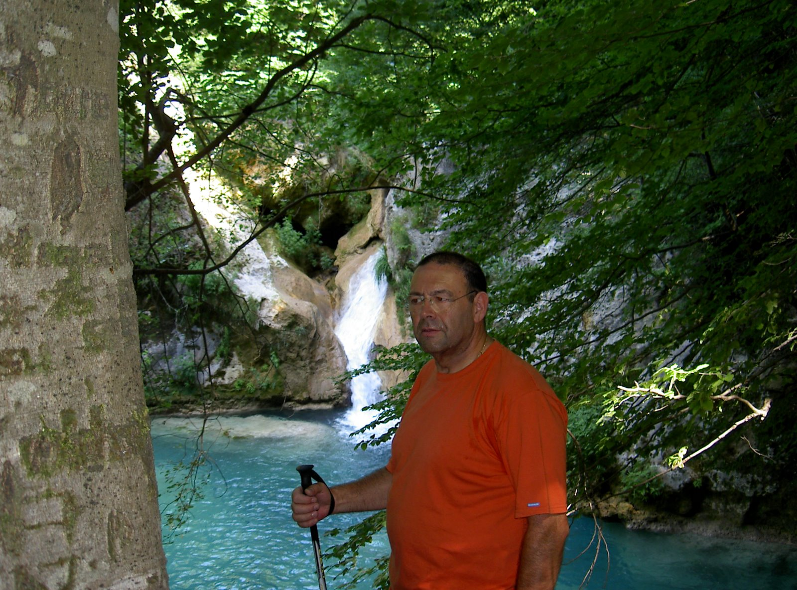

# Urbasa y Urederra

 

**Otoño de 2009**

El Balcón de Pilatos, al fondo el nacimiento del río Urederra

**Algunos apuntes geopolíticos**

La sierra de Urbasa (“Bosque de Agua” en euskera), está situada al Oeste de Navarra y constituye, junto a la sierra de Andía, una barrera climática frente a las influencias del Atlántico por su altitud y su situación de Este a Oeste.

La altiplanicie con praderas y bosques, su clima, paisajes y la paz que se desprende de la forma de vida, hacen de Urbasa un lugar ideal para pasar un fin de semana relajado.

La ganadería es el principal motor de la economía de unos montes que pertenecen al pueblo navarro. Vacas, caballos, cerdos y ovejas pastando en libertad son los habitantes más numerosos de las praderas.

 

**Aquí comienza la vertiente mediterránea, al fondo las Ameskoas.**

Los hallazgos arqueológicos prueban la presencia humana desde hace más de 100.000 años. Con la domesticación de los animales y las primeras técnicas agrícolas, el pastoreo pasó a ser la base de la economía, propiciando el asentamiento de las poblaciones en los valles colindantes.

En edad media se produce un hecho insólito en un entorno feudal: se hace extensivo a todos los navarros el derecho al uso y disfrute de las sierras de Urbasa y Andía. En la actualidad, Urbasa es un monte común, propiedad de la Comunidad Foral, que antes lo fue del Estado y aún antes del reino de Navarra.

En el siglo XVII Diego Ramírez de Baquedano, marqués de Andía, consigue licencia y manda construir un palacio desde donde administrar justicia. El palacio abandonado está situado en la altiplanicie de la sierra.

Urbasa también es testigo de las batallas libradas durante la primera guerra Carlista (1833-1840) por el general Zumalakarregui “El zorro de las Amescoas”.

Urbasa es una formación kárstica que abarca una superficie de 30.000 ha, funciona como una esponja que recoge las abundantes aguas pluviales, propiciadas por el choque de los frentes atlánticos en su vertiente norte, y las vierte principalmente en la vertiente sur, en especial al río Urederra cuyo nacimiento se produce en una especie de “embudo”, en el fondo del valle.

 

**Saltado una cancela**

**Condiciones para visitar la sierra**

La Diputación Foral de Navarra ha declarado Urbasa “Parque Natural”, cuyo uso y disfrute está regido por el decreto foral 340/2001 de 4 de Diciembre.

Como en todos los parques naturales hay una serie de normas que se deben respetar escrupulosamente:

Solo pueden circular vehículos de motor en la carretera de Olazagutía a Estella y en la pista de Otxoportillo.

El estacionamiento de los vehículos está restringido a los espacios de aparcamiento señalizados.

No se deben verter ningún tipo de residuos fuera de los contenedores.

No está permitida la quema de vegetación ni hacer fuego fuera de los lugares acondicionados.

No se permite el lavado de vehículos ni el cambio de aceite.

Está rigurosamente prohibida la corta de maderas, leñas y ramas sin el correspondiente permiso.

No se permite la emisión de ruidos que perturben o molesten a la ganadería.

**No se permite lavar ni fregar**

**Los animales de compañía deben estar siempre controlados.**

**Esta prohibida la acampada libre.**

Hace unos años se permitía realizar la pernocta en cualquier vehículo vivienda en los lugares de estacionamiento por un período no superior a 24 horas.

Sin embargo, de un tiempo a esta parte no está permitida, probablemente, por presiones del camping local, caro y mal acondicionado.

Para disfrutar de la sierra existe la posibilidad de pernoctar en el parking de Baquedano 42º46’59,20’’N / 2º07’18,03’’W. Es un parking de pago durante la temporada estival en el que se permite pernoctar y que, fuera de los fines de semana del verano hay espacio suficiente para unas pocas autocaravanas.

En los lugares de estacionamiento de la sierra, los fines de semana, a partir de las once de la mañana se van ocupando los mejores lugares por excursionistas que despliegan sus mesas y sillas para tomar el sol y pasar el día. Los usuarios de las autocaravanas, de la misma forma que los usuarios de los turismos pueden tomar posiciones en los lugares autorizados, desplegar los toldos, mesas y sillas para pasar el día. Cualquier lugar de la sierra es idóneo para hacer excursiones, tanto paseos a pié como en bicicleta.

 

 

**El balcón de Pilatos, observatorio de rapaces**

**El Balcón de Pilatos**

La primera excursión que realizamos nos lleva hasta la cresta de un farallón rocoso, el balcón de Ubaba popularmente conocido como el balcón de Pilatos. El estacionamiento desde donde partimos está situado el inicio del descenso del puerto que nos lleva a Zudaire (42º48’03,87’’N/2º08’48,64’’W), en la carretera de Olazagutía a Estella, en sentido de la marcha a la izquierda, se inicia una pista que nos lleva por las crestas de unos imponentes farallones de roca caliza que se abren al valle de las Amsecoas.

Un paseo de unas dos horas y media entre hayas y robles durante el que avistamos grandes rapaces como el águila común y el buitre que vuelan majestuosos entre las rocas cortadas a pico.

**Otxoportillo**

En la segunda excursión partimos en bicicleta desde la desviación bien señalizada de la carretera de Olazagutía a Zudaire, donde estacionamos, (42º51’27,70”N/2º10’16,11”W) al comienzo de la pista a Otxoportillo. Es una pista de unos 14 kilómetros apta para MB donde las bicicletas de ciudad que llevamos se hacen incómodas por el piso tan irregular.

El camino discurre por un bosque de hayas de todo tipo entre las dolinas de un terreno kárstico de formas variadas y realmente bellas.

**Nacimiento del río Urederra**

**Camino del nacimiento del río Urederra**

La tercera excursión, nos lleva al nacimiento del río Urederra partiendo del mismo parking de Baquedano. La vegetación ha cambiado radicalmente, entre un entorno boscoso de robles y encinas que configuran ya la vertiente mediterránea, el río Urederra transcurre desde su nacimiento flanqueado por un tupida mancha de hayas entre las asoman algunos tejos, que compiten por alcanzar la luz del sol con sus copas y nacen entre las mismas rocas. Pozas, saltos y rápidos jalonan el curso de este río que rendirá sus aguas al Ega unos kilómetros mas abajo.

El recorrido de un par de horas nos lleva hasta el fondo del farallón donde nos asomábamos en el Balcón de Pilatos. Una cascada con abundante agua después de las lluvias y varias pozas indican la surgencia cuyo acceso es bastante complicado. Este camino transcurre en suave subida y es cómodo y con buen piso aunque son recomendables las botas de montaña.

Los atractivos naturales de esta sierra son suficientes para pasar un largo fin de semana y el poso de la visita en el recuerdo anima a volver siempre con el aliciente del bosque caducifolio que se transforma en algo nuevo cada estación del año, especialmente en primavera y otoño cuyo el color varía del rojo al verde.